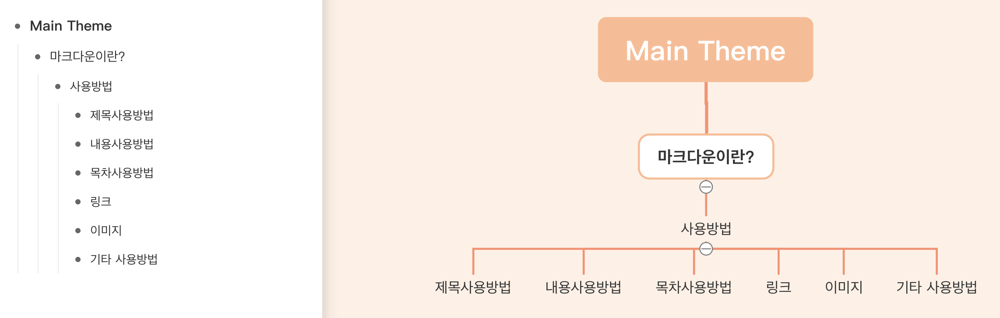

# TIL 
- 마크다운 설명서 및 연습 .md 파일 작성       
👉 [마크다운 설명서 클릭!](https://github.com/ekfka4863/TIL/tree/master/MarkDown)
- 🛠 마크다운 tool 추천 🔧:
  - [Typora](https://typora.io/)
  - [MacDown](https://macdown.uranusjr.com/)    
  (cf. MacDown은 맥 유저 전용!)
- 개발환경 세팅: 
  - [Go2Shell](https://zipzapmac.com/Go2Shell)
- 💻 CLI ⌨️ 맛보기:
  - CLI 통칭    
    - e.g. *terminal, cmd, powershell,* etc.
  - CLI 명령어       
    - e.g. *cd, mv, mkdir, rmdir,* etc.
- 마크다운의 Outline *(cf. 목차/headings map -> 하단의 그림 참고!)* 에서 heading 1 ~ 6이 해당 문서 전체에서 굶직하게 차지하고 있는 부분을 대표적으로 나타내주는 것처럼, 웹사이트를 보면 그런 구조를 볼 줄 아는 연습을 해야한다:

 
  👉 내일까지 <a href="https://winiadimchae.com/main">위디아 딤채</a> 사이트 들어가서 위에 마인드 맵처럼 구성 생각해오는 것 <u>숙제</u>!

 
 

## HW
- [x]  [위디아 딤채](https://winiadimchae.com/main) 마인드 맵 구현하기    
👉 [GItMind](https://gitmind.com/) 활용해서!    

 
[내가 스스로 구현한 위디아 딤채 웹사이트 구조]

~~(cf. 나중에 강사님과 함께 구현한 버전은 추가할 예정!)~~

- [x] ~~어제 배운~~ 깃허브 데스크탑 사용방법 정리한 파일에 내용 추가     
  👉 [깃허브 데스크탑 사용방법 클릭!](https://github.com/ekfka4863/TIL/tree/master/Git%26GitHub)

- [🔺] 네이밍 컨벤션 정리하기

<!-- - [❔] 문자열 인코딩 알아보기 (?)       
  👉 [참고 사이트 예시](https://it-eldorado.tistory.com/61)

- [❔] Github `README.md` 파일 꾸미는 방법 알아두기 (?)    
  - [참고 사이트 예시 1](https://awesomeopensource.com/projects/readme-template)
  - [참고 사이트 예시 2](http://blog.cowkite.com/blog/2102241544/)
   -->

