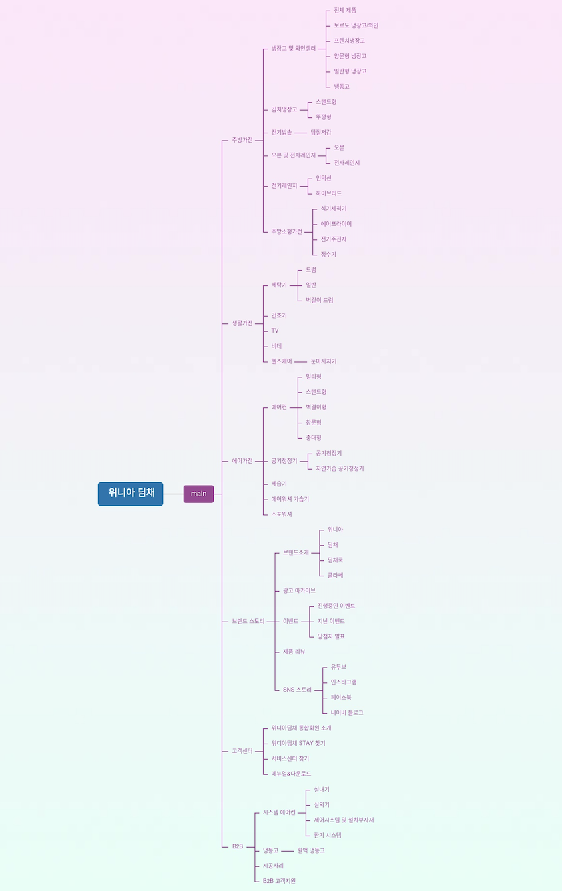
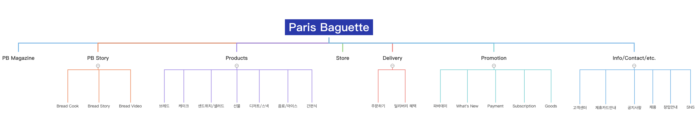
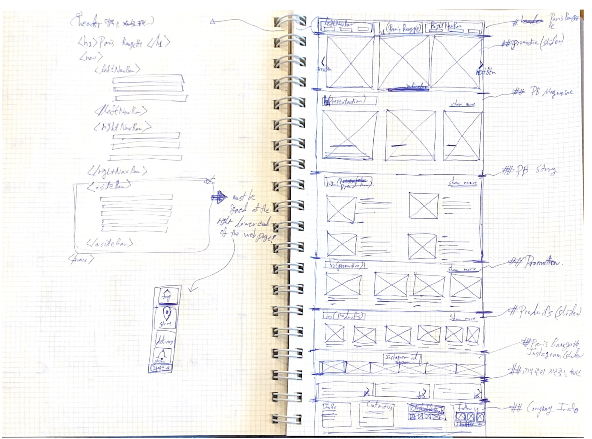

# TIL 

- [위니아 딤채](https://winiadimchae.com/main) 마인드 맵 보다 구체적으로 구현         

 

- 📚 어제 내주신 과제 📖:
  - 웹페이지 하나 골라서 **headings map** 만들기 
  - 웹페이지 outline으로 **마인드맵** 구성 
  - 결과물: [파리바**](https://www.paris.co.kr/) 홈페이지로 선택!      
  headings map을 마인드맵으로 만들어갔다.   

- 오늘 수업시간에는 과제로 해온 마인드맵을 가지고 해당 홈페이지를 sketch 하는 시간과, sketch한 자료를 수강생들에게 서로 보여주고, 강사님에게 피드백을 받는 시간을 가졌다.     

<ul style="padding-left: 40px; list-style: none;">
  <li> 👀 <u>강사님께 받은 피드백/팁</u> ✍️ :</li> 
  <ul>
    <li>
      그냥 줄 그어놓은 부분이 제목 <i>(e.g. heading2 ~ 6)</i> 인지 내용 <i>(e.g. p tag, etc.)</i> 인지 구분이 안가니까 이런 부분을 좀 더 상세히 적어서 명료하게 하면 좋을 것 같다고 하심!
    </li>
    <li>
      sketch 단계에서도 <u>강약조절</u>이 필요하다.  
      그래서 각 섹션마다 너무 단일한 구조로 가지말고, 어떤 곳에서는 섹션 안에 있는 이미지들 양 옆으로 margin을 준다든지 등의 variation을 주면 단조롭지 않은 홈페이지 구조가 될 수 있을 것 같다고 하심! 
    </li>
  </ul>
</ul>
 

- 사이트 분석의 중요성과 올바른 분석방법
  - 여기서 **분석**이란? 
    - [x] 기존사이트를 클라이언트 입장에서 변경하고 싶은 부분을 의뢰서를 만들어보자! 
    - [x] 의뢰서를 (재)분석한다    
    (→ e.g. 3C, SWOT, 기업컬러, 등에 기반해서 ... )
    -  [x] 페르소나 ~~(cf. 가상의 인물)~~ 을 만들어 낸다.   
    - [x] 위에서 SWOT과 3C 분석방법에서 도출한 분석결과를 기반으로한 새로운 *웹사이트 제작 방향성*을 제시한다.
    - [x] 스케치 도안을 만든다    
    (📝 <u>cf</u>. **여기까지 다음주 화요일에 볼 시험 범위!** 🥲 )

 
 

## HW
- [x]  [다나와 닷컴](http://prod.danawa.com/list/?cate=112756&src=adwords&kw=GN0404783&gclid=CjwKCAjwj8eJBhA5EiwAg3z0m9u2q--vLJ6qkN5sXZpu4uMxfRSzU9f4TN85fr08uuoP8aUz1URtWBoCC80QAvD_BwE)를 SWOT, 3C, 페르소나 방법으로 분석한다    
👉 강사님이 보내주신 양식에 맞춰서!      
~~(cf. 월요일에 올린 TIL에 캡쳐본 올릴 예정!)~~

- [x]  [파리바**](https://www.paris.co.kr/) 홈페이지도 위와 같이 SWOT, 3C, 페르소나 방법으로 분석한다    
👉 똑같이 강사님이 보내주신 양식에 맞춰서!         
👉 Tip! 만약 페르소나(가상의 인물)을 만들기 힘들다면 본인이야기나 주변 사람에 대해 적을 수도...!       
👉 Tip! 오늘 과제를 토대로 나중에 내가 생각해낸 해당 홈페이지의 "수정 사항"들을 실제로 바꿔볼 예정이니 이를 염두해두고 과제를 할 것!   
