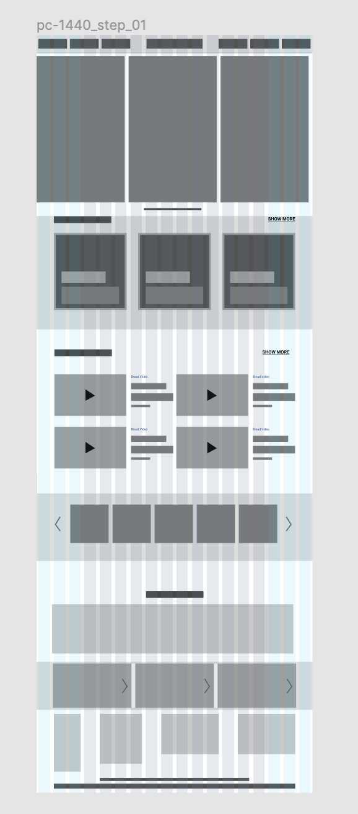
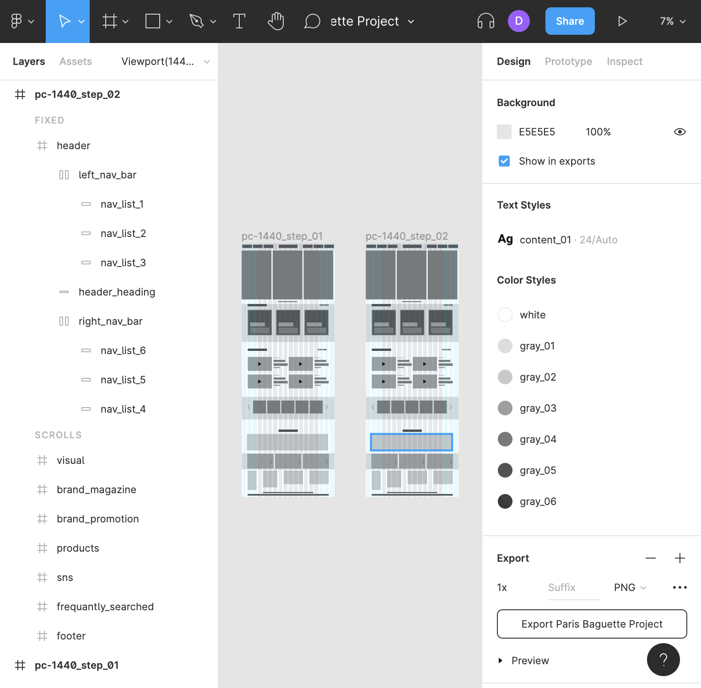
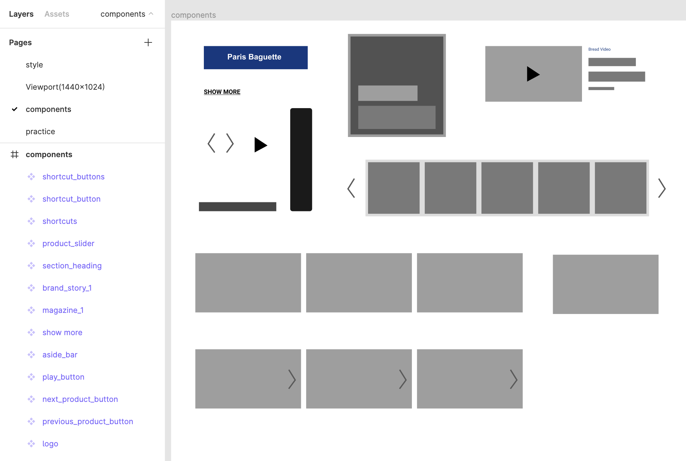

# TIL 
<!-- 
- [x] Figma 단축키 익히기    
👉 [참고파일](https://github.com/ekfka4863/figma/blob/master/theMeatOfFigma.md)  
- [x] Continuing Figma 활용하여 레이아웃 제작     
  👉  프로토타입 제작
 
 

     

 

- [x] Continuing Figma 활용하여 레이아웃 제작        
  👉 프로토타입 실제 코딩하는 것처럼      
  👉  자주쓰는 컬러 변수선언처럼 저장

    

 

- [x] Continuing Figma 활용하여 레이아웃 제작       
  👉  중복되는 component들 따로 페이지로 빼서 작성 

    

 

(cf. [피그마애서 프로토타입 보기](https://www.figma.com/file/31g4ulF7oBmZcvT0GnKp9p/Paris-Baguette-Project?node-id=9%3A4))

 
 

## HW
- [x] 내가 다시 리뉴얼 하고자 하는 웹페이지를 스케치할 수 있게 5개 ~~정도~~의 참고 사이트 리스트업        

(cf. 하단 `CLICK ME` 참고!) → 참고해서 스케치해오기 

---

CLICK ME!
  

- cf.  
  - https://www.foodnews.news/news/article.html?no=214445
  - http://www.tarrtarr.com/user/board/lists/board_cd/2010
  - https://www.sungsimdangmall.co.kr/
  - http://www.krispykreme.co.kr/
  - http://www.dunkindonuts.co.kr/
  - http://pariscroissantorder.com/
  - http://www.hanscake.co.kr/#self
  - https://www.tlj.co.kr:7008/index.asp

</detials>

--- -->