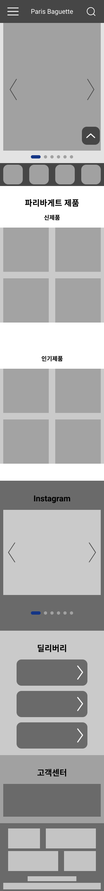
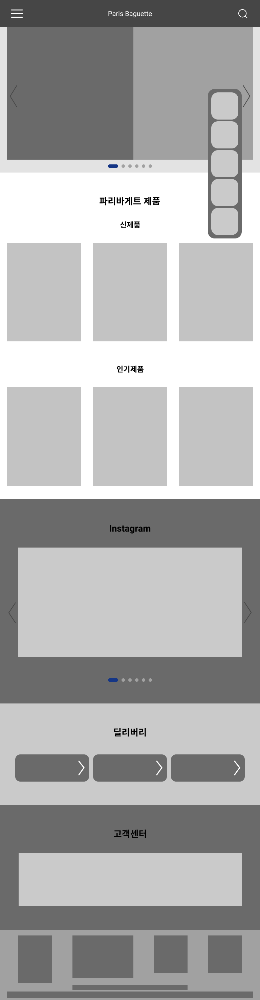
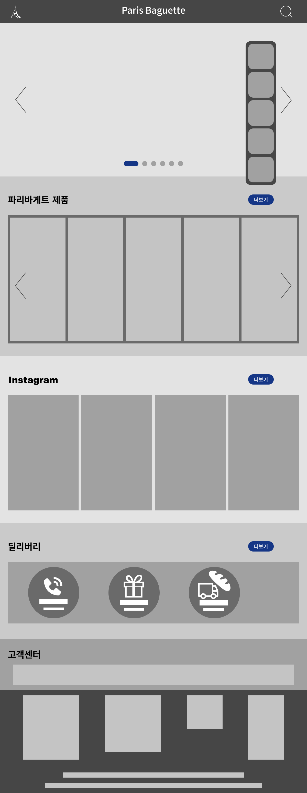
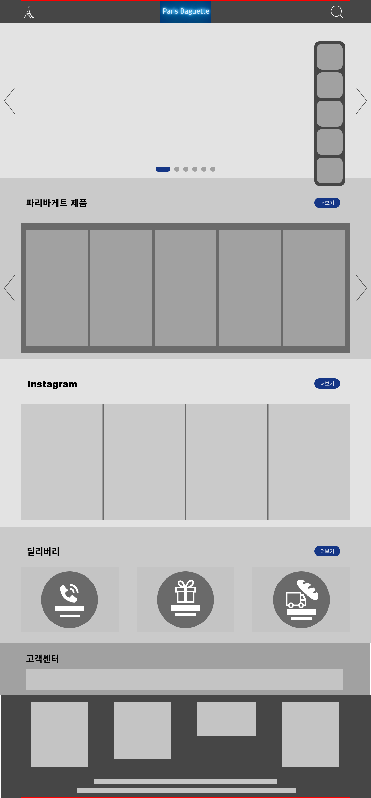

# TIL 

- [x] `device screen width`는 정말 다양하다.    
이런 [다양한 기기의 뷰포트 크기](https://screensiz.es/)에 맞춰서 [반응형으로 웹을 디자인](https://mediaqueri.es/) 하기 위해서는 연습이 필요하다.    
~~(cf. 하단 이미지 참고!)~~

- [x] Figma 사용해서 기존에 만든 `Paris Baguette redesigned한 버전`을 반응형웹으로 만들 것을 고려하여 `320, 768, 1200, 1440, 1920px`로 width를 각기 다르게 설정하여 프로토타입을 4-5개 만든다.        
~~(cf. 1920px은 가로 양 옆에 빈 공간이 넓어지는 것이기 때문에 별다른 변화를 주지 않아도 된다고 생각하면 1920px 프로토타입은 생략한다)~~

  
  

[**sketch**]

  

     

 

     

 

     

 
 

[**prototypes with PB's signiture color**]

  

     

 

     

 

     

 

     

 
 

## HW
- [x] Continue 반응형웹을 위한 프로토타입 제작 with Figma 

---

CLICK ME!
  

- cf.  
  - https://screensiz.es/
  - https://mediaqueri.es/

</detials>

---