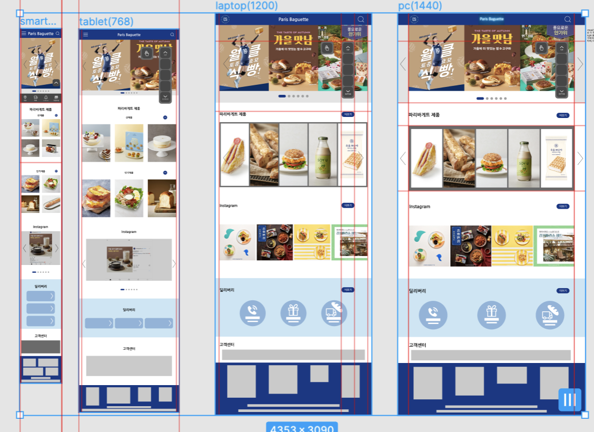

# TIL 

- [x] 📚 발표하는 날📖:   
  - 웹사이트 SWOT, 3C, 페르소나 기법 활용해서 조사 및 분석한 뒤, 이를 토대로 프로토타입을 완성 🔎
  - 웹사이트 선정 이유부터, 컨셉 도출, 변경사항 반영한 사이트 스케치 및 프로토타입 제작한 것 발표하기   
  - **선생님 피드백**: 
    - tablet부터 있는 `aside bar`은 너무 길어서 처음 홈페이지에 들어왔을 때 상당 부분을 가리게된다.       
      👉 누르거나 호버할 때 펼쳐지는 `aside bar`로 만들기! 
      

 
 

## HW
- [x] 내일부터 HTML 들어갈 예정:    
👉 HTML 기본 코드 쌤이 수업시간에 알려주신 노트 내용 찾아오기 
👉 `태그`란 무엇인가? 
👉 `속성`이란 무엇인가? 
👉 `id/class`는 무엇인가? 
