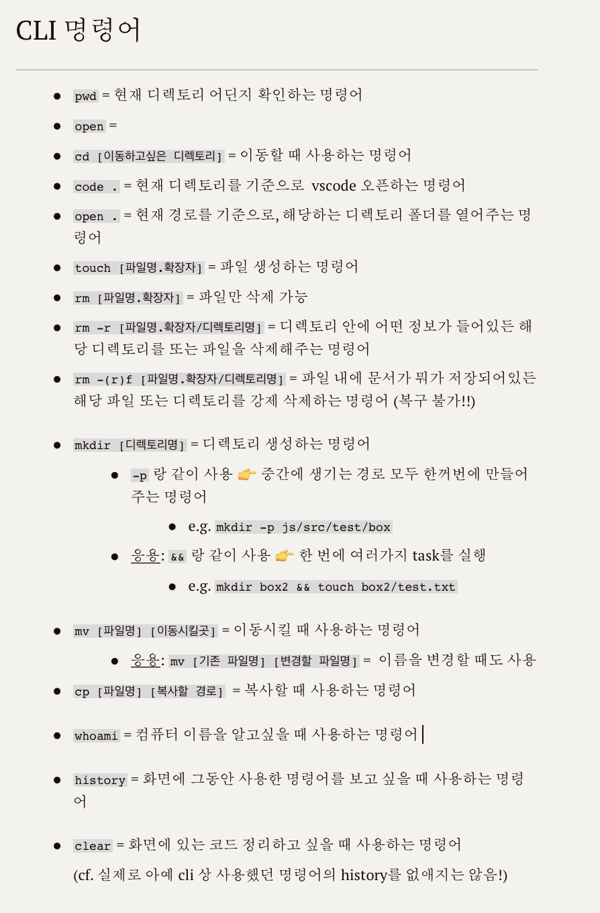

# TIL 
- 📚 어제 내용 복습  📖:    
  - html 기본 태그 공부
    - 제목: `h1 ~ h6`
    - 내용: `p, pre, q, blockquote, address`
    - 일부 내용 강조 표현: `strong, em, ins, del, mark, i`
    - 링크: `a`
    - 이미지: `img`
- 🔎 오늘 공부한 내용 🔍: 
  - `list`       
    👉 순서가 있는 것 (`ol > li`)      
    👉 순서가 없는 것 (`ul > li`)    
    👉 내용이 있는 것 (`dl > (dt + dd)`)
  - `id`와 `class 개념 
  - cli 명령어 추가 공부: 

  

  - **절대경로** vs **상대경로** 
    1. 절대경로: 최상단/변하지 않는 위치에서부터 처리하는 기능 
    2. 상대경로: 사용하고 있는 문서를 기준으로 위치를 찾아가는 기능   
    (cf. 현재 폴터의 상위 폴더의 상위 폴더에 있는 파일을 찾을 때...)
- 무료 웹사이트 배포 사이트 [vercel](https://vercel.com/dashboard) 사용방법 
- css 관련: 
  - `display` 속성     
  👉 `block; inline; inline-block; none`
  - 기본적으로 `display: inline-block;` 인 요소    
  👉 `img, button, input, select, textarea`
  - 선택자     
   👉 하나의 요소를 선택하여 css를 적용: `타입/요소 선택자` 
   👉 **요소 (스페이스) 요소** 선택하여 css 적용: `자손(후손) 선택자`     
   👉 자식 요소를 의미하는 **요소 > 요소** 는 `자식 선택자`     
   📍📍 더 많은 정보는 [관련 TIL](https://github.com/ekfka4863/TIL/blob/master/CSS%26SASS%26Bootstrap/CSS/CSS_Selectors.md) 참고! 📍📍 

- 📌 Tip! 
  - css에서 주석은 `/* */`인데, 앞부분에 `*(asterisk)`를 두 번 붙이면 ~~실제 코드가 아닌~~ **설명을 위한 주석** 이란 뜻으로 통용된다.

 
 

## HW
- [x] 선생님이 주신 html & css 관련 pdf 파일     
👉 [html_01_practices.pdf](https://github.com/ekfka4863/frontEndCource_210901/blob/main/source/html_01_practices.pdf) 최소 5문항까지 풀어오기! 
- [x] css 에서 거의 짝처럼 다니는 `float`와 `clear: both;` search 해보기 🔍

 

---

CLICK ME!
  

- cf.  
  - https://github.com/ekfka4863/TIL/blob/master/CSS%26SASS%26Bootstrap/CSS/CSS_Selectors.md
  - https://developer.mozilla.org/ko/docs/Web/CSS/display
  - https://developer.mozilla.org/ko/docs/Web/CSS/CSS_Selectors
  - https://www.w3schools.com/cssref/css_selectors.asp

</detials>  

