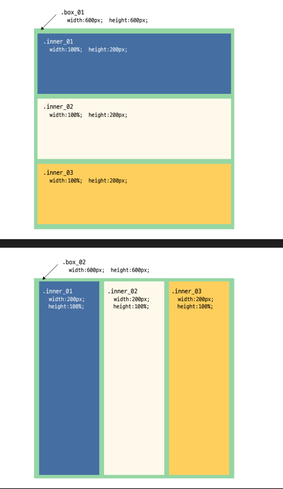
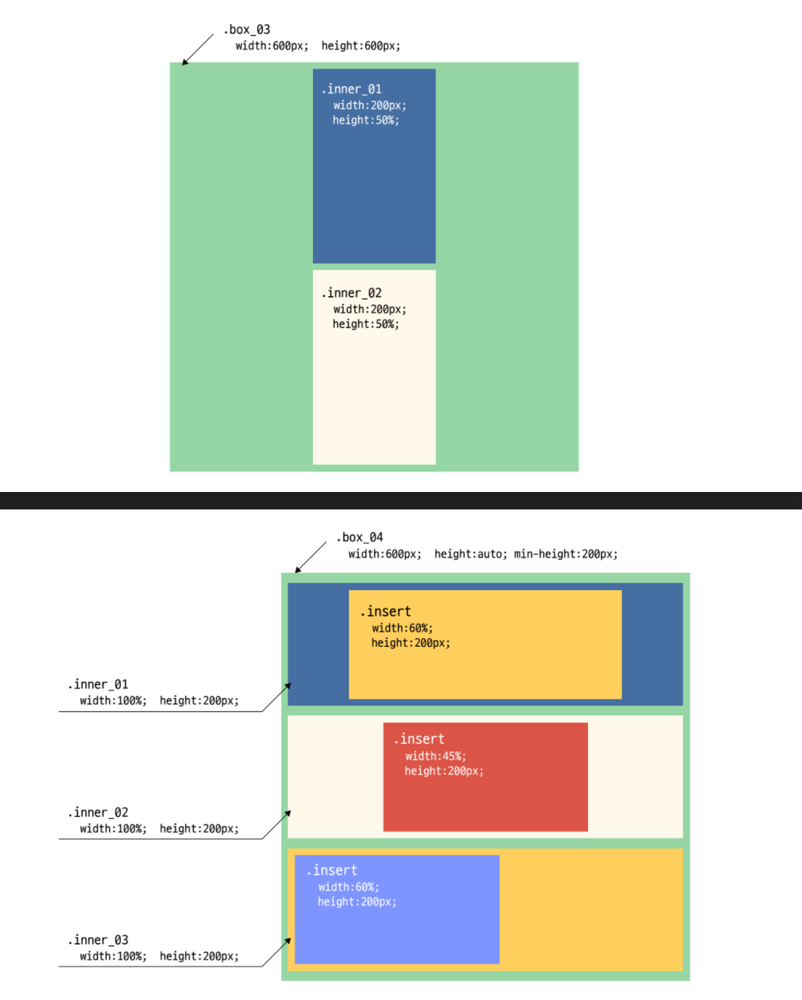
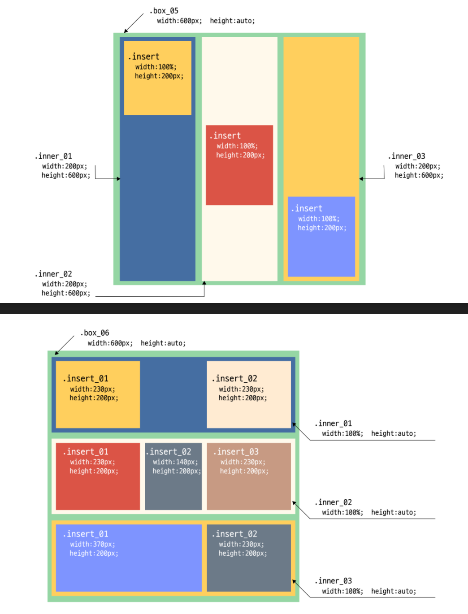

# TIL 
- 📝 복습 ✏️ : 
  - [x] `id`/`class`의 역할 
  - [x] 'CSS'(Cascading Style Sheets):      
  👉 HTML 문서에 있는 요소들을 선택하여 스타일을 적용하는데 사용한다.      
  👉글씨의 색상, 태그의 크기, 이미지 적용, 위치 설정 등을 가능케한다. 
  - [x] `table`   
  👉 **table, caption, thead, tbody, tfoot, tr, th, td**
  👉 `border-spacing` : 선과 선의 간격을 주는 css 속성  
  👉 `border-collapse`: 선의 간격형태를 처리하는 것 (table에서만 사용하는 border 속성이다)
  ```css
    table, tr, th, td {
      border-spacing: 0;          /* 따로 단위는 없음 */
      border-collapse: collapse;
    }
  ```     
  - [x] `CSS Selectors`: HTML 요소에 필요한 디자인을 처리할 수 있도록 선택하는 것 (cf. CSS 선택자)
  ```html
      <h1></h1>                                      <!-- 선택자: h1 {}-->
      <div></div>                                     <!-- 선택자: div {} -->
      <p id="box"></p>                                 <!-- 선택자: #box {} -->
      <div class="box"></div>                           <!-- 선택자: .box {} -->
      <div class="box"></div>                           <!-- 선택자: div.box {} -->
      <div class="box other more"></div>                 <!-- 선택자: .box {}   .other{}   .more{} -> 셋다 전부 okay! -->
      <div id="idBox"></div>                              <!-- 선택자: #idBox {} -->


 
      <ul>
        <li>
          <a href="#">link</a>
          <div><a href="#">link2</a></div>
        </li>
      </ul>

       <!-- 
        css selectors

        ul > li > a { }
        ul li a { }
        ul li > div > a { }
        ul li div a { }
      -->
  ```

<br />

- 📚 오늘 배울 내용 🔍:     
  - [x] `pseudo class` 그리고 `pseudo element`:     
  **가상의 코드**로써, 수행될 인간의 언어로 간략히 설명해 놓은 것이다.     
  아래와 같은 상황에 적용할 수 있다.    
    - 마우스 버튼을 올렸을 경우 👉 `:hover`
    - 마우스 버튼을 누르고 있는 경우 👉 `:active`
    - a요소를 이용하여 페이지를 방문한 경우 👉 `:visited`
    - 초점을 맞추는 경우 👉 `:focus` (_a, button, input_)
    - 첫글자/첫줄만 작업하는 경우 👉 `::first-letter`/`::first-line`
    - 요소의 앞에 존재하는 가상의 코드 👉 `::before`
    - 요소의 뒤에 존재하는 가상의 코드 👉 `::after`
  - [x] `float`과 `clear: both;`
    - **float**: _'뜨다'라는 의미를 가지고 있으며, block 요소 (~~~float은 강제로 블록요소로 만들어준다~~)로 옆으로 나열하는데 사용하는 기능이다_
    - **clear**: _float 으로 저치된 속성의 기능을 '해제'하기 위해 만들어진 속성이다_
    - 📍 <u>설명</u>:     
    블록요소는 인라인 요소처럼 나란히 나열이 안된다.     
    그래서 이런 성질의 블록을 나열하고 싶을 때 사용하는 것이 float이다.     
    float을 적용하면 해당 요소는 display: block; 이 되면서 나열할 수 있게 바뀐다.   
    단, float은 부유하는 성질이 있기 때문에 요소를 감싸고 있던 부모요소가 갖고 있던 부피가 자식 요소가 float 하기 시작하면서 그만큼 부피가 줄어들게 된다는 부작용이 있다.    
    예를 들어, 부모 요소가 height: auto; 로 되어있었다고 하고, 그 안에 있는 자식들이 적부 부유하고 있다고 하면 부모 요소는 사실상 그 높이값이 0이 되었다고 봐야한다.      
    이를 해결할 방법은?    
    바로 <u>clear: both;</u> 속성이다. clear: both; 를 하면 float을 상쇄시켜주는/부모요소의 부피가 주는 것을 막아주게 된다.           
    이런 **clear: both; 속성은 float을 적용한 형제요소, hr, div 등에 적용할 수 있다**.          
    또는 **부모요소에** `::after` **속성으로 가상 요소를 만들고 거기다가** `display: block; content: ''; clear: both;` **을 적용하면 똑같은 효과를 볼 수 있다.**
    📍  
  - [x] 크로스 브라우징 이슈 ~~해결~~/완화 방법     
  👉 [modernizr](https://modernizr.com/)    
  👉 과거에는 [IE hack](https://www.biew.co.kr/entry/CSS-%ED%95%B5hack-%EC%A0%95%EB%A6%AC)을 사용함.    
  위의 모더나이저를 사용하면 과거 사용했던 hack의 사용은 현저하게 줄어든다고 한다.   


<br /> 
<br />

## HW
- [x] 💻 `float`과 `clear: both;`를 활용하여 아래의 레이아웃 구현하기 ⌨️    

<br />
 
👉 [과제 pdf](https://github.com/ekfka4863/frontEndCource_210901/blob/main/source/14%EA%B0%95_layout_%EA%B8%B0%EB%B3%B8.pdf)



<br /> 



<br /> 



<br /> 
<br />

---

<details>
<summary>CLICK ME!</summary>  

- cf.  
  - https://modernizr.com/
  - https://webclub.tistory.com/256      
  (cf. 모더나이저란? 브라우저 간의 호환성을 유지시켜주는 모더나이저의 적용 방법)
  - https://stackoverflow.com/questions/6724515/what-is-the-purpose-of-the-html-no-js-class
  - https://goddino.tistory.com/66
  - [과제 pdf](https://github.com/ekfka4863/frontEndCource_210901/blob/main/source/14%EA%B0%95_layout_%EA%B8%B0%EB%B3%B8.pdf)

</detials>  


