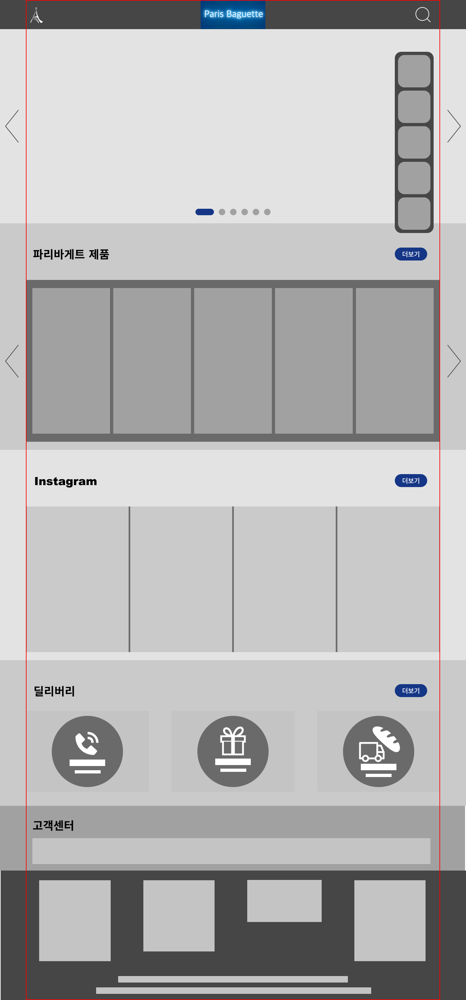
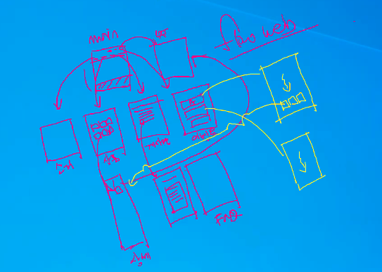
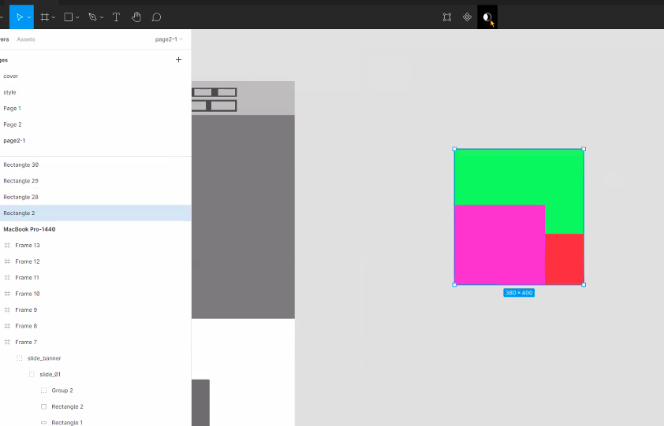
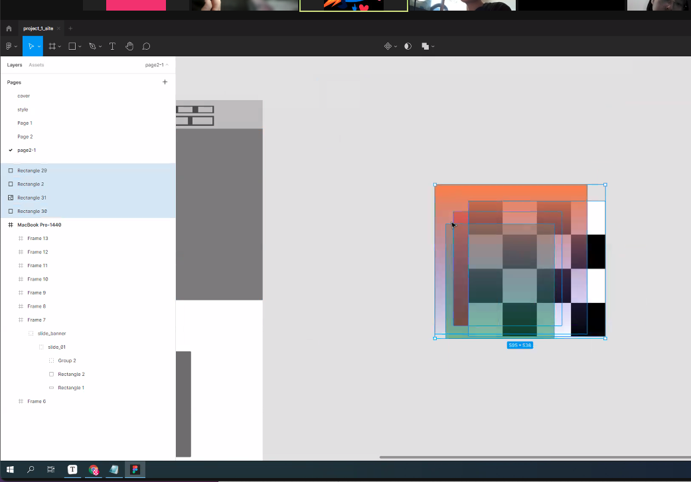

# TIL 

- [x] Figma 사용해서 기존에 만든 Paris Baguette `redesigned한 버전`으로 다시 만들어 보기    

     

 

- [x] 전체페이지 구조. ~~더 정확히는~~ 전체 웹사이트의 flowchart를 구상해 올 것! 
  👉 홈페이지를 들어가면 처음 보이는 페이지가 `메인 페이지`
  👉 메인페이지에서 클릭하고 타고 넘어가는 linked page들이 모여모여 `전체페이지 구성/구조`를 이룬다      
  (cf. 강사님이 설명해주신 자료 하단 이미지 참고!)   

    

 

- [x] Tip!     
  👉 Figma의 `clipping mask`는 **밥그릇과 같다**!  
  👉 밥그릇처럼 담고 싶은 것들을 위에 올리고, clipping mask를 적용시킬 component는 가장 밑에 가게 한다!    

    

 

    

 
 

## HW
- [x] 내가 다시 리뉴얼 하고자 하는 웹페이지를 스케치할 수 있게 5개 ~~정도~~의 참고 사이트 리스트업한 것 스케치하기 
- [x] 디바이스 뷰포트 크기에 따른 반응형 웹을 만들기 위해서는 어떤 조건이 필수적으로 고려돼야 하는지 알아보기 

---

CLICK ME!
  

- cf.  
  - https://www.mydevice.io/
  - https://seulbinim.github.io/WSA/media-query.html#media-query%EC%9D%98-%EC%A1%B0%EA%B1%B4%EC%8B%9D
  - https://developer.mozilla.org/ko/docs/Web/CSS/Media_Queries/Using_media_queries
  - https://skydoor2019.tistory.com/8
  - http://designbase.co.kr/webcoding-22/

</detials>

---