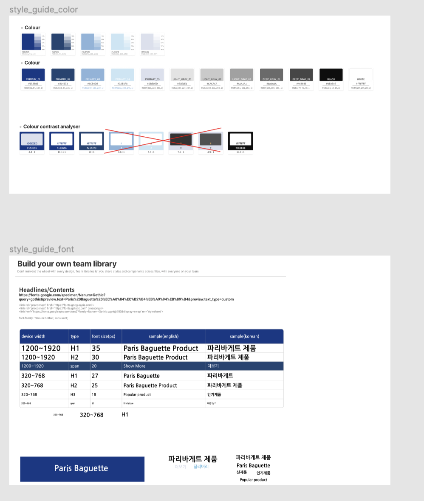
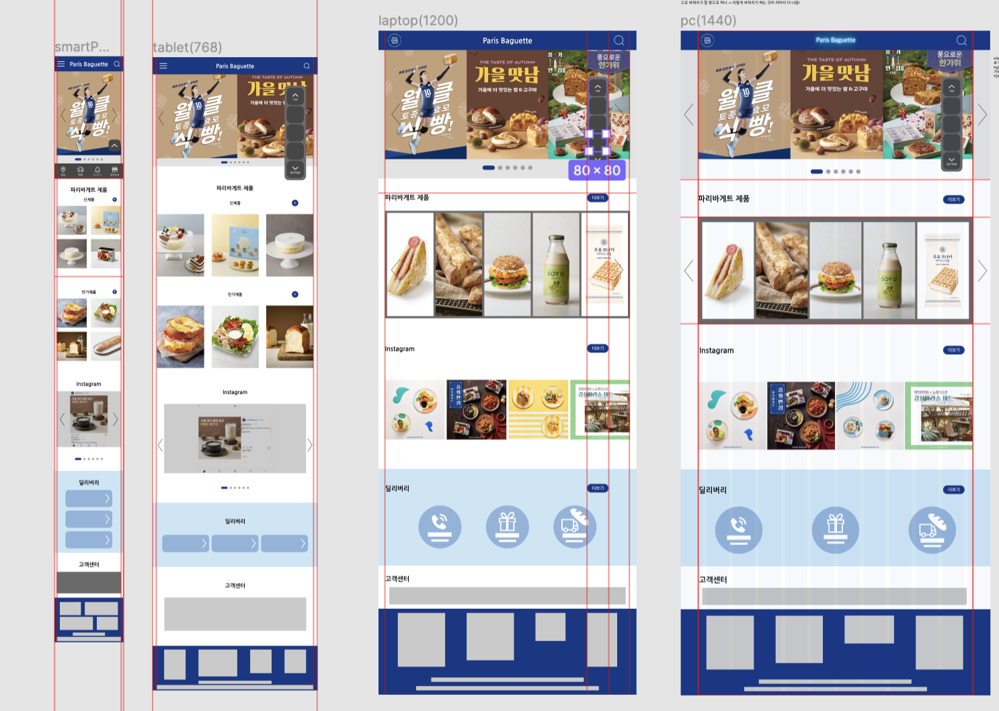

# TIL 

- [x] Figma 사용해서 기존에 만든 `Paris Baguette redesigned한 버전`을 반응형웹으로 만들 것을 고려하여 `320, 768, 1200, 1440, 1920px`로 width를 각기 다르게 설정하여 프로토타입을 4-5개 만든다.     
그리고 그 안에 사용할 색상과 폰트 스타일을 따로 `style page`에 정리한다;

 

     

 

- [x] 각 프로토타입에 이미지와 색상 및 굵직한 heading 텍스트 처리 

 

     

 
 

## HW
- [x] Continue`UI/UX 요구분석 ppt` 및 `UI/UX 콘셉트 기획 ppt` 작성 다하고 구글 드라이브에 올리기 
- [x] 월요일 발표 준비 😱😱😱

<!-- ---

CLICK ME!
  

- cf.  
  - https://screensiz.es/
  - https://mediaqueri.es/

</detials> -->

