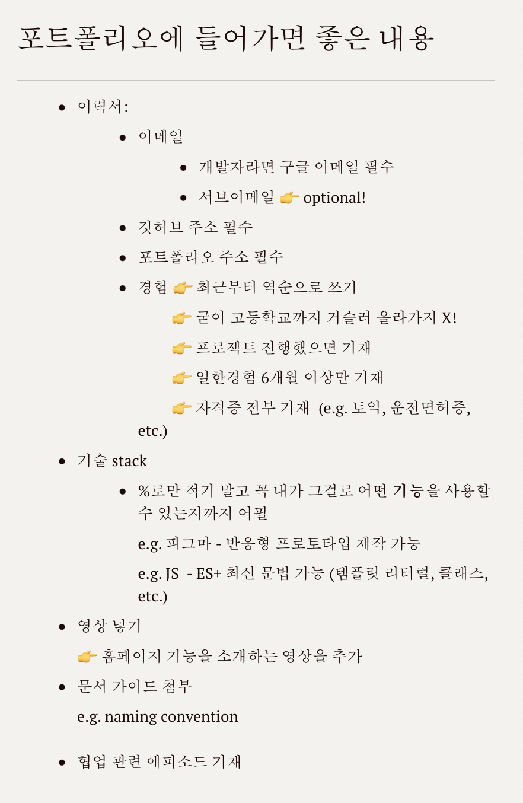
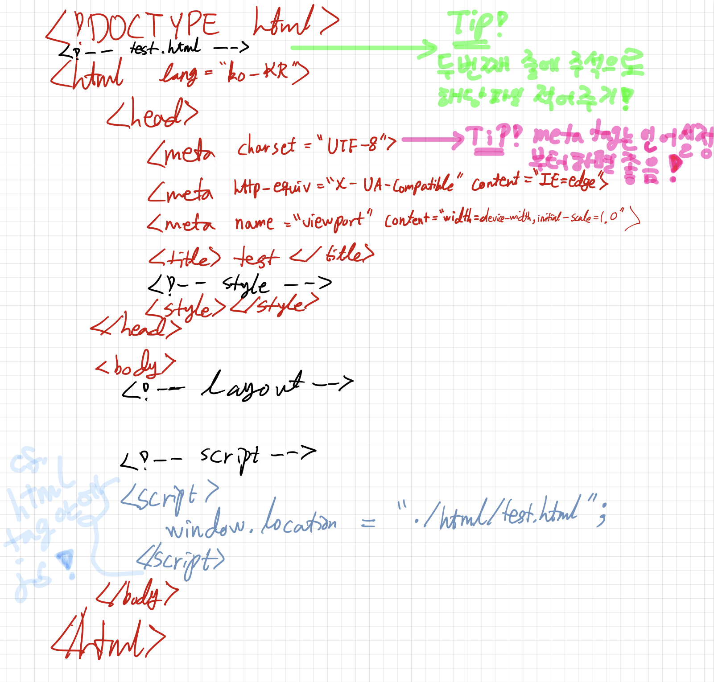

# TIL 
- 🙌 어제 시험본 내용 피드백 🙌:     
  - 로고 사용 규정이 없다면 굳이 같은 업계의 로고 규정을 찾아볼 필요는 없다.    
  e.g. AP 통신 로고 사용 규정, 병원 등의 구체적으로 잘 작성된 로고 규정을 참고하면 된다.
  - 자료 매트릭스 분석시 키워드는 최소 20, 권장은 50개 이상이다.
  - 디바이스 크기를 언급할 때는 `px`단위도 잊지말고 언급한다.
- `웹표준`이란?
  - 웹의 측면을 서술하고 정의하는 공식 표준으로 다른 기술 규격을 가리키는 일반적이 용어이다.    
  최근에 이 용어는 웹 사이트를 작성하는데 중요도가 높아지고 있으며 웹 디자인, 개발과 관계가 있다. 
- `웹접근성`이란? 
  - WWWW(World Wide Web)창시자 **팁버너스**리는 웹이란, ~~장애에 구애없이~~ 모든 사람들이 손쉽게 정보를 공유할 수 있는 공간이다고 정의한다.
  - 접근성이란 ~~장애인뿐 아니라~~ 모든 사람이 정보통신 기기나 서비스를 손쉽게 활용할 수 있도록 만드는 것이다. 

- keyboard 특수문자 영문이름과 한글이름 및 별칭     
👉 [참고 사이트](https://mainia.tistory.com/1523) 클릭! 

- `표기법`  

 

- 포트폴리오에 들어가면 좋은 내용:    

 

- cli 명령어로 vscode에 해당 디렉토리 파일 열기    

 

## HW
- [x] html 파일의 기본 골격 vscode 없이 손코딩으로 연습하기    

 

- [x] html 태그 `inline`요소인지 `block`요소인지 대강 읽어보기      
👉 [참고 사이트](https://htmlreference.io/) 클릭!    
👉 권장 사항: `inline`요소는 `block`요소에 감싸라!    
👉 반대로 `inline`요소 안에 `block`요소가 들어갈 수 있는가?    
기본적으로 **아니요**!    
(cf. 몇몇의 예외를 제외하고는...      
e.g. `a` 태그가 div를 감싸는 것과 같이...)     
👉 다시...     

  inline 안에 inline 가능!  
  block 안에 inline 가능!  
  inline 안에 block 요소는 <storng>basically NOOOO</storng>!

 
 

---

CLICK ME!
  

- cf.  
  - https://seulbinim.github.io/WSA/standards.html#%EC%9B%B9%ED%91%9C%EC%A4%80-%EA%B4%80%EB%A0%A8-%EA%B8%B0%EC%88%A0%EC%9D%98-%EC%86%8C%EA%B0%9C    
  - https://mainia.tistory.com/1523
  - https://velog.io/@fstone/CLI-%EA%B0%9C%EB%85%90-%EB%B0%8F-%EB%AA%85%EB%A0%B9%EC%96%B4-%EC%A0%95%EB%A6%AC
  - https://htmlreference.io/

</detials> 