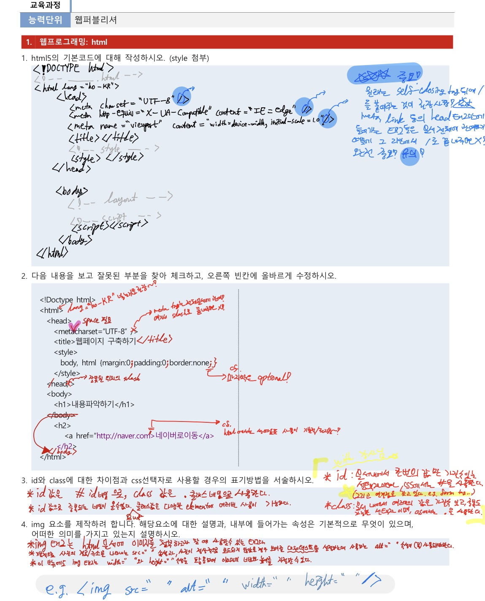
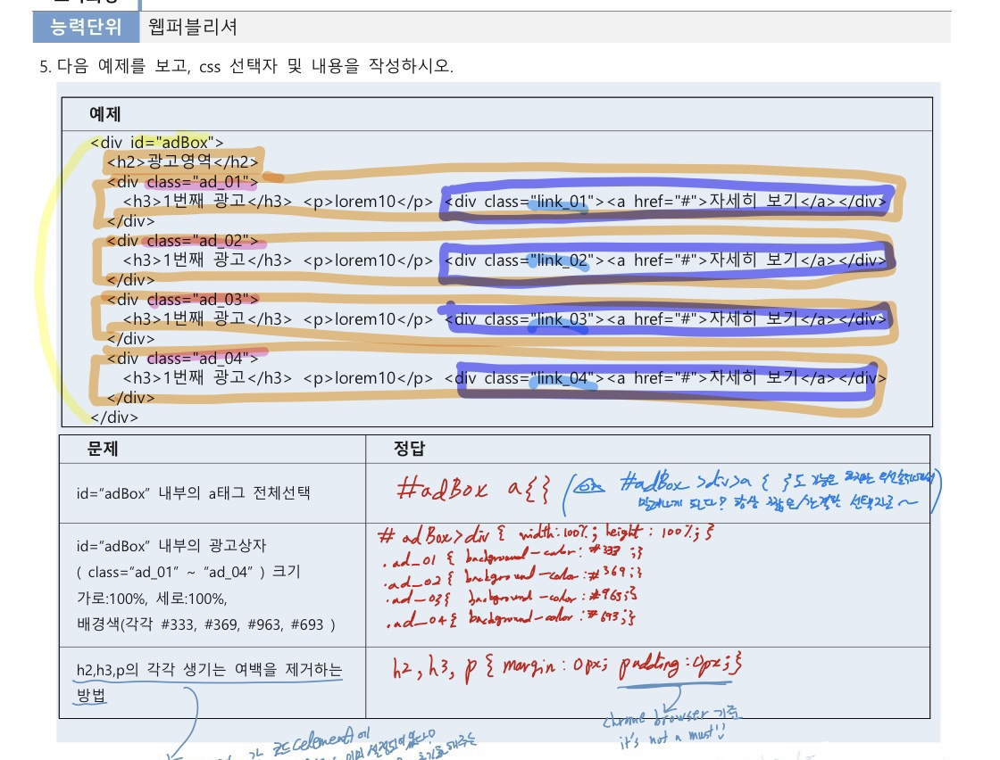
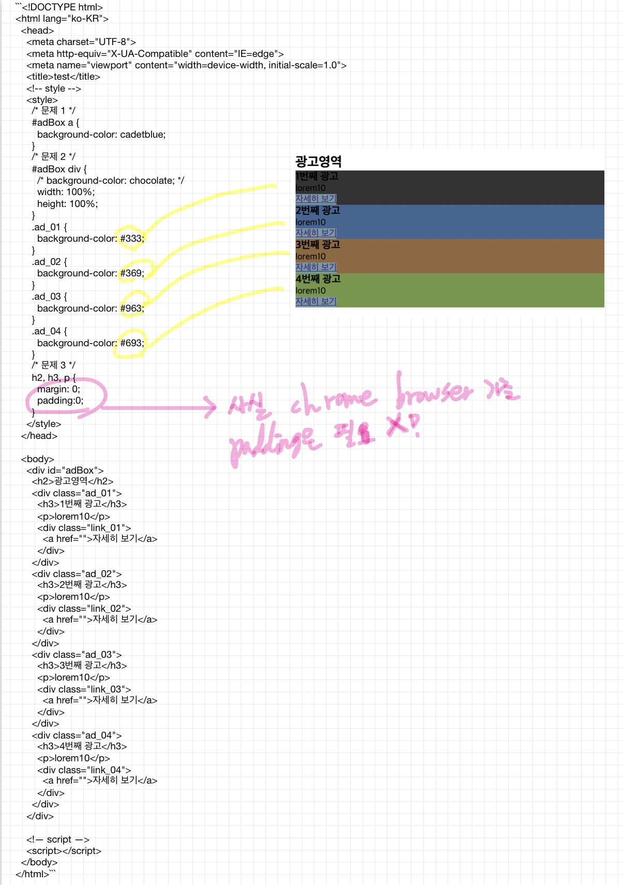

---

date: 2021-09-16-Thursday
[toc]

---

# TIL 
- 📚 어제 내용 복습  📖:    
  - continuing **html** 기본 태그 공부
    - `list`       
    👉 순서가 있는 것 (`ol > li`)      
    👉 순서가 없는 것 (`ul > li`)    
    👉 내용이 있는 것 (`dl > (dt + dd)`)
    - `id`와 `class 개념 
  - continuing **css** 공부
    - `선택자(css selectors)`       
    👉 모든 선택자 (`*`)      
    👉 타입 선택자 (`요소이름`)    
    👉 id 선택자 (`#아이디네임`)     
    👉 class 선택자 (`#클래스네임`)    
    👉 자손 (`요소 요소`)    
    👉 자식 (`요소 > 요소`)     
    👉 사이즈 (`width, height`), 색상처리 (`background-color, color, border-color`)

<br /> 
  
- 오늘 공부한 내용 🔍: 
  - 공간:            
    - 여백 - 시각적 공간 (`margin`)      
    - 여백 - it's like 내장지방 (`padding`)    
  - 테두리    
    - 테두리 R 값 (`border-radius`)    
    - 상자의 그림자 (`box-shadow`)
  - 📍📍 파비콘 📍📍  
    - link 태그로 설정      
    ```Html 
    <link rel="shortcut icon" href="../favicon.png" type="image/png">
    <link rel="apple-touch-icon" href="../favicon.png">
    ```
  - 📍📍 `table` 태그 📍📍:
   - 테이블 안에 제목으로 사용되는 `<caption></caption>` 태그는 table 태그 안에 있음에도 불구하고 브라우저에서는 마치 table 태그 밖에 있는 것처럼 보인다. 
   - table 태그에는 `summary` 속성으로 테이블에 대한 설명을 넣어줄 수 있다.    
   하지만 summary는 HTML5로 들어와서 deprecated 되었다.    
   그럼에도 불구하고 아직 summary 속성을 사용하는 것은 접근성 측면에서 고려했기 때문!!    
   [ARIA](https://developer.mozilla.org/ko/docs/Web/Accessibility/ARIA/forms/Basic_form_hints)를 사용하는 방법도 있지만 구형 브라우저에서는 지원 안되는 경우가 아직은 많다!       
   ~~그래서 업계에서는 아직 summary 속성을 많이 사용하는 중~!~~       
   - 과거에는 테이블 태그로 웹 레이아웃을 짜곤 했었다.     
   하지만 현재 **테이블 태그를 사용하면 코드가 많아짐에 따라 코드가 너무 복잡해지고, 접근성도 지키기 굉장히 어렵다**.    
   ~~(cf. 달력은 테이블 태그를 사용하여 만들면 좋을 것 같지만 리스트 태그를 사용한다.     
   왜? 테이블 태그를 사용하면 접근성을 지키기 어려워지니까!)~~
   - table 태그 관련 태그들은 **`border`와 관련된 속성들이 적용 X**!!!!
   - `<colgroup></colgroup>`과 `<col></col>`은 사용 안해도 됨!    
   Passsssssss~!!
   
   <br />

  - `하이퍼링크` vs `마이크로 링크`
    - **하이퍼링크**: 페이지 이동을 하는 하이퍼링크     
    👉 페이지의 주소를 연결해서 (`a`)
    - **마이크로 링크**: 페이지 내부에서 위치를 찾아가게 하는 마이크로 링크    
    👉 id 속성의 값을 연결해서  (`a` + `#idName`)
  - `entity code`를 사용하는 이유와 [참고 사이트](https://alonehistory.tistory.com/12)          

<br /> 

- 선생님이 주신 html & css 관련 pdf 파일 5번까지 reviewing done 😊   


<br /> 


<br /> 




<br /> 
<br />

## HW
- [x] css 에서 거의 짝처럼 다니는 `float`와 `clear: both;` search 해보기 🔍 

<br />

---

<details>
<summary>CLICK ME!</summary>  

- cf.  
  - https://coding-factory.tistory.com/184
  - https://htmlreference.io/
  - https://aboooks.tistory.com/59
  - https://blog.daum.net/janustop/71

</detials>  


