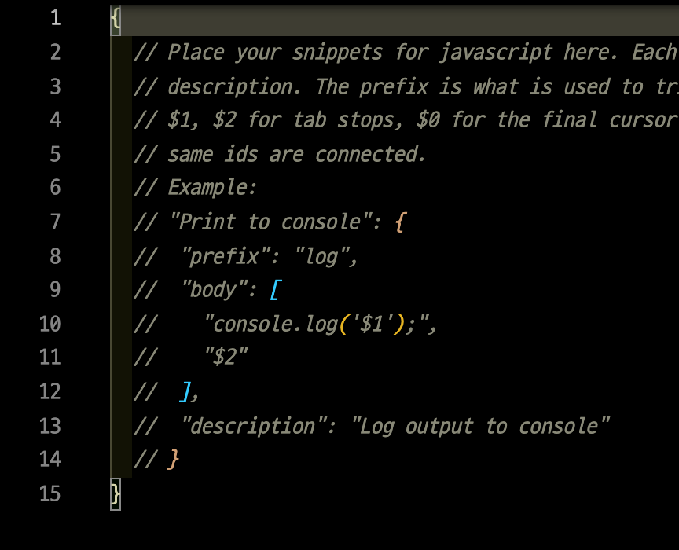
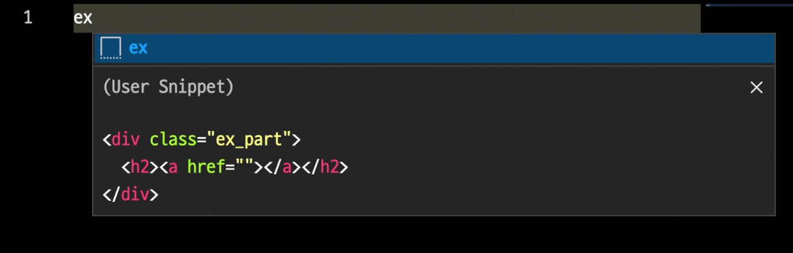

# TIL 
- 📝 오늘 배운 내용 ✏️ : 
  - [x] [추석 연휴 레이아웃 숙제 - 선생님 같이 reviewing](https://github.com/ekfka4863/frontEndCource_210901/tree/main/code/HW/%EC%B6%94%EC%84%9D%EA%B3%BC%EC%A0%9C/teacher's%20solution/layout_01) 
  - [x] [조건부 주석](https://github.com/ekfka4863/TIL/blob/master/HTML/ie_%EC%A1%B0%EA%B1%B4%EB%B6%80%EC%A3%BC%EC%84%9D.md)이란?     
  - [x] vscode에서 나만의 snippet 설정하기:      
    - (맥북기준) 상단의 `code` 👉 `preference` 👉 `user snippets`에 들어가서 **나만의 코드 블록이 작동되게 하고 싶은 파일 확장자를 선택**.     
    - 그럼 아래와 같이 snippets 설정 파일이 열린다;       
        
    - 위의 그림에서 설정하는 방법:    
      1. `prefix`:    
      단축어.     
      원하는 단축어를 지정된 파일 포맷에 등록하면 해당 확장자를 사용할 때마다 단축키로 아래 `body`부분에 지정한 코드 블록을 자동완성 시킨다.       
      2. `body`:       
      자동완성될 코드.      
      반드시 [이스케이프 문자](https://ko.wikipedia.org/wiki/%EC%9D%B4%EC%8A%A4%EC%BC%80%EC%9D%B4%ED%94%84_%EB%AC%B8%EC%9E%90)를 사용하여 만든 **문자열 배열**로 등록해야하며, 각 배열의 항목이 한줄의 코드가 된다.     
      만약 이스케이프 문자로 만드는데 어려움이 있다면 [코드를 문자열로 자동 완성시켜주는 사이트](https://snippet-generator.app/)의 도움을 받자! 강추!!             
      3. `description`:      
      단축어 입력시 노출될 설명문.     
      여기까지 완성하면 아래와 같이 사용 가능!      
              
  - [x] `margin`의 특이성 - [margin 상쇄 효과/ 더블 margin 효과](https://github.com/ekfka4863/TIL/blob/master/CSS%26SASS%26Bootstrap/CSS/CSS_margin_with_floated_elements.md):        
    👉 `float` 속성을 자식 요소에 적용 시키면 사실 원래는 부모 요소와 관련이 없어야 하는데, 만약 **자식 요소 중 첫째에게 마진을 적용하면 부모의** `border` **유무를 따진 뒤, 만약 border가 없으면 (cf. 부모 요소의 border: 0; 이면) 첫째 자식인 자기가 마진이 생기는 것이 아니라, 부모에 마진을 먹여버리는 현상이 생기고, 만약 부모에게 border가 있으면 첫번째 자식 요소는 혼자만 마진을 먹게 된다**.            
    👉 이런 현상 ~~(자식 요소에게 float을 적용 시켰는데 자식 중 첫째에게 margin을 적용하려고 했을 때, 부모의 border 유무를 따져, 만약 부모의 border가 0이면 첫째 자식 자신에게가 아니라 부모에게 마진을 적용시켜버리는 이런 현상)~~ 을 `더블 마진 효과/ 마진 상쇄 효과`라고 한다.       
    👉 또한 자식요소들에게 `float`을 적용 시켰을 때 특이점 하나가 더 있다.     
    기본적으로 형제 인접 요소들이 있으면 요소 a에 적용된 마진값이 요소 b에 적용된 마진값보다 작으면, 작은 값과 큰값 중 큰 값으로 적용되곤 한다.    
    하지만 `큰 마진값 + 작은 마진값`이 적용되는 경우가 있는데, 이는 float을 요소 a와 b에게 적용했을 때 그러하다.      
    👉 그래서... POINT!        
    `float`이 적용되면 margin이 적용될 때 유의 사항이 있음!     
    1. <u>부모요소가 border가 없으면 첫째 요소에게 갈 마진값은 부모에게 가게 된다</u>.       
    2. <u>float을 먹인 자식요소들은 서로의 마진값만큼 서로에게서 떨어지게 된다</u>.    
    

  
 

## HW
- [x] 💻 오늘부터 `온라인 콘텐츠 교과 강의` 듣기 시작 ⌨️    
- [x] 내일 배울 `border`와 `outline` 예습해오기 
  - **border**: 부피를 차지하는 외곽선      
  - **outline**: 보이지만 부피를 차지하지 않는 (다른 요소에 영향이 없는) 외곽선     
  (cf. 다른 요소에 영향을 주지 않기 때문에 tab 키를 눌러서 지금 focus가 어디에 가있는지 알려주는 용도로 활용되곤 한다.)     

  
 

---

CLICK ME!
  

- cf.  
  - https://webdir.tistory.com/451
  - https://code.visualstudio.com/docs/editor/userdefinedsnippets
  - https://snippet-generator.app/
  - https://jojoldu.tistory.com/491
  - https://singa-korean.tistory.com/44
  - https://velog.io/@raram2/CSS-마진-상쇄Margin-collapsing-원리-완벽-이해
  - https://webclub.tistory.com/26
  - https://blog.danggun.net/4276
  - https://www.codeit.kr/community/threads/2385
  - [과제 pdf](https://github.com/ekfka4863/frontEndCource_210901/blob/main/source/14%EA%B0%95_layout_%EA%B8%B0%EB%B3%B8.pdf)

</detials>  

