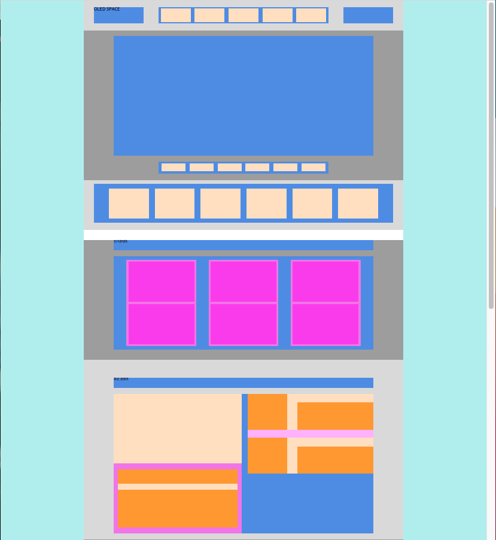

# TIL
- 📝 오늘 배운 내용 ✏️ : 
  - [x] [OLED SPACE 레이아웃 주말 과제 pdf](https://github.com/ekfka4863/frontEndCourse_210901/blob/main/src/layout_basic_%EA%B3%BC%EC%A0%9C.pdf) 선생님과 같이 reviewing - [선생님 코드](https://github.com/xidoWeb/smart_210901/tree/main/c_code/c_layout_01) 그리고 [내가 짠 코드](https://github.com/ekfka4863/frontEndCourse_210901/tree/main/code/HW/oled_space_assignment) 👍      
    - 하단 이미지 참고! 

  
   
  <br />

- `단위 환산` (cf. **16px, 12pt, 1em, 1rem**)   
  - [참고 사이트 1](https://www.dunplab.it/px-to-rem)
  - [참고 사이트 2](https://websemantics.uk/tools/font-size-conversion-pixel-point-em-rem-percent/)
  - 📍 <u>TIP</u> 📍         
  ```css 
    /* e.g. 18pt을 px로 변환할 때는? 
    pt의 기준치인 12pt로 나눈뒤 px의 기준치인 16px로 곱한다 */
    18 / 12 * 16 = 24px

    /* e.g. 18px을 rem으로 변환할 때는? 
    px의 기준치인 16px로 나눈다 */
    18 / 16 = 1.125rem

    /* e.g. 퍼센트 계산할 때는? 
    50은 300을 기준으로 몇 %인가?? */
    50 / 300 * 100  👉 vw/vh 계산할 때 필수! 
  ```   
- `float`과 `margin`이 만났을 때의 특이점      
👉 [margin 상쇄 효과/ 더블 margin 효과](https://github.com/ekfka4863/TIL/blob/master/CSS%26SASS%26Bootstrap/CSS/CSS_margin_with_floated_elements.md)

<br /> 
<br />

## HW
- [x] 💻 빽다방 반응형 웹사이트 프로토타입 figma로 완성하고, html/css 사용해서 1440px 기준으로 구현하기 ⌨️    

<br /> 
<br />

<!-- ---

<details>
<summary>CLICK ME!</summary>  

- cf.  
  -

</detials>   -->


