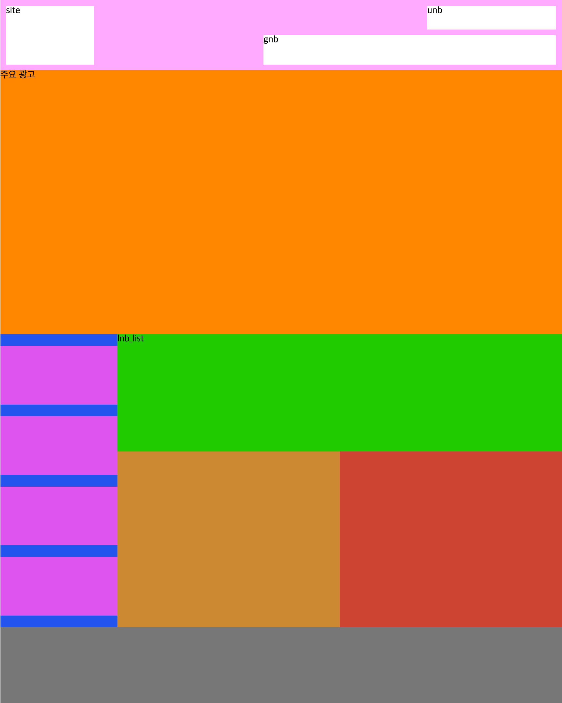
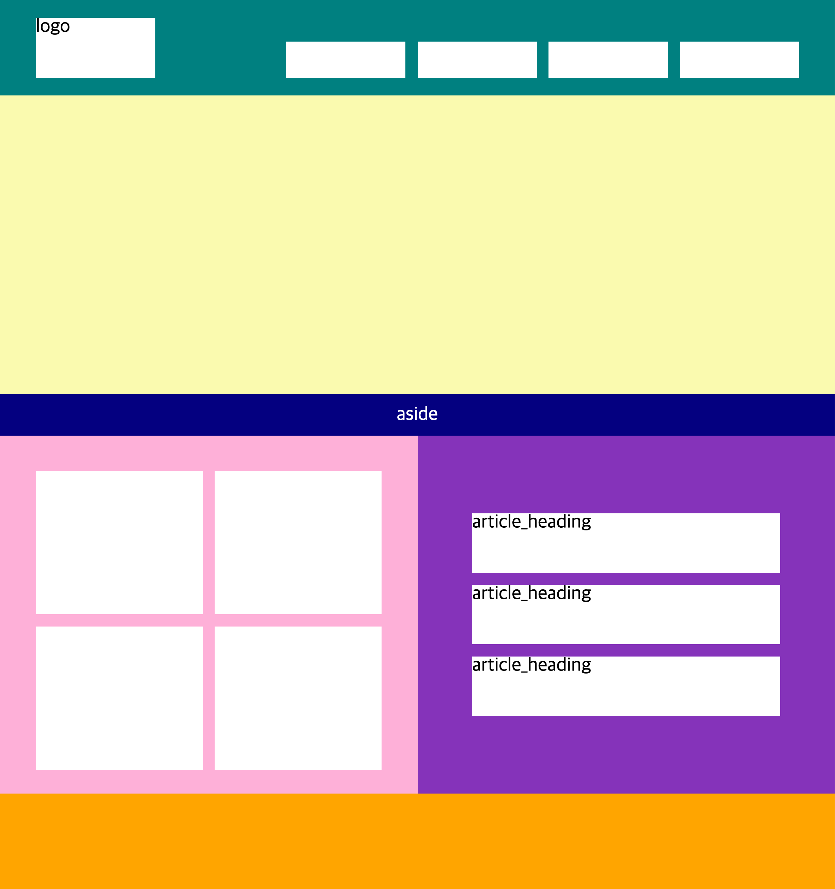
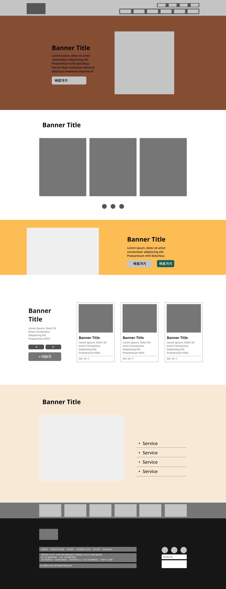
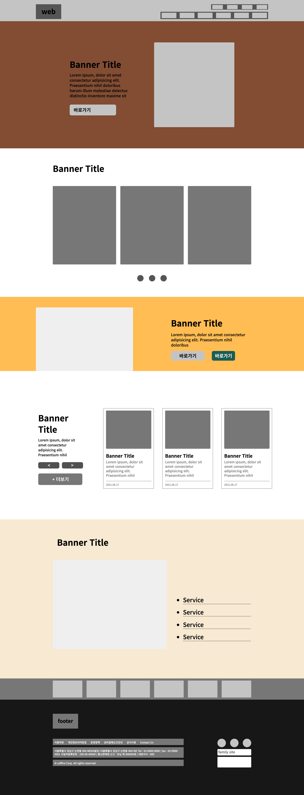

# TIL
- 📝 오늘 배운 내용 ✏️ : 
  - [x] 레이아웃 연습문제 1   
   
  
   

  - [x] 레이아웃 연습문제 2      
   
  
 

  
 

## HW
  - [x] 레이아웃 연습문제 3      
    - 만들어야 하는 레이아웃 ~~(cf. 하단 **첫 번째 이미지**)~~ 과 내가 구현한 레이아웃 ~~(cf. 하단 **두 번째 이미지**)~~        
      👉 [내가 구현한 레이아웃 HTML 코드](https://github.com/ekfka4863/frontEndCourse_210901/blob/main/test/test_3/html/test_3.html) & [CSS 코드](https://github.com/ekfka4863/frontEndCourse_210901/blob/main/test/test_3/css/test_3.css)

     
    
     
    <!--   -->
    
     
     

- [x] 💻 빽다방 반응형 웹사이트 프로토타입 figma로 완성하고, html/css 사용해서 1440px 기준으로 구현하기 ⌨️    

  
 

<!-- ---

CLICK ME!
  

- cf.  
  -

</detials>   -->

