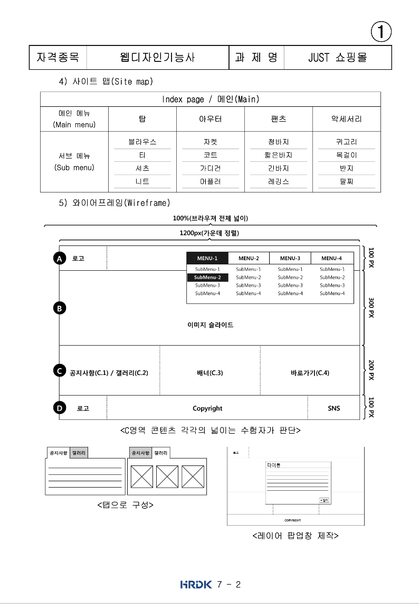

# TIL
- 📝 오늘 배운 내용 👊 : 
  - [x] `position` 속성과 `float` 속성 사용해서 [웹디자인기능사 출제문제](https://github.com/ekfka4863/frontEndCourse_210901/blob/main/test/test_5(%EC%9B%B9%EB%94%94%EC%9E%90%EC%9D%B8%EA%B8%B0%EB%8A%A5%EC%82%AC%EA%B8%B0%EC%B6%9C)/src/%EC%9B%B9%EB%94%94%EC%9E%90%EC%9D%B8%EA%B8%B0%EB%8A%A5%EC%82%AC_%EA%B8%B0%EC%B6%9C%EB%AC%B8%EC%A0%9C(2021%EB%85%84%EB%8F%84)/A-1.pdf) 풀어보기

   
  
   

 
 

## HW
- [x] 💻 position 속성 [레이아웃 연습문제](https://github.com/ekfka4863/frontEndCourse_210901/tree/main/test/test_4) 풀면서 복습하기 ⌨️    

   
  
   
   
  
   
   
 
- [x] 💻 빽다방 반응형 웹사이트 프로토타입 figma로 완성!!
  - [x] 이제 html로 1440px ~~(cf. 1280px 이상으로 렌더링 되게끔...)~~ 기준으로 뼈대 짜기 ⌨️    
  <!-- - [x] 이제 css로 스타일링 하기 ⌨️    -->

    
  
   
 

 

---

CLICK ME!
  

- cf.  
  - [웹디자인기능사 공개문제](https://www.q-net.or.kr/cst006.do?id=cst00602&gSite=Q&brdId=Q006&code=1204&artlSeq=5199079)
  
</detials>  

<!-- 
  
  
    -->