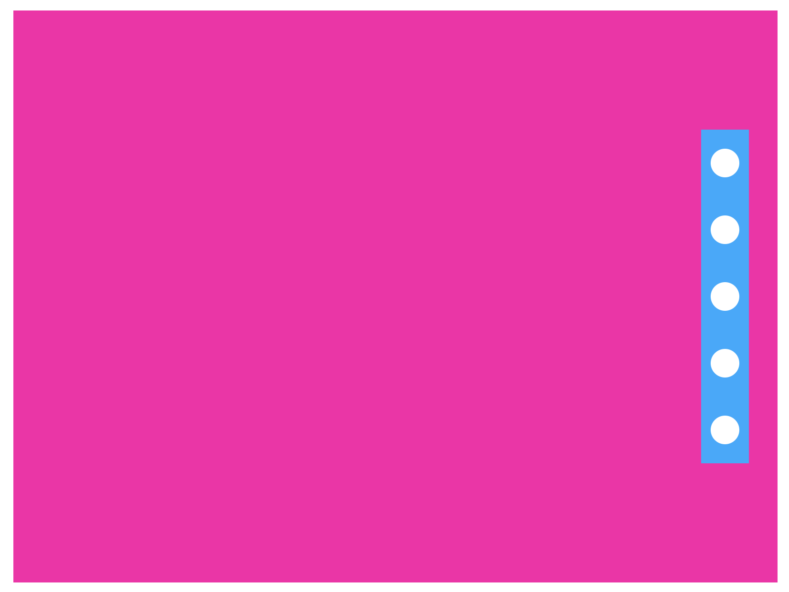
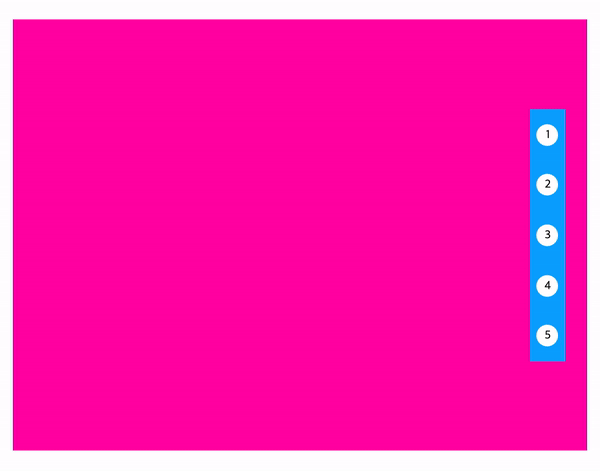
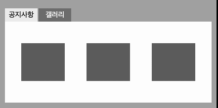
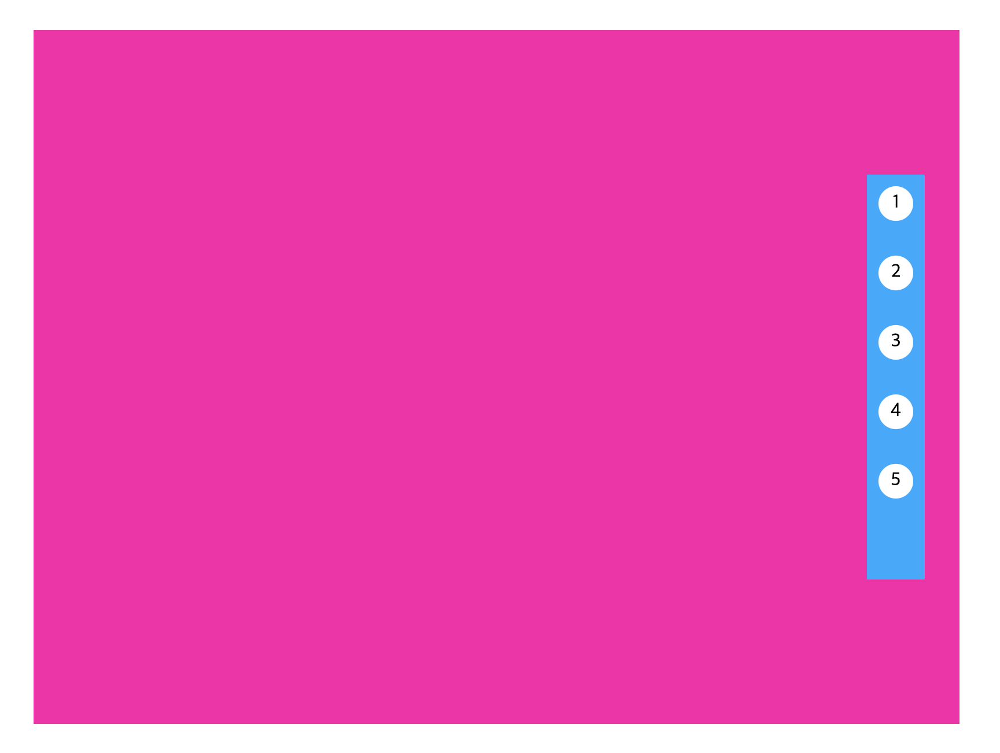
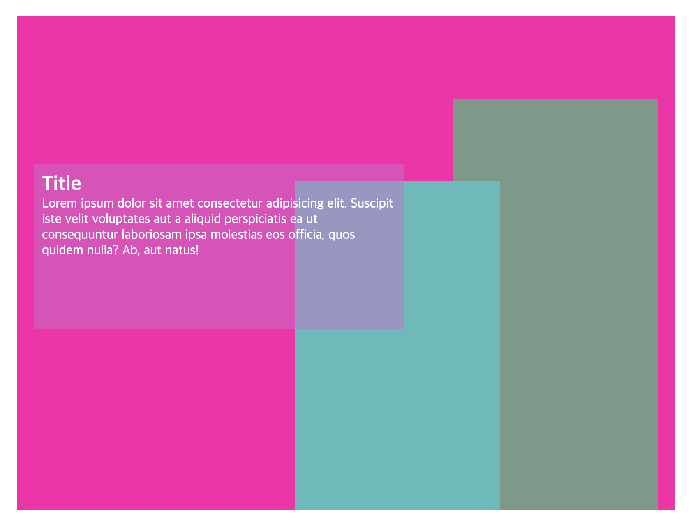

# TIL

> 📝 position 레이아웃 복습 ✏️ 

<br />

>> **가로/세로 기준 정 가운데로 요소를 옮기는 방법**

- <u>방법 1-1</u>: 
  - `(부모 높이(너비)값 - 현 요소 높이(너비)값) / 2` && `top/right/bottom/left로 얼마나 옮겨갈지 직접 계산`     
- <u>방법 1-2</u>: 
  - `% 사용하고 `top/right/bottom/left로 얼마나 옮겨갈지 직접 계산`     
- <u>방법 2</u>: 
  - `상황에 따라 top/right/bottom/left 중 가로, 세로 기준점 어딘가에서 50%씩 너비/높이값을 적용`    
  &&    
  `transform: translate(-50%, -50%); 사용`          
(cf. 아래 에시를 보면서 이해한다!) 

<br />

<br />


```html
<!-- 기본 HTML 구조 -> 아래의 css 방법 1-1, 1-2, 2 에 동일하게 적용된다 -->
  <div class="wrap">
    <div class="modal"></div>
  </div>
```   

```css
  /* 방법 1-1 소개 */

  .wrap {
    /* 아래 .modal에게 position을 적용했을 때. 그 기준점은 position: relative; 를 적용한 .wrap 이 된다. */
    position: relative;

    width: 800px;
    height: 600px;
    margin: 50px auto;
    background-color: #f0a;
  }

  .modal {
    position: absolute;

    /* 방법 1-1 */
    /* 부모 높이값 - 현 요소 높이값 = 450px을 나누기 2하면 225px */
    top: 225px;
    /* 부모 너비값 - 현 요소 너비값 = 300px 나누기 2하면 150px */
    left: 150px;

    width: 500px;
    height: 150px;
    background-color: #0af;
  }
```  

```css
  /* 방법 1-2 소개 */

  .wrap {
    position: relative;
    
    width: 800px;
    height: 600px;
    margin: 50px auto;

    /* 방법 1-2 */
    padding-top: 225px;
    box-sizing: border-box;
    /* 위에서 세로로 정렬했으면 아래에서는 가로로 정렬! 
    부모의 너비 800px - 자식의 너비 500px = 300px 이고, 여기서 반을 옆으로 옯겨야 하니까 총 150px 옮기기! */
    padding-left: 150px;

    background-color: #f0a;
  }

  .modal {
    position: absolute;

    /* 방법 1-2 */
    top: 50%;
    /* 부모 요소의 전체 높이가 600이고 현재 요소의 높이가 150이면 -> 450이 남는데, 여기서 절반을 내려와야 하니까 -> 총 2250px 내려와야지 세로로 가운데 정렬이 가능! */
    /* margin-top: 225px; */
    /* 단, 이 조건은 부모에게 border 가 있을 경우에만 사용 가능하다. 
      옵션 1: 부모에게 border를 1px solid #현재부모의색상; 으로 적용한다
      옵션 2: 아니면 margin-top 말고 그냥 부모의 padding-top과 box-sizing: border-box; 를 사용한다. 
    (cf. 여기서 결국 사용할 코드는 옵션 2이다. 위의 .wrap 스타일링 확인! )*/

    width: 500px;
    height: 150px;
    background-color: #0af;
  }
```

```css
  /* 방법 2 소개 */

  .wrap {
    position: relative;

    width: 800px;
    height: 600px;
    margin: 50px auto;
    background-color: #f0a;
  }

  .modal {
    position: absolute;

    /* 방법 2 */
    top: 50%;
    left: 50%;
    transform: translateX(-50%, -50%); 
      
    width: 500px;
    height: 150px;
    background-color: #0af;
  }
```
<br />
<br />


- 포지션으로 레이아웃 짜기 연습 문제 - 1 

<br />

<br />

<details style="padding-left: 40px;">
<summary>See More Code!!</summary>  

```html
  <div class="wrap">
    <div class="side_indicator">
      <ul>
        <li class="indicator"></li>
        <li class="indicator"></li>
        <li class="indicator"></li>
        <li class="indicator"></li>
        <li class="indicator"></li>
      </ul>
    </div>
  </div>
```

```css
.wrap {
  position: relative;

  width: 800px;
  height: 600px;
  margin: 50px auto;
  background-color: #f0a;
}
.side_indicator {
  position: absolute;
  top: 50%;
  right: 30px;
  transform: translate(0, -50%);

  padding: 10px;
  box-sizing: border-box;

  width: 50px;
  height: 350px;
  background-color: #0af;
}
.indicator {
  width: 30px;
  height: 30px;
  border-radius: 100%;
  margin-bottom: 40px;
  background-color: #fff;
}
.indicator:first-child {
  margin-top: 10px;
}
```
</details>

<br />

- 포지션으로 레이아웃 짜기 연습 문제 - 2 

<br />

<br />

<details style="padding-left: 40px;">
<summary>See More Code!!</summary>  

```html
<div class="wrap">
  <div class="side_indicator">
    <ul>
      <li class="indicator">
        <a href="#">1</a>
        <span>text</span>
      </li>
      <li class="indicator">
        <a href="#">2</a>
        <span>text</span>
      </li>
      <li class="indicator">
        <a href="#">3</a>
        <span>text</span>
      </li>
      <li class="indicator">
        <a href="#">4</a>
        <span>text</span>
      </li>
      <li class="indicator">
        <a href="#">5</a>
        <span>text</span>
      </li>
    </ul>
  </div>
</div>
```

```css
.wrap {
  position: relative;

  width: 800px;
  height: 600px;
  margin: 50px auto;
  background-color: #f0a;
}
.side_indicator {
  position: absolute;
  top: 50%;
  right: 30px;
  transform: translate(0, -50%);

  padding: 10px;
  box-sizing: border-box;

  width: 50px;
  height: 350px;
  background-color: #0af;
}
  .indicator {
    position: relative;
    /* width: 30px; */
    /* height: 30px; */
    width: 100%;
    height: 100%;
    margin-bottom: 40px;
  }
  .indicator:first-child {
    margin-top: 10px;
  } 
  .indicator:last-child {
    margin-bottom: 10px;
  } 

  .indicator a {
    display: block;
    width: 30px;
    height: 30px;
    text-align: center;
    line-height: 30px;
    border-radius: 100%;
    background-color: #fff;
    }
    
    .indicator span {
      display: none;
      
      position: absolute;
      top: 0;
      right: 50px;
      
      width: 200px;
      height: 40px;
      color: #fff;
      text-align: center;
      line-height: 40px;
      background-color: #06c;
    }
    .indicator a:hover + span {
      display: block;
    }
```
</details>

<br />

<!--  -->
<!--  -->
<!--  -->


- 포지션으로 레이아웃 짜기 연습 문제 - 3

<br />

<br />


<details style="padding-left: 40px;">
<summary>See More Code!!</summary>  

```html
```

```css
```
</details> 

<br />

- 포지션으로 레이아웃 짜기 연습 문제 - 4 

<br />

<br />

<details style="padding-left: 40px;">
<summary>See More Code!!</summary>  

```html
```

```css
```
</details> 


<!--  -->
<!--  -->
<!--  -->


- 📝 오늘 배운 내용 ✏️ : 
  - [x]


<br /> 
<br />

## HW
<!--   

## HW
- [x] 💻 빽다방 반응형 웹사이트 프로토타입 figma로 완성하고, html/css 사용해서 1440px 기준으로 구현하기 ⌨️    

<br /> 
<br /> -->

<!-- ---

<details>
<summary>CLICK ME!</summary>  

- cf.  
  -

</detials>   -->


<!--  <br />
  
  <br />
  ```html
  ```

  ```css
  ```
  <br />
  
  <br />
  ```html
  ```

  ```css
  ``` -->