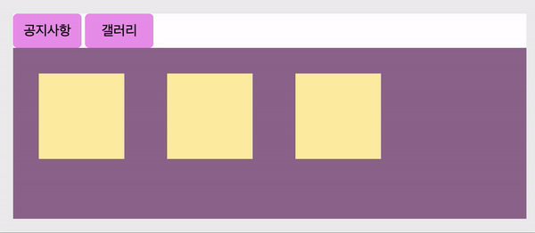
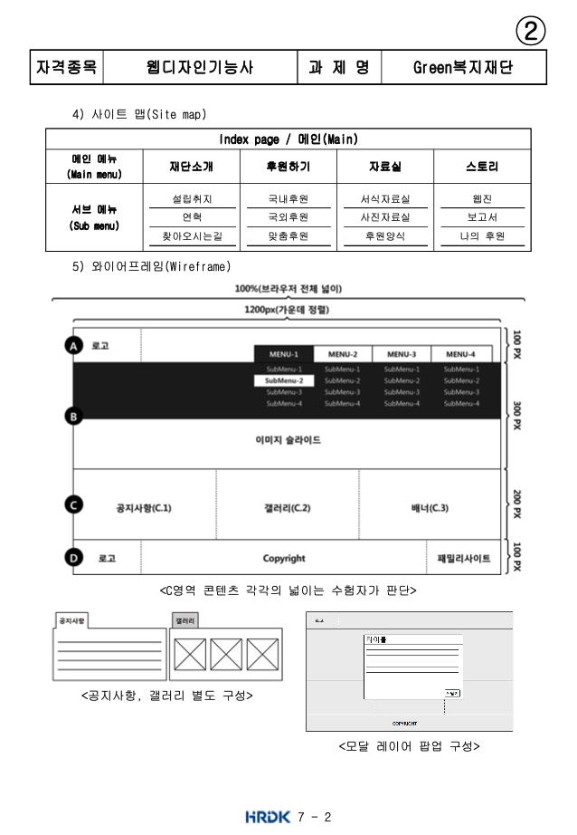
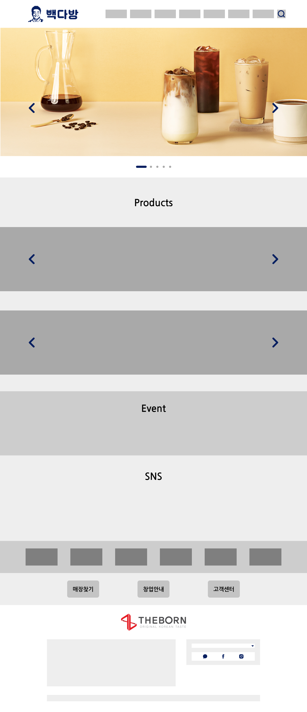

# TIL
> semantic 태그에서 유의사항
- 시멘틱 구조에서 웹페이지의 본문의 성격을 띄는 `article/section`의 형식은 내부에 다신 `header/article/section/nav/asdie/footer/...` 등을 포함시킬 수 있다.     
하지만 `header/nav/aside/footer`와 같이 **특정 위치나, 기능의 성향을 가지고 있는 요소는 내부에** `section/article`을 사용할 수 없다.       
(cf. 다만 header > nav 요소는 가능!)     
- 원칙적으로는 인라인 요소와 블록 요소를 나란히 형제요소로 나열하는 것은 그리 좋은 방법이 아니다.      
e.g.     
```html
  <!-- 아래보다는... -->
  <dl>
    <dt><a href="#">재단소개</a></dt>
    <dd>
      <a href="#">list_01</a>
      <a href="#">list_02</a>
      <a href="#">list_03</a>
      <a href="#">list_04</a>
    </dd>
  </dl>

  <!-- 아래의 코드가 바람직하다! -->
  <dl>
    <dt><a href="#">재단소개</a></dt>
    <dd><a href="#">list_01</a></dd>
    <dd><a href="#">list_02</a></dd>
    <dd><a href="#">list_03</a></dd>
    <dd><a href="#">list_04</a></dd>
  </dl>

  <!-- 또는 그냥 ... -->
  <div><a href="#">재단소개</a></div>
  <ul>
    <li><a href="#">list_01</a></li>
    <li><a href="#">list_02</a></li>
    <li><a href="#">list_03</a></li>
    <li><a href="#">list_04</a></li>
  </ul>
```

<br />
<br />

> 📝 position 레이아웃 복습 ✏️ 

<br />

>> **가로/세로 기준 정 가운데로 요소를 옮기는 방법**

- <u>방법 1-1</u>: 
  - `(부모 높이(너비)값 - 현 요소 높이(너비)값) / 2`     
  &&     
  `top/right/bottom/left로 얼마나 옮겨갈지 직접 계산`     
- <u>방법 1-2</u>: 
  - `% 사용하고 `top/right/bottom/left로 얼마나 옮겨갈지 직접 계산`     
- <u>방법 2</u>: 
  - `상황에 따라 top/right/bottom/left 중 가로, 세로 기준점 어딘가에서 50%씩 너비/높이값을 적용`    
  &&    
  `transform: translate(-50%, -50%); 사용`          
(cf. 아래 에시를 보면서 이해한다!) 

<br />

<br />


```html
<!-- 기본 HTML 구조 -> 아래의 css 방법 1-1, 1-2, 2 에 동일하게 적용된다 -->
  <div class="wrap">
    <div class="modal"></div>
  </div>
```   

```css
  /* 방법 1-1 소개 */

  .wrap {
    /* 아래 .modal에게 position을 적용했을 때. 그 기준점은 position: relative; 를 적용한 .wrap 이 된다. */
    position: relative;

    width: 800px;
    height: 600px;
    margin: 50px auto;
    background-color: #f0a;
  }

  .modal {
    position: absolute;

    /* 방법 1-1 */
    /* 부모 높이값 - 현 요소 높이값 = 450px을 나누기 2하면 225px */
    top: 225px;
    /* 부모 너비값 - 현 요소 너비값 = 300px 나누기 2하면 150px */
    left: 150px;

    width: 500px;
    height: 150px;
    background-color: #0af;
  }
```  

```css
  /* 방법 1-2 소개 */

  .wrap {
    position: relative;
    
    width: 800px;
    height: 600px;
    margin: 50px auto;

    /* 방법 1-2 */
    padding-top: 225px;
    box-sizing: border-box;
    /* 위에서 세로로 정렬했으면 아래에서는 가로로 정렬! 
    부모의 너비 800px - 자식의 너비 500px = 300px 이고, 여기서 반을 옆으로 옯겨야 하니까 총 150px 옮기기! */
    padding-left: 150px;

    background-color: #f0a;
  }

  .modal {
    position: absolute;

    /* 방법 1-2 */
    top: 50%;
    /* 부모 요소의 전체 높이가 600이고 현재 요소의 높이가 150이면 -> 450이 남는데, 여기서 절반을 내려와야 하니까 -> 총 2250px 내려와야지 세로로 가운데 정렬이 가능! */
    /* margin-top: 225px; */
    /* 단, 이 조건은 부모에게 border 가 있을 경우에만 사용 가능하다. 
      옵션 1: 부모에게 border를 1px solid #현재부모의색상; 으로 적용한다
      옵션 2: 아니면 margin-top 말고 그냥 부모의 padding-top과 box-sizing: border-box; 를 사용한다. 
    (cf. 여기서 결국 사용할 코드는 옵션 2이다. 위의 .wrap 스타일링 확인! )*/

    width: 500px;
    height: 150px;
    background-color: #0af;
  }
```

```css
  /* 방법 2 소개 */

  .wrap {
    position: relative;

    width: 800px;
    height: 600px;
    margin: 50px auto;
    background-color: #f0a;
  }

  .modal {
    position: absolute;

    /* 방법 2 */
    top: 50%;
    left: 50%;
    transform: translateX(-50%, -50%); 
      
    width: 500px;
    height: 150px;
    background-color: #0af;
  }
```
<br />
<br />


- 포지션으로 레이아웃 짜기 연습 문제 - 1 

<br />

<br />

<details style="padding-left: 40px;">
<summary>See More Code!!</summary>  

```html
  <div class="wrap">
    <div class="side_indicator">
      <ul>
        <li class="indicator"></li>
        <li class="indicator"></li>
        <li class="indicator"></li>
        <li class="indicator"></li>
        <li class="indicator"></li>
      </ul>
    </div>
  </div>
```

```css
.wrap {
  position: relative;

  width: 800px;
  height: 600px;
  margin: 50px auto;
  background-color: #f0a;
}
.side_indicator {
  position: absolute;
  top: 50%;
  right: 30px;
  transform: translate(0, -50%);

  padding: 10px;
  box-sizing: border-box;

  width: 50px;
  height: 350px;
  background-color: #0af;
}
.indicator {
  width: 30px;
  height: 30px;
  border-radius: 100%;
  margin-bottom: 40px;
  background-color: #fff;
}
.indicator:first-child {
  margin-top: 10px;
}
```
</details>

<br />

- 포지션으로 레이아웃 짜기 연습 문제 - 2 

<br />

<br />

<details style="padding-left: 40px;">
<summary>See More Code!!</summary>  

```html
<div class="wrap">
  <div class="side_indicator">
    <ul>
      <li class="indicator">
        <a href="#">1</a>
        <span>text</span>
      </li>
      <li class="indicator">
        <a href="#">2</a>
        <span>text</span>
      </li>
      <li class="indicator">
        <a href="#">3</a>
        <span>text</span>
      </li>
      <li class="indicator">
        <a href="#">4</a>
        <span>text</span>
      </li>
      <li class="indicator">
        <a href="#">5</a>
        <span>text</span>
      </li>
    </ul>
  </div>
</div>
```

```css
.wrap {
  position: relative;

  width: 800px;
  height: 600px;
  margin: 50px auto;
  background-color: #f0a;
}
.side_indicator {
  position: absolute;
  top: 50%;
  right: 30px;
  transform: translate(0, -50%);

  padding: 10px;
  box-sizing: border-box;

  width: 50px;
  height: 350px;
  background-color: #0af;
}
  .indicator {
    position: relative;
    /* width: 30px; */
    /* height: 30px; */
    width: 100%;
    height: 100%;
    margin-bottom: 40px;
  }
  .indicator:first-child {
    margin-top: 10px;
  } 
  .indicator:last-child {
    margin-bottom: 10px;
  } 

  .indicator a {
    display: block;
    width: 30px;
    height: 30px;
    text-align: center;
    line-height: 30px;
    border-radius: 100%;
    background-color: #fff;
    }
     
    .indicator span {
      display: none;
      
      position: absolute;
      top: 0;
      right: 50px;
      
      width: 200px;
      height: 40px;
      color: #fff;
      text-align: center;
      line-height: 40px;
      background-color: #06c;
    }
    .indicator a:hover + span {
      display: block;
    }
```
</details>

<br />

<!--  -->
<!--  -->
<!--  -->


- 포지션으로 레이아웃 짜기 연습 문제 - 3

<br />

<br />


<details style="padding-left: 40px;">
<summary>See More Code!!</summary>  

<!-- 여기 코드 더 채워넣기! -->

```html
<!-- 공지사항 및 갤러리 -->
<article id="noticeAndGallery">
  <h2 class="blind">공지사항 및 갤러리</h2>

  <!-- 버튼 구역 따로 -->
  <div class="notice_and_gallery_btns">
    <button type="button" class="notice_btn active">공지사항</button>
    <button type="button" class="gallery_btn">갤러리</button>
  </div>

  <!-- 디테일 구역 따로 -->
  <div class="notice_and_gallery_cons">
    <div class="notice_con">
      <p>
        Lorem ipsum dolor sit amet consectetur adipisicing elit. Adipisci ea laborum est?
        Lorem ipsum dolor sit amet consectetur adipisicing elit. Adipisci ea laborum est?
        Lorem ipsum dolor sit amet consectetur adipisicing elit. Temporibus exercitationem aliquid blanditiis quidem maiores a nihil ducimus earum unde, doloribus repellendus hic, quaerat doloremque necessitatibus? Excepturi voluptas harum unde consequuntur
      </p>
    </div>
    <div class="gallery_con clearfix">
      <div class="gallery_con_box"></div>
      <div class="gallery_con_box"></div>
      <div class="gallery_con_box"></div>
    </div>
  </div>
</article>
```

<br />

```css
#noticeAndGallery {
  width: 600px;
  height: 200px;
  margin: 30px auto;
  background-color: #fff;
}
  #noticeAndGallery button {
    width: 80px;
    height: 40px;
    border-radius: 5px;
    background-color: rgb(235, 152, 235);
  }

    .notice_and_gallery_cons {
      width: inherit;
      height: inherit;
      padding: 30px;
      box-sizing: border-box;
      background-color: rgb(150, 111, 150);
    }
    .gallery_con_box {
      float: left;

      width: 100px;
      height: 100px;
      margin-right: 50px;
      background-color: #fea;
    }
    
    .notice_con, 
    .gallery_con {
      display: none;
    }
    /* event */
    .notice_con.active, 
    .gallery_con.active {
      display: block;
    }
```

<br />

```html
<script>
  const btn_wrap = document.querySelector('.notice_and_gallery_btns');    // 버튼들을 선택하였다 
  const btn = btn_wrap.querySelectorAll('button');                        // 버튼이라는 요소를 전부 선택 
  const con = document.querySelector('.notice_and_gallery_cons');         // 노티스와 갤러리의 내용이 담긴 div를 선택 
  const conData = con.querySelectorAll('div');                            // 

  btn.forEach( (data, i) => {
    data.addEventListener('click', (e) => {
      e.preventDefault();
      // console.log(data, i);
      conData.forEach((d,j)=>{
        conData[j].classList.remove('active');
      })
      conData[i].classList.add('active');
    })
  });
```

</details> 

<br />
<br />


- 📝 오늘 배운 내용 ✏️ : 
  - [x] `display: flex;`랑 `justify-content: space-between;` 맛보기
    - [참고 사이트 1](https://css-tricks.com/snippets/css/a-guide-to-flexbox/), [참고 사이트 2](https://css-tricks.com/almanac/properties/j/justify-content/)
  - [x] css `counter()` 사용해서 일렬 번호 한번에 붙이기
    - [참고 사이트 1](https://developer.mozilla.org/ko/docs/Web/CSS/CSS_Lists_and_Counters/Using_CSS_counters), [참고 사이트 2](https://aboooks.tistory.com/261), [참고 사이트 3](https://www.codingfactory.net/10799) 
  - [x] 웹디자인 기출문제 2번째 풀어보기 

<br />

<br />
<br />

<details style="padding-left: 80px;">
<summary>See More Code!!</summary>  

```html
<div id="wrap"> 

  <!-- #headBox -->
  <header id="headBox">
    <!-- div > (h1 + nav) -->
    <div class="head_wrapper">
      <h1>site name</h1>
      <nav class="navigation">
        <h2 class="blind">네비게이션</h2>
        <ul>
          <li>
            <div class="nav_title"><a href="#">재단소개</a></div>
            <ul class="nav_list">
              <li><a href="#">설립취지</a></li>
              <li><a href="#">연혁</a></li>
              <li><a href="#">찾아오시는길</a></li>
            </ul>
          </li>
          <li>
            <div class="nav_title"><a href="#">후원하기</a></div>
            <ul class="nav_list">
              <li><a href="#">국내후원</a></li>
              <li><a href="#">국외후원</a></li>
              <li><a href="#">맞춤후원</a></li>
            </ul>
          </li>
          <li>
            <div class="nav_title"><a href="#">자료실</a></div>
            <ul class="nav_list">
              <li><a href="#">서식자료실</a></li>
              <li><a href="#">사진자료실</a></li>
              <li><a href="#">후원양식</a></li>
            </ul>
          </li>
          <li>
            <div class="nav_title"><a href="#">스토리</a></div>
            <ul class="nav_list">
              <li><a href="#">웹진</a></li>
              <li><a href="#">보고서</a></li>
              <li><a href="#">나의 후원</a></li>
            </ul>
          </li>
        </ul>
      </nav>
    </div>
  </header>

  <!-- #viewBox -->
  <section id="viewBox">
    <h2 class="blind">광고</h2>
  </section>

  <!-- #contentBox -->
  <main id="contentBox">
    <h2 class="blind">본문</h2>
    
    <section class="con_area notice_area">
      <h3>공지사항</h3>
      <div class="con_part">
        <ul>
          <li>공지사항: Lorem ipsum dolor sit.</li>
          <li>공지사항: Lorem ipsum dolor sit.</li>
          <li>공지사항: Lorem ipsum dolor sit.</li>
          <li>공지사항: Lorem ipsum dolor sit.</li>
        </ul>
      </div>
    </section>
    
    <section class="con_area gallery_area">
      <h3>갤러리</h3>
      <div class="con_part">
        <ul>
          <li>gallery_01</li>
          <li>gallery_02</li>
          <li>gallery_03</li>
        </ul>
      </div>
    </section>

    <section class="con_area commercial_area">
      <h3 class="blind">commercial</h3>
    </section>
  </main>

  <!-- #otherBox -->
  <aside id="otherBox"></aside>

  <!-- #footBox -->
  <footer id="footBox">
    <h2>사이트이름</h2>
    <address>&copy; copyright</address>
    <div class="family"></div>
  </footer>
</div>
```

```css
#wrap {
  width: 1200px;
  height: auto;
  min-height: 700px;
  margin: 0 auto;
  /* padding-top: 100px; */
}


/* #headBox
-----------------------------------------------------*/
#headBox {
  /* tip!! 아래 :before랑 같이 가는 코드~ 일단 이 요소를 정중앙에 위치하게 한뒤 ... 
  position: fixed;
  top: 0;
  left: 0;
  right: 0;
  bottom: 0;
  margin: auto;
  z-index: 9999; */

  position: fixed;
  top: 0;
  left: 0;

  /* left: 50%; */
  /* transform: translate(-50%); */
  /* margin-left: -600px; */

  width: 100%;
  /* width: 1200px; */
  height: 100px;
  /* padding: 60px 20px 0; */
  padding: 0 20px;
  padding-top: 60px;
  box-sizing: border-box;
  background-color: rgba(200, 200, 200, 0.5);
}

/* tip!! 
아래의 :before 코드는 위에 #haedBox 요소를 정중앙에 위치하게 하는 코드랑 같이 가는 코드 ...  
단!!!! 이때 중요한 것은 ... 
:before/:after를 사용하면 #headBox의 자식 요소로 들어간다는 사실!!!! 
유의!!!
*/
/* #headBox::before {
  content: '';
  display: block;
  position: absolute;
  top: 0;
  left: -50vw;
  width: 100vw;
  height: 100%;
  margin-left: 50%;
  z-index: -1;

  background-color: #aaf;
} */

.head_wrapper {
  width: 1200px;
  height: 40px;
  margin: auto;
}

  h1 {
    float: left;
    width: 200px;
    height: 40px;
    background-color: #afa;
  }
  .navigation {
    float: right;
    width: 600px;
    height: 30px;
    margin-top: 10px;
    background-color: #aff;
  }
  .navigation > ul {
    width: 100%;
    /* height: 100%; */
    height: auto;
    background-color: #999;
  }
  .navigation > ul > li {
    float: left;
    width: 25%;
    /* height: 100%; */
    height: auto;
    padding: 0 5px;
  }

  /* event */
  /* .navigation:hover .nav_list {
    display: block;
  } */
  .navigation > ul > li:hover > .nav_list {
    display: block;
  }
  .nav_title:hover {
    background-color: #171717;
    color: #fff;
  }
  /* 아래의 방법 3 코드는 문제가 있음!!
  왜냐면 인접 형제 요소라서... 클릭이 안된다.
  하지만 위의 방법 2개는 ... 부모와 자식 요소라서
  부모요소에 호버를 해도 클릭을 해도 자식 요소를 포함해서 건드리게 된다! */
  /* .nav_title:hover + .nav_list {
    display: block;
  } */
    
    .nav_title {
      width: 100%;
      /* navigation과 동일한 height 적용 -> 그래야 .nav_title a 에서 높이와 너비 100%로 설정해도 문제 없음! */
      height: 30px;
    }
    .nav_title a {
      display: block;
      width: 100%;
      height: 100%;
      text-align: center;
      line-height: 30px;
      /* background-color: #faa; */
    }
    .nav_list {
      display: none;
      width: 100%;
      height: auto;
      color: #fff;
      background-color: #333;
      /* background-color: #dfd; */
    }
    .nav_list li {
      width: 100%;
      height: 40px;
      margin-bottom: 10px;
      /* background-color: #dff; */
    }
    .nav_list a {
      display: block;
      width: 100%;
      height: 100%;
      text-align: center;
      line-height: 40px;
    }

    
/* #viewBox 
-----------------------------------------------------*/
#viewBox {
  width: 100%;
  height: 300px;
  /* margin-top: 100px; */
  background-color: #aaa;
  padding-top: 100px;
  box-sizing: content-box;
}


/* #contentBox 
-----------------------------------------------------*/
#contentBox {
  width: 100%;
  height: 200px;
}
  #contentBox > .con_area {
    float: left;
    width: 400px;
    height: 200px;
    padding: 10px 30px; box-sizing: border-box;
  }
  .notice_area {
    background-color: #afd;
  }
  .con_part {
    width: 100%;
    height: 150px;
    border: 1px solid #777;
  }
  .con_part ul {
    width: 100%;
    /* height: 100%; */
    height: auto;
  }
  .notice_area ul {
    list-style-type: decimal;
    padding: 10px;
    padding-left: 30px; box-sizing: border-box;
  }
  .notice_area li {
    width: 100%;
    height: 25px;
    margin-bottom: 10px;
  }

  .gallery_area {
    background-color: #daf;

    counter-reset: gal_li;
  }
  /* tip! */
  /* .gallery_area li:nth-child(1)::before { content: '1.'; }
  .gallery_area li:nth-child(2)::before { content: '2.'; }
  .gallery_area li:nth-child(3)::before { content: '3.'; } */
  /* 하지만 이거 말고... 더 좋은 거... */
  .gallery_area li::before {  
    counter-increment: gal_li ;
    /* content: counter(gal_li); */
    content: counter(gal_li) ". ";
  }
  .gallery_area ul {
    display: flex;
    justify-content: space-between;
    /* background-color: #fff; */
  }
  .gallery_area li {
    /* float: left; */
    width: 100px;
    height: 150px;
    /* margin-right: 18px; */
    background-color: #fff;
  }
  .gallery_area li:last-child {
    margin-right: 0;
  }

  .commercial_area {
    background-color: #afd;
  }

  /* 탭메뉴 event 설정 가이드 */
  .con_part {
    display: none;
  }
  .con_area > h3:active + .con_part {
    display: block;
  }


/* #otherBox
-----------------------------------------------------*/
#otherBox {
  width: 900px;
  height: 800px;
  margin: 30px auto;
  background-image: linear-gradient(#aaf, #faa);
}


/* #footBox
-----------------------------------------------------*/
#footBox {
  width: 100%;
  height: 100px;
  padding-top: 30px 20px;
  padding-bottom: 50px;
  background-color: #999;
}
#footBox > h2 {
  float: left;
  width: 200px;
  height: 40px;
  background-color: #faa;
}
address {
  float: left;
  width: 600px;
  height: 30px;
  margin-top: 10px;
  margin-left: 100px;
  background-color: #afa;
}
.family { 
  float: right;
  width: 200px;
  height: 30px;
  margin-top: 10px;
  background-color: #aaf;
}
```

</details>

<br />
<br />

## HW

- [x] 💻 빽다방 반응형 웹사이트 프로토타입 figma로 완성한대로(cf. 뷰포트 1440px 기준) html 사용해서 뼈대 만들기 ⌨️    

<br />

[빽다방 프로토타입]


<br /> 
<br /> 

[빽다방 구현 모습]


<br />

---

<details>
<summary>CLICK ME!</summary>  

- cf.  
  - https://developer.mozilla.org/ko/docs/Web/CSS/CSS_Lists_and_Counters/Using_CSS_counters
  - https://aboooks.tistory.com/261
  - https://www.codingfactory.net/10799
  - https://css-tricks.com/snippets/css/a-guide-to-flexbox/
  - https://css-tricks.com/almanac/properties/j/justify-content/


</detials>  

