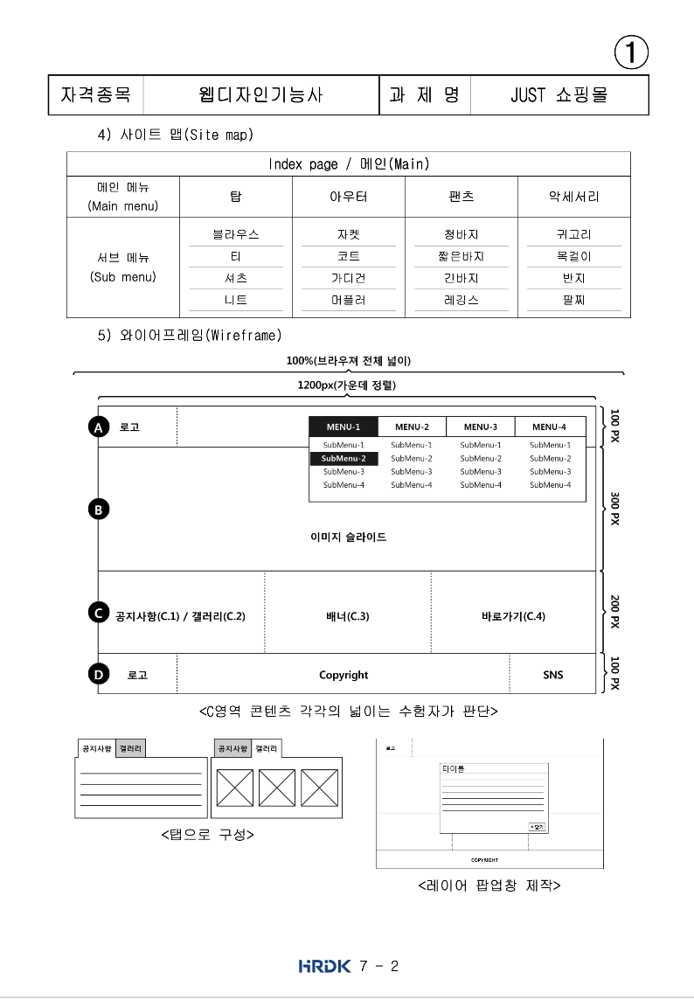

# TIL
- 📝 오늘 배운 내용 👊 : 
  - [x] [fontawesome](https://fontawesome.com/) 사용방법 
    1. 먼저 사이트에 들어가서 `start for free`를 클릭한다. 
    2. 파일을 `Download` 버튼을 누른 뒤 넘어간 페이지에서 다시 `Download Font Awesome Free for the Web`을 눌러서 파일을 다운받는다. 
    3. 파일을 다운 받으면 폰트 어썸 퐅더를 적용할 html, css 파일 근처에 위치하게 한다.   
    4. html 파일에 가서 head 태그 부분에 아래와 같이 `link` 태그를 활용하여 아래와 같이 폰트 어썸 파일과 html 파일을 연결 시킨다.      
    ```html
        <head>
          <link href="/[your-path-to-fontawesome]/css/all.css" rel="stylesheet"> 
          <!-- 이떄, css/all.css 는 우리가 보기 좋게 넣어논 css 파일이고, 
          우리가 이해하기는 어려워도 용량을 줄여논 파일은 css/all.min.css 이다. -->
        </head>
    ```
    5. 그리고 이제 폰트 어썸을 실제로 적용하기 위해 사용하는 방법이 크게 2가지 있다:       
      - <u>`html` 상에서 사용하기</u>      
        - html에서 사용하고 싶으면 `<i class="fas fa-user"></i>`의 형태의 태그를 원하는 자리에 넣어주면 된다. 

      - <u>Unicode로 `CSS` 코드로 사용하기</u>         
        - unicode로 css 파일에서 사용하고 싶으면, 폰트어썸 사이트에서 `f0c9`와 같은 형태의 유니코드를 각 아이콘마다 제공한다.     
        이 유니코드를 갖고 css에서 아래와 같이 사용 가능하다;     

        ```css
              .element::before {
                /* 유니코드를 '' 안에 넣는데, 이때 \를 앞에 적어준다 */
                content: '\f0c9';     

                /* css/all.css 에 적혀있는 font-family를 확인하고 적어준다. 
                이때, 만약 적용이 안되는 아이가 있다면 그건 무료여서... 
                맨 뒤에 부분을 Free 로 바꿔준다. */
                font-family: 'Font Awesome 5 Free';    

                /* 기본적으로 폰트 어썸은 font다. 
                그래서 font관련 속성들이 적용ㄷ이 다 된다는 점 잊지말기~! */
                font-weight: 900;
                font-size: 0.5rem:
                color: #f06;
                margin-right: 3px; 
              } 
        ```

  - [x] `aria-hidden="true"` 사용해서 스크린리터가 폰트어썸 읽지 않게 하기     
    - e.g.               
    ```html 
      <i class="fas fa-bars" aria-hidden="true"></i>
    ```
      
  - [x] `address` 태그 안에 heading 관련 태그는 들어갈 수 없다.     
  대신, 강조하고 싶을 때는 `em`과 같은 태그를 사용할 것.      
  (cf. `p`, `li` 등의 태그에는 heading이 들어갈 수 있다.)
  - [x] `clip` 사용방법
    - css의 clip 속성은 이미지를 자르거나 일부만 노출하고 싶을 때 사용하는 속성이다.   
    - 기본 문법:    
    ```css
      .element {
        clip: rect(10px, 20px, 30px, 40px);    // 상 우 하 좌 (cf. 시계방향)
      }

      /* clip 속성은 현재 deprecated 되었으며, 더 이상 추천하지 않는다.
      또한, clip은 쉽게 사용하기 어려운 두 가지 제약이 있다: 
      
        - 엘리먼트에 absolute 속성이 적용되어야 한다. 
        - 직사각형 형태로만 적용 가능하다. 
      */
    ``` 
    - clip 속성은 현재 `deprecated` 되었으며, 더 이상 추천하지 않는다.        
      또한, <u>clip은 ~~쉽게~~ 사용하기 어려운 두 가지 제약</u>이 있다:      
        - **엘리먼트에 absolute 속성이 적용되어야 한다**. 
        - **직사각형 형태로만 적용 가능하다**. 
    - 그래서 등장한 것이 `clip-path`. clip-path 는 새롭게 추가된 속성으로 여러 형태의 도형을 적용할 수 있다는 장점이 있다.    
    물론, 다양한 도형을 적용하려면 브라우저 호한성을 꼭 확인해야 한다.         
      - e.g.            
        ```css
        clip-circle {
        clip-path: circle(40px at center);
        }

        .clip-ellipse {
          clip-path: ellipse(130px 140px at 10% 20%);
        }

        .clip-polygon {
          clip-path: polygon(50% 0, 100% 50%, 50% 100%, 0 50%);
        }
      ```       
      👉 조금 더 쉽게 `clip-path` 속성을 적용하고 싶으면 [clippy](https://bennettfeely.com/clippy/) 사이트 참고!!         
      👉 `clip`에 대해 좀 더 알고 싶다면 [TIL-CSS_clip_속성.md 파일](https://github.com/ekfka4863/TIL/blob/master/CSS%26SASS%26Bootstrap/CSS/CSS_clip_%EC%86%8D%EC%84%B1.md) 참고!!!!     


  <!-- <br />
  
  <br /> -->


<br />
<br />

---

<details>
<summary>CLICK ME!</summary>  

- cf.  
  - [웹디자인기능사 공개문제](https://www.q-net.or.kr/cst006.do?id=cst00602&gSite=Q&brdId=Q006&code=1204&artlSeq=5199079)
  - https://developer.mozilla.org/ko/docs/Web/CSS/clip-path
  - https://www.codingfactory.net/10636
  - https://shlee1353.github.io/2019/07/15/css-clip-mask/
  - https://homzzang.com/b/css-116
  - https://css-tricks.com/clipping-masking-css/
  - https://developer.mozilla.org/ko/docs/Web/CSS/background-clip

</detials>  

--- 

<!-- 
 <br />
  
  <br /> -->