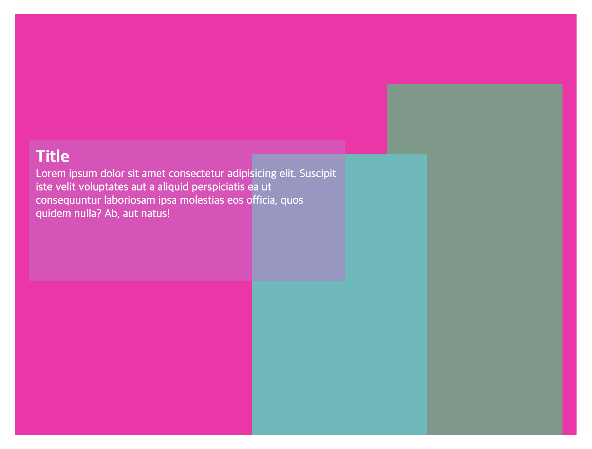

# TIL
- 📝 오늘 배운 내용 👊 : 
  - [x] 개인적으로 리뉴얼 하고 싶은 사이트 프로토타입 만든 것 1280px 사이즈로 구현하기 

  <br />
  
  <br />

  - 코드: 

    <details>

    <summary>See HTML Code!</summary>

      ```html
      <!DOCTYPE html>
      <!-- ayout_1440.html -->
      <html lang="ko-KR" class="no-js">
      <head>
        <meta charset="UTF-8">
        <meta http-equiv="X-UA-Compatible" content="IE=edge">
        <meta name="viewport" content="width=device-width, initial-scale=1.0">

        <script src="../js/common/modernizr-custom.js"></script>

        <!-- font:   https://fonts.google.com/specimen/Sunflower?preview.text_type=custom&preview.text=%EB%B9%BD%EB%8B%A4%EB%B0%A9%20%ED%99%98%EC%98%81%ED%95%A9%EB%8B%88%EB%8B%A4!%20&subset=korean -->
        <link rel="preconnect" href="https://fonts.googleapis.com">
        <link rel="preconnect" href="https://fonts.gstatic.com" crossorigin>
        <link href="https://fonts.googleapis.com/css2?family=Sunflower:wght@300;500;700&display=swap" rel="stylesheet">
        <link rel="stylesheet" href="../fontawesome/css/all.min.css">

        <link rel="stylesheet" href="../css/common/variable.css">

        <link rel="stylesheet" href="../css/common/reset.css">
        <link rel="stylesheet" href="../css/common/common.css">

        <link rel="stylesheet" href="../css/src/layout_1280.css">
        <link rel="stylesheet" href="../css/src/layout_1280_new_ver.css">

        <title>Paik's Coffee (1280px)</title>
        
        <link rel="shortcut icon" type="image/x-icon" href="../images/favicon.jpeg">
        <link rel="apple-touch-icon" href="../images/favicon.jpeg">
      </head>

      <body>
          <!-- layout -->
          <div id="wrap">

            <!-- #headBox -->
            <header id="headBox">
              <div class="head_box_inner clearfix">
                <h1>
                  <a href="#">
                    <span class="blind">빽다방</span>
                  </a>
                </h1>
                <nav>
                  <h2 class="blind">navigation</h2>
                  <ul class="gnb clearfix">
                    <li><a href="#">빽다방</a></li>
                    <li><a href="#">메뉴</a></li>
                    <li><a href="#">소식</a></li>
                    <li><a href="#">매장안내</a></li>
                    <li><a href="#">창업안내</a></li>
                    <li><a href="#">고객의 소리</a></li>
                    <li><a href="#">제휴업체</a></li>
                    <li>
                      <a href="#">
                        <span class="blind">검색</span>
                        <i class="fas fa-search"></i>
                      </a>
                    </li>
                  </ul>
                </nav>
              </div>
            </header>

            <!-- #viewBox -->
            <section id="viewBox">
              <h2 class="blind">viewBox</h2>
              <div class="view_box_inner">
                <div class="view_box_img">
                  <button type="button" class="prev_btn">
                    <!--  -->
                    <span class="blind">이전 이미지 버튼</span>
                  </button>
                  <button type="button" class="next_btn">
                    <!--  -->
                    <span class="blind">다음 이미지 버튼</span>
                  </button>
                </div>
                <div class="view_box_indicator_bar clearfix">
                  <div class="indicator_circle showing">
                    <a href="#">
                      <span class="blind">슬라이드 이미지 1</span>
                    </a>
                  </div>
                  <div class="indicator_circle">
                    <a href="#">
                      <span class="blind">슬라이드 이미지 2</span>
                    </a>
                  </div>
                  <div class="indicator_circle">
                    <a href="#">
                      <span class="blind">슬라이드 이미지 3</span>
                    </a>
                  </div>
                  <div class="indicator_circle">
                    <a href="#">
                      <span class="blind">슬라이드 이미지 4</span>
                    </a>
                  </div>
                  <div class="indicator_circle">
                    <a href="#">
                      <span class="blind">슬라이드 이미지 5</span>
                    </a>
                  </div>
                </div>
              </div>
            </section>

            <!-- #mainBox -->
            <main id="mainBox">
              <div class="main_box_inner">

                <!-- #productBox -->
                <article id="productBox">
                  <h2>Product</h2>
                  <div class="product_box_img_1">
                    <button type="button" class="prev_btn">
                      <span class="blind">이전 상품 보기 버튼</span>
                    </button>
                    <button type="button" class="next_btn">
                      <span class="blind">다음 상품 보기 버튼</span>
                    </button>
                  </div>
                  <div class="product_box_img_2">
                    <button type="button" class="prev_btn">
                      <span class="blind">이전 상품 보기 버튼</span>
                    </button>
                    <button type="button" class="next_btn">
                      <span class="blind">다음 상품 보기 버튼</span>
                    </button>
                  </div>
                </article>
                <!-- #eventBox -->
                <article id="eventBox">
                  <h2>Event</h2>
                </article>
                <!-- #snsBox -->
                <article id="snsBox">
                  <h2>SNS</h2>
                </article>
                <!-- #familysitesBox -->
                <article id="familysitesBox">
                  <h2 class="blind">familysitesBox</h2>
                  <div class="familysites_box_inner">
                    <ul class="clearfix">
                      <li class="familysite"><a href="#">familysite_01</a></li>
                      <li class="familysite"><a href="#">familysite_02</a></li>
                      <li class="familysite"><a href="#">familysite_03</a></li>
                      <li class="familysite"><a href="#">familysite_04</a></li>
                      <li class="familysite"><a href="#">familysite_05</a></li>
                      <li class="familysite"><a href="#">familysite_06</a></li>
                    </ul>
                  </div>
                </article>

              </div>
            </main>

            <!-- #oftenSearchedBtns -->
            <aside id="oftenSearchedBtns">
              <h2 class="blind">oftenSearchedBtns</h2>
              <div class="often_searched_btns_inner clearfix">
                <button type="button"><span>매장찾기</span></button>
                <button type="button"><span>창업안내</span></button>
                <button type="button"><span>고객안내</span></button>
              </div>
            </aside>

            <!-- #footBox -->
            <footer id="footBox">
              <div class="foot_box_inner clearfix">
                <h2>
                  <a href="#">
                    <span class="blind">footBox</span>
                  </a>
                </h2>
                <div class="foot_box_content clearfix">
                  <div class="company_info"></div>
                  <div class="familysites_and_sns">
                    <div class="more_familysites">
                      <button type="button" class="drop_down_menu_icon"></button>
                    </div>
                    <div class="sns_icon_set clearfix">
                      <button type="button" class="chat_icon"></button>
                      <button type="button" class="facebook_icon"></button>
                      <button type="button" class="instagram_icon"></button>
                    </div>
                  </div>
                  <address>&copy; All rights reserved ...</address>
                </div>
              </div>
            </footer>
          </div>

          <!-- script -->
          <script></script>
      </body>
      </html>
      ```

    </details>      
    
    <details>

    <summary>See CSS Code!</summary>
    
      ```css
      @charset "UTF-8";
      /* layout_1280.css*/
      /* 구형 브라우저에서도 돌아갈 수 있는 css 코드 */

      /* design
      ============================================= */
      body {
        background-color: #171717;
      }
      #wrap {
        width: 1280px;
        /* width: 100%; */
        height: auto;
        min-height: 3330px;
        margin: auto;
        /* background-color: #555; */
      }

      /* #headBox
      --------------------------------------------- */

      #headBox {
        position: fixed;
        z-index: 9999;

        /* width: 1280px; */
        width: 100%;
        left: 0;
        height: 130px;
        padding: 0px 80px;
        box-sizing: border-box;
        background-color: #fff;
      }
      .head_box_inner {
        width: 1280px;
        height: 100%;
        margin: auto;
        /* background-color: #faf; */
      }
        /* h1 */
        .head_box_inner > h1 {
          float: left;

          width: 220px;
          height: 130px;
          background: url(../../images/logo_1280.svg) no-repeat center;
          /* background-color: #fee; */
        }
        h1 > a {
          display: block;
          width: 100%;
          height: 100%;
          /* background-color: #fee; */
        }
        
        /* navigation */
        nav {
          float: right;
        }
        .gnb {
          padding: 45px 0px;
          box-sizing: border-box;
        }
        .gnb li {
          float: left;
          width: 100px;
          height: 40px;
          margin-right: 15px;
          text-align: center;
          /* line-height: 40px; */
          line-height: 55px;
          /* background-color: #ccc; */
        }
        .gnb li:first-child {
          margin-left: 55px;
        }
        .gnb li:last-child {
          width: 40px;
          height: 40px;
          margin-right: 0;
          cursor: pointer;
          /* background: url(../../images/search_icon.svg) no-repeat center; */
        }
          .gnb li a {
            display: block;
            width: 100%;
            height: 100%;
            font-size: 19.2px;
            color: #0b1f60;
            /* background-color: #a9a9a9; */
          }
          .gnb li:last-of-type a {
            font-size: 24px;
          }


      /* #viewBox 
      --------------------------------------------- */
      #viewBox {
        width: 100%;
        height: 700px;
        padding-top: 130px;
        box-sizing: content-box;
        background-color: #fff;
      }
        .view_box_inner {
          position: relative;

          width: 100%;
          height: 600px;
          background-color: #ccc;
        }
          .view_box_img {
            width: 100%;
            height: inherit;
            background: url(../../images/view_box_img_1220_1440_1920.jpg) no-repeat center;
          }
            .view_box_inner .prev_btn, .next_btn {
              position: absolute;
              top: 325px;

              width: 100px;
              height: 100px;
              /* background-color: #eee; */
            }
            .prev_btn {
              left: 0;
              background: url(../../images/prev_btn.svg) no-repeat center;
            }
            .next_btn {
              right: 0;
              background: url(../../images/next_btn.svg) no-repeat center;
            }
            .view_box_indicator_bar {
              position: absolute;
              bottom: -50px;
              left: 557px;
            }
              .indicator_circle {
                float: left;

                width: 10px;
                height: 10px;
                margin-right: 20px;
                border-radius: 100%;
                background-color: #a9a9a9;
              }
              .indicator_circle:last-child {
                margin-right: 0;
              }

            /* event - when indicator_circle is showing its image */
            .showing {
              width: 50px;
              height: 10px;
              border-radius: 34px;
              background-color: #0b1f60;
            }


      /* #mainBox 
      --------------------------------------------- */
      #mainBox {
        width: 100%;
        /* padding: 0 80px; */
        box-sizing: border-box;
        background-color: #eee;
      }
      .main_box_inner {
        /* width: 1120px; */
        height: auto;
        min-height: 1850px;
      }

        /* #productBox */
        #productBox {
          width: 100%;
          height: 1000px;
        }
          #productBox h2 {
            padding: 90px 469px;
          }
            .product_box_img_1 {
              position: relative;

              width: 1280px;
              height: 300px;
              margin-bottom: 90px;
              background-color: #a9a9a9;
            }
            .product_box_img_2 {
              position: relative;
              
              width: 1280px;
              height: 300px;
              margin-bottom: 78px;
              background-color: #a9a9a9;
            }  
              .product_box_img_1 button, 
              .product_box_img_2 button { 
                position: absolute;
                top: 100px;
                
                width: 100px;
                height: 100px;
              }
              .product_box_img_1 .prev_btn, 
              .product_box_img_2 .prev_btn {
                background: url(../../images/prev_btn.svg);
              }
              .product_box_img_1 .next_btn,
              .product_box_img_2 .next_btn {
                background: url(../../images/next_btn.svg) no-repeat center;
              }


        /* #eventBox */
        #eventBox {
          width: 100%;
          height: 300px;
          background-color: #ccc;
        }
          #eventBox h2 {
            padding: 52px 582px 0px;
          }

        /* #snsBox */
        #snsBox {
          width: 100%;
          height: 400px;
          background-color: #eee;
        }
          #snsBox h2 {
            padding: 70px 599px 0px;
          }

        /* #familysitesBox */
        #familysitesBox {
          width: 100%;
          height: 150px;
          background-color: #ccc;
        }
        .familysites_box_inner ul {
          padding: 35px 0px;
        }
        .familysite {
          float: left;

          width: 150px;
          height: 80px;
          margin-right: 40px;
          text-align: center;
          line-height: 80px;
          background-color: #777;
        }
        .familysite:first-child {
          margin-left: 90px;
        }
        .familysite:last-child {
          margin-right: 0;
        }

        .familysite a {
          display: block;
          width: 100%;
          height: 100%;
          background-color: #777;
        }


      /* aside 
      --------------------------------------------- */
      /* #oftenSearchedBtns */
      #oftenSearchedBtns{
        width: 100%;
        height: 150px;
        background-color: #eee;
      }
        .often_searched_btns_inner {
          position: relative;

          padding: 35px 205px;
        }
          .often_searched_btns_inner button {
            float: left;

            width: 150px;
            height: 80px;
            margin-right: 130px;
            border-radius: 10px;

            background-color: #ccc;
          }
          .often_searched_btns_inner button:nth-child(1) {
            float: left;
          }
          .often_searched_btns_inner button:nth-child(2) {
            position: absolute;
            top: 50%;
            left: 50%;
            transform: translate(-50%, -50%);
          }
          .often_searched_btns_inner button:nth-child(3) {
            float: right;
            margin-right: 0;
          }


      /* #footBox 
      --------------------------------------------- */
      #footBox {
        width: 100%;
        height: 500px;
        border: 1px solid #ccc;
        background-color: #ccc;
      }
        #footBox h2 {
          width: 400px;
          height: 80px;
          margin: 40px auto;
          background: url(../../images/the_born_logo_1200_1440_1920.svg) no-repeat center;
        }
          .company_info {
            float: left;

            width: 604px;
            height: 220px;
            margin: 0px 50px 50px 140px;
            /* margin-right: 50px;
            margin-bottom: 50px; */
            background-color: #fff;
          }
          .familysites_and_sns {
            float: left;

            width: 346px;
            height: 120px;
            /* margin-right: 140px; */
            background-color: #fff;
          } 
            .more_familysites {
              position: relative;

              width: 296px;
              height: 20px;
              margin: 20px 25px;
              background-color: #eee;
            }
              .drop_down_menu_icon {
                position: absolute;
                top: 0;
                right: 0;

                width: 20px;
                height: 20px;
                background: url(../../images/drop_down_icon.svg) no-repeat center;
              }
            .sns_icon_set {
              position: relative;

              width: 296px;
              height: 40px;
              margin: 20px 25px;
              background-color: #eee;
            }
              .sns_icon_set button {
                position: absolute;
                top: 0;

                width: 40px;
                height: 40px;
              }
              .sns_icon_set .chat_icon {
                left: 43px;
                background: url(../../images/chat_icon.svg) no-repeat center;
              }
              .sns_icon_set .facebook_icon {
                left: 128px;
                background: url(../../images/facebook_icon.svg) no-repeat center;
              }
              .sns_icon_set .instagram_icon {
                right: 43px;
                background: url(../../images/instagram_icon.svg) no-repeat center;
              }
          
          address {
            float: left;

            width: 1000px;
            height: 30px;
            margin: 0px 140px;
            line-height: 30px;
            text-indent: 10px;
            background-color: #fff;
          }

      ```
      <br />

      ```css
      @charset "UTF-8";
      /* layout_1280_new_ver.css*/
      /* 구형 브라우저에서는 적용이 안 될수 있음! */

      @supports (background-color: --color){

        /* design
        ============================================= */
        body {
          background-color: var(--color-black);
        }
        #wrap {
          width: 1280px;
          /* width: 100%; */
          height: auto;
          min-height: 3330px;
          margin: auto;
          /* background-color: var(--color-gray5); */
        }
        
        /* #headBox
        --------------------------------------------- */
        
        #headBox {
          position: fixed;
          z-index: 9999;
        
          /* width: 1280px; */
          width: 100%;
          left: 0;
          height: 130px;
          padding: 0px 80px;
          box-sizing: border-box;
          background-color: var(--color-white);
        }
        .head_box_inner {
          width: 1280px;
          height: 100%;
          margin: auto;
          /* background-color: #faf; */
        }
          /* h1 */
          .head_box_inner > h1 {
            float: left;
        
            width: 220px;
            height: 130px;
            background: url(../../images/logo_1280.svg) no-repeat center;
            /* background-color: #fee; */
          }
          h1 > a {
            display: block;
            width: 100%;
            height: 100%;
            /* background-color: #fee; */
          }
          
          /* navigation */
          nav {
            float: right;
          }
          .gnb {
            padding: 45px 0px;
            box-sizing: border-box;
          }
          .gnb li {
            float: left;
            width: 100px;
            height: 40px;
            margin-right: 15px;
            text-align: center;
            /* line-height: 40px; */
            line-height: 55px;
            /* background-color: var(--color-gray2); */
          }
          .gnb li:first-child {
            margin-left: 55px;
          }
          .gnb li:last-child {
            width: 40px;
            height: 40px;
            margin-right: 0;
            cursor: pointer;
            /* background: url(../../images/search_icon.svg) no-repeat center; */
          }
            .gnb li a {
              display: block;
              width: 100%;
              height: 100%;
              font-size: 1.2rem;
              color: var(--color-primary2);
              /* background-color: var(--color-gray3); */
            }
            .gnb li:last-of-type a {
              font-size: 1.5rem;
            }
        
        
        /* #viewBox 
        --------------------------------------------- */
        #viewBox {
          width: 100%;
          height: 700px;
          padding-top: 130px;
          box-sizing: content-box;
          background-color: var(--color-white);
        }
          .view_box_inner {
            position: relative;
        
            width: 100%;
            height: 600px;
            /* background-color: var(--color-gray2); */
          }
            .view_box_img {
              width: 100%;
              height: inherit;
              background: url(../../images/view_box_img_1220_1440_1920.jpg) no-repeat center;
            }
              .view_box_inner .prev_btn, .next_btn {
                position: absolute;
                top: 325px;
        
                width: 100px;
                height: 100px;
                /* background-color: var(--color-gray1); */
              }
              .prev_btn {
                left: 0;
                background: url(../../images/prev_btn.svg) no-repeat center;
              }
              .next_btn {
                right: 0;
                background: url(../../images/next_btn.svg) no-repeat center;
              }
              .view_box_indicator_bar {
                position: absolute;
                bottom: -50px;
                left: 557px;
              }
                .indicator_circle {
                  float: left;
        
                  width: 10px;
                  height: 10px;
                  margin-right: 20px;
                  border-radius: 100%;
                  background-color: var(--color-gray3);
                }
                .indicator_circle:last-child {
                  margin-right: 0;
                }
        
              /* event - when indicator_circle is showing its image */
              .showing {
                width: 50px;
                height: 10px;
                border-radius: 34px;
                background-color: var(--color-primary2);
              }
        
        
        /* #mainBox 
        --------------------------------------------- */
        #mainBox {
          width: 100%;
          /* padding: 0 80px; */
          box-sizing: border-box;
          background-color: var(--color-gray1);
        }
        .main_box_inner {
          /* width: 1120px; */
          height: auto;
          min-height: 1850px;
        }
        
          /* #productBox */
          #productBox {
            width: 100%;
            height: 1000px;
          }
            #productBox h2 {
              padding: 90px 469px;
            }
              .product_box_img_1 {
                position: relative;
        
                width: 1280px;
                height: 300px;
                margin-bottom: 90px;
                background-color: var(--color-gray3);
              }
              .product_box_img_2 {
                position: relative;
                
                width: 1280px;
                height: 300px;
                margin-bottom: 78px;
                background-color: var(--color-gray3);
              }  
                .product_box_img_1 button, 
                .product_box_img_2 button { 
                  position: absolute;
                  top: 100px;
                  
                  width: 100px;
                  height: 100px;
                }
                .product_box_img_1 .prev_btn, 
                .product_box_img_2 .prev_btn {
                  background: url(../../images/prev_btn.svg);
                }
                .product_box_img_1 .next_btn,
                .product_box_img_2 .next_btn {
                  background: url(../../images/next_btn.svg) no-repeat center;
                }
        
        
          /* #eventBox */
          #eventBox {
            width: 100%;
            height: 300px;
            background-color: var(--color-gray2);
          }
            #eventBox h2 {
              padding: 52px 582px 0px;
            }
        
          /* #snsBox */
          #snsBox {
            width: 100%;
            height: 400px;
            background-color: var(--color-gray1);
          }
            #snsBox h2 {
              padding: 70px 599px 0px;
            }
        
          /* #familysitesBox */
          #familysitesBox {
            width: 100%;
            height: 150px;
            background-color: var(--color-gray2);
          }
          .familysites_box_inner ul {
            padding: 35px 0px;
          }
          .familysite {
            float: left;
        
            width: 150px;
            height: 80px;
            margin-right: 40px;
            text-align: center;
            line-height: 80px;
            background-color: var(--color--gray4);
          }
          .familysite:first-child {
            margin-left: 90px;
          }
          .familysite:last-child {
            margin-right: 0;
          }
        
          .familysite a {
            display: block;
            width: 100%;
            height: 100%;
            background-color: var(--color-gray4);
          }
        
        
        /* aside 
        --------------------------------------------- */
        /* #oftenSearchedBtns */
        #oftenSearchedBtns{
          width: 100%;
          height: 150px;
          background-color: var(--color-gray1);
        }
          .often_searched_btns_inner {
            position: relative;
        
            padding: 35px 205px;
          }
            .often_searched_btns_inner button {
              float: left;
        
              width: 150px;
              height: 80px;
              margin-right: 130px;
              border-radius: 10px;
        
              background-color: var(--color-gray2);
            }
            .often_searched_btns_inner button:nth-child(1) {
              float: left;
            }
            .often_searched_btns_inner button:nth-child(2) {
              position: absolute;
              top: 50%;
              left: 50%;
              transform: translate(-50%, -50%);
            }
            .often_searched_btns_inner button:nth-child(3) {
              float: right;
              margin-right: 0;
            }
        
        
        
        /* #footBox 
        --------------------------------------------- */
        #footBox {
          width: 100%;
          height: 500px;
          border: 1px solid var(--color-gray2);
          background-color: var(--color-gray2);
        }
          #footBox h2 {
            width: 400px;
            height: 80px;
            margin: 40px auto;
            background: url(../../images/the_born_logo_1200_1440_1920.svg) no-repeat center;
          }
            .company_info {
              float: left;
        
              width: 604px;
              height: 220px;
              margin: 0px 50px 50px 140px;
              /* margin-right: 50px;
              margin-bottom: 50px; */
              background-color: var(--color-gray1);
            }
            .familysites_and_sns {
              float: left;
        
              width: 346px;
              height: 120px;
              /* margin-right: 140px; */
              background-color: var(--color-gray1);
            } 
              .more_familysites {
                position: relative;
        
                width: 296px;
                height: 20px;
                margin: 20px 25px;
                background-color: var(--color-gray1);
              }
                .drop_down_menu_icon {
                  position: absolute;
                  top: 0;
                  right: 0;
        
                  width: 20px;
                  height: 20px;
                  background: url(../../images/drop_down_icon.svg) no-repeat center;
                }
              .sns_icon_set {
                position: relative;
        
                width: 296px;
                height: 40px;
                margin: 20px 25px;
                background-color: var(--color-gray1);
              }
                .sns_icon_set button {
                  position: absolute;
                  top: 0;
        
                  width: 40px;
                  height: 40px;
                }
                .sns_icon_set .chat_icon {
                  left: 43px;
                  background: url(../../images/chat_icon.svg) no-repeat center;
                }
                .sns_icon_set .facebook_icon {
                  left: 128px;
                  background: url(../../images/facebook_icon.svg) no-repeat center;
                }
                .sns_icon_set .instagram_icon {
                  right: 43px;
                  background: url(../../images/instagram_icon.svg) no-repeat center;
                }
            address {
              float: left;
              width: 1000px;
              height: 30px;
              margin: 0px 140px;
              line-height: 30px;
              text-indent: 10px;
              background-color: var(--color-gray1);
            }
      }
    
      ```
    </details>      

<br />
<br />

## HW
- [x] 💻 피그마로 프로토타입 좀 더 develop 하기 ⌨️    
<!-- 
  <br />
  
  <br /> -->
- [x] 썜이랑 수업 시간에 같이 한 **탭메뉴**, **모달창**, **이미지 슬라이더와 인디케이터** 다시 코드 쳐보면서 연습하기     

<br />
<br />
