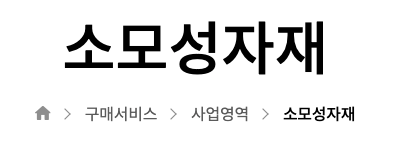

# TIL

- 📝 오늘 배운 내용 ✏️ : 
  - [x] `::before and ::after effects used in footer section and 'breadcrumbs'`        

    -  

  
  <br />
  
  <br />

  - 📍 <u>example</u> 📍        
  ```html
  ```
  ```css 
  ```

  ```html 
  ```
  ```css 
  ```

👉 다양한 variation들이 있지만 하나만 딱 골라서 사용해도 무방하다!    

<br /> 
<br />

## HW
- [x] 💻 빽다방 반응형 웹사이트 프로토타입 figma로 더 develop ⌨️    

<br /> 
<br />

---

<details>
<summary>CLICK ME!</summary>  

- cf.  
  - http://www.serveone.co.kr/kr/purchasing-service/business/consumable-materials.do
  - https://www.gdweb.co.kr/main/
  - 

</detials>   

