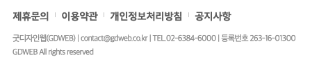
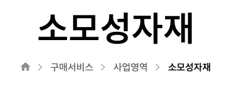
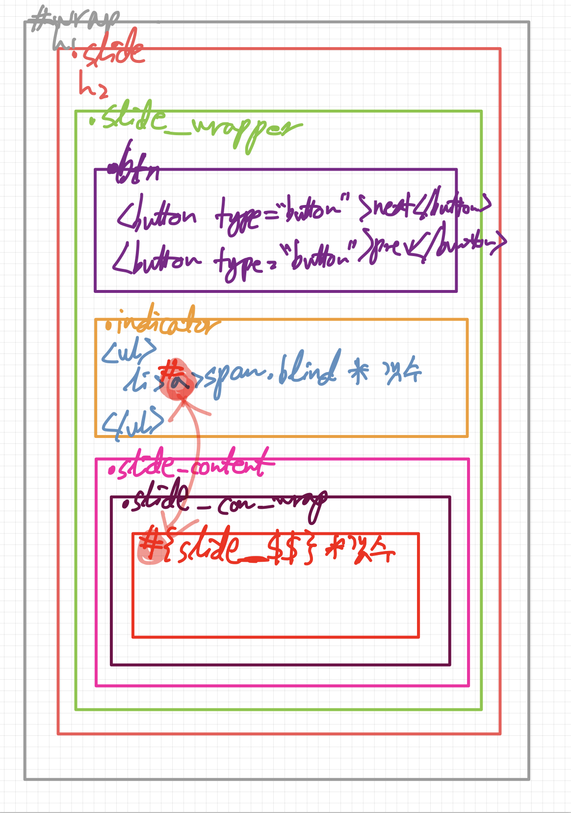

# TIL

- 📝 오늘 배운 내용 ✏️ : 
  - [x] `::before and ::after effects used in footer section and 'breadcrumbs'`        

  <br />
  
  <br />
  
  <br />

  - 위의 예시들처럼 가상 요소를 사용하여 ~~드래그해도 선택되지는 않지만~~ 시각적으로 **구별하는 용도**로 vertical bar 또는 삼각형, 화살표 등을 넣어줄 수 있다.       

  - 📍 <u>example</u> 📍         
    - 위의 그림 중 처음 사진을 예시로 만든다고 하면 ... 

      <details>
      <summary>See More HTML Code!</summary>  

      ```html
      <!-- 솔루션 1 (with 선생님):  span 태그로 처리하기 -->
      
        <div class="nav_list">
          <ul>
            <li>
              <!-- 단, 여기는 span 안씀 -->
              <a href="#">제휴 문의</a>
            </li>
            <li>
              <span class="bar"></span>
              <a href="#">이용 약관</a>
            </li>
            <li>
              <span class="bar"></span>
              <a href="#">개인정보 처리 방침</a>
            </li>
            <li>
              <span class="bar"></span>
              <a href="#">공지 사항</a>
            </li>
          </ul>
        </div>

      ```

      </details>
      <br />
      <details>
      <summary>See More CSS Code!</summary>  

      ```css
        /* 솔루션 1 (with 선생님):  span 태그로 처리하기 */
        .bar {
          display: none;

          float: left;
          width: 1px;
          height: 10px;
          margin-left: -5px;
          margin-top: 5px;
          background: #777;
        }


        /* 솔루션 2 : 비포 가상 요소로 처리하기 
                      (span 쓰고 싶지 않으면... 두 번째 방법으로 이거...)
        */
        .nav_list li:first-child:before, 
        .nav_list li:first-child::before {
          display: none;
        }

        .nav_list li:before,
        .nav_list li::before {
          content: '';
          float: left;
          width: 1px;
          height: 10px;
          margin-left: -5px;
          margin-top: 5px;
          background-color: #59a;
        }


        /* 솔루션 3 - before말고 after도 가능...! */
        .nav_list li:after,
        .nav_list li::after {
          /* entity 코드는 가끔 읽을 수도 있기때문에... 생략... 
            유니 코드는 넣어도 무방... 
          */
          content: '';
          display: block;
          /* float: right;
          margin-left: 10px; */
          /* 위와 같이 플로트를 주는 방법도 있지만 나중에 a 태그가 크기를 갖으면 변할 수도 있으니까... */
          
          /* 이걸 선호... 추천... !! 
          플로트를 주면 해당 요소는 display: block; 과 같아지니까 ... 
          대신 여기다가 position: absolute; 줄거면 li라는 부모요소에 position: relative; 주기... */
          position: absolute;
          /* top: 5px; */
          top: 0;
          bottom: 0;
          right: -5px;
          margin: auto;

          width: 0;
          height: 10px;
          border-right: 1px solid #19a;
        }


        /* 솔루션 4 - li에 border를 활용하는 방법 */
        .nav_list li {
          height: 10px;
          margin-right: 10px;
          padding-right: 10px;
          border-right: 1px solid #f06;
        }
        .nav_list li:last-child {
          border: 0;
          margin-right: 0;
        }
        .nav_list a {
          /* width: 100px;
          height: 50px; */
          background-color: #7ff;
        }
      ```

      </details>

  <br />
  <p style="padding-left: 40px;">👉 &nbsp; 다양한 <a href="https://github.com/ekfka4863/frontEndCourse_210901/blob/main/code_during_the_class/html/c_01_position_set.html">html</a> 그리고 <a href="https://github.com/ekfka4863/frontEndCourse_210901/blob/main/code_during_the_class/css/src/c_01_position_set.css">css</a> 코드의 variation들이 있지만 하나만 딱 골라서 사용해도 무방하다!</p>   

  <br />

  - [x] `이미지 슬라이더, 버튼, 인디케이터 구조` 다시보기      

  <br />     
  
  <br />     

  <div style="padding-left: 20px;">
    <ul style="list-style: square;">
      <li>구조: <br />
      <em>👉  &nbsp; .slide > (h2 + .slide_wrapper) > (.btn > button*2) + (.indicator > ul > (li > a > span.blind) * 갯수) + (.slide_content > div > (div * 갯수))</em>
      </li>
      <li><a href="https://github.com/ekfka4863/frontEndCourse_210901/tree/main/practice/practice_11%20(slide%20banner)">🔍 코드로 보기</a></li>
    </ul>
  </div>
  <br /> 


  - [x] [js](https://github.com/ekfka4863/frontEndCourse_210901/blob/main/practice/pracice_11%20(%EC%8A%AC%EB%9D%BC%EC%9D%B4%EB%93%9C%20%EB%B0%B0%EB%84%88)/js/src/slide_banner.js)와 [jQuery](https://github.com/ekfka4863/frontEndCourse_210901/blob/main/practice/pracice_11%20(%EC%8A%AC%EB%9D%BC%EC%9D%B4%EB%93%9C%20%EB%B0%B0%EB%84%88)/js/src/slide_banner_from_JQ.js) 맛보기         
    - 실제 동작하는 모습     
    
    <br />
    

<br /> 
<br />

## HW
- [x] 💻 빽다방 반응형 웹사이트 프로토타입 figma로 더 develop ⌨️    

<br /> 
<br />

---

<details>
<summary>CLICK ME!</summary>  

- cf.  
  - http://www.serveone.co.kr/kr/purchasing-service/business/consumable-materials.do
  - https://www.gdweb.co.kr/main/
  - https://green-webdesigner.tistory.com/20
  - https://blogpack.tistory.com/868

</detials>   

