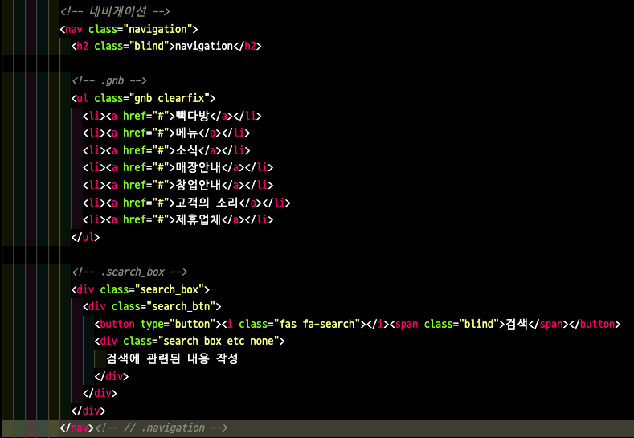
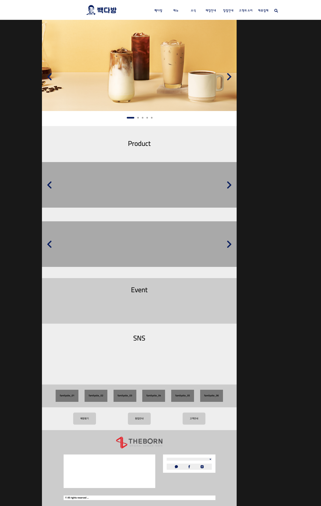

# TIL

- 📝 오늘 배운 내용 ✏️ : 
  - [x] 빽다방 메인 페이지 레이아웃 시험 문제 피드백 받기 
    - \<h3>\</h3> 추가해서 **headings map**의 구조 완성도 높이기 
    - 인디케이터에서 탭 했을 때, 다음 버튼이 먼저 focus가 올 수 있게 아래와 같이 ~~이미지 슬라이드 내~~ 버튼 역역 구성하기:          
    ```html  
     <!-- 버튼 영역 > 버튼 요소 -->
        <div class="btn">
          <button type="button" class="next">next</button>
          <button type="button" class="prev">prev</button>
        </div>
    ```
    - `footer` 영역에서 로고를 클릭하면 모달창이 뜨는 것이 아니고 다른 사이트에 링크가 걸려 있는 경우       
      - `button` 태그의 사용 **X**
      - `a` 태그의 사용 **O**
    - `button` 태그 안에는 a 태그가 오지 않는다. 
    - `button` 태그 안을 비워두지 않는다.     
      - 텍스트를 적어야 하는데, 만약 텍스트를 숨김 처리 하고 싶으면 `<span class="blind">아무 텍스트</span>`라고 html 상에서 적어주고, css에서는 아래와 같은 css class를 만들어 준다:            
      ```css
      /* common.css */ 

        .blind {
          display: block; 
          width: 0; 
          height: 0; 
          overflow: hidden;
        } 
      ```
    - `z-index` 속성은 헤더, 모달창, 최상단 위치로 가는 top버튼, 등에 사용되는 속성이다.    
    너무 높은 값을 주면 나중에 문제가 생길 수 있으니, 어떠한 규칙을 정해서     
    ~~(e.g. header는 1000을 주고, 모달창은 1500을 준다든지의 나만의 룰...)~~           
    사용하도록 한다.
    - 구형 브라우저에서는 semantic tag인 `header, article, nav, section, aside, footer, figure, figcaption`을 인식하지 못하고 `div`로 치환한다는 사실 잊지 말기!      
    (cf. 다만, 안타깝게도 `main` 태그는 인식 자체를 못한다.)
      - 📍 TIP!📍          
      `nav`같은 태그를 사용할거면 구형 브라우저를 고려하여 `class="navigation"`또는 `id="navigation"`이라는 이름을 붙여준 뒤, css에서 선택자로 클래스나 아이디 값을 주면 구형브라우저에서 만약 해당 시멘틱 태그를 인식하지 못해도 우리가 의도한대로 css 스타일링이 적용될 수 있다.          
    - px은 소수점이 적용되지 않는다.       
    (cf. rem이나 %는 소수점까지 적용된다.)   
    - 버튼은 인라인 개념이다.     
    그리고 인라인 요소는 focus가 갈 경우 튕겨져 나가는 특징이 있다.      
    근데 만약 이런 튕김 현상이 있는 와중에 버튼에 `position: absolute;`까지 걸어주면 더 튕겨져 나갈 수 있기 때문에... [참고 자료](https://github.com/ekfka4863/frontEndCourse_210901/tree/main/practice/practice_11%20(slide%20banner))를 참고하여 버튼들을 감싸고 있는 div에다가 포지셔닝을 한다.       
    - `#eventBox` height값으로 기존의 300px에서 1200px로 변경 
    - `#footBox`에 있는 로고 크기를 350px * 70px 로 변경
    - `#headBox`안에 `.gnb` 영역에서 **검색창**은 `gnb`에 포함시키는 것보다 따로 ul이나 div로 빼는 것을 추천:         
    

<!-- ---

## 피드백 전 / 후

  <br />
  
  <br />
  
  <br /> -->

<br />

## HW
- [x] 💻 빽다방 반응형 웹사이트 프로토타입 figma로 더 develop ⌨️    

<!-- <br />  -->
<br />

---

<details>
<summary>CLICK ME!</summary>  

- cf.  
  - ✨ Only 선생님 피드백 ✨

</detials>   

