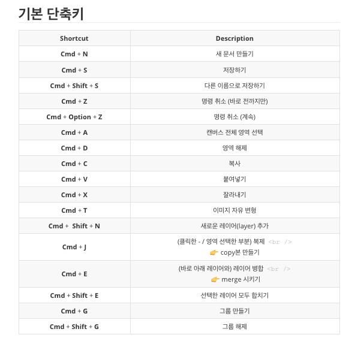
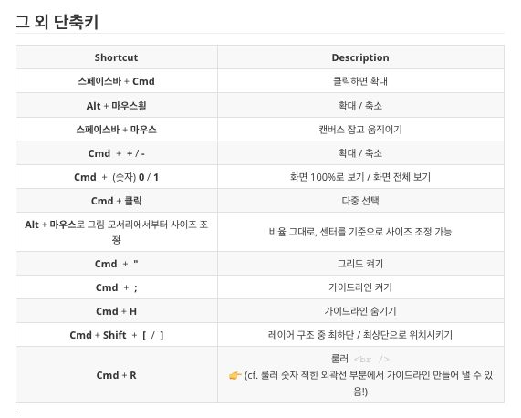

# TIL

- 📝 오늘 배운 내용 ✏️ : 
- [x] 디자이너가 ~~엉망으로 만든~~ 시안을 줄때, 레이아웃 다시 그루핑하는 팁

 

👉 &nbsp; 위의 시안의 레이어를 보면 뒤죽박죽인 것을 볼 수 있다 

 

👉 &nbsp; 수정후

 

- [x] 포토샵 기본 단축키 

 
기본 단축키 
 
 

  |           Shortcut           |                        Description                        |
  | :--------------------------: | :-------------------------------------------------------: |
  |       **Cmd** + **N**        |                      새 문서 만들기                       |
  |       **Cmd** + **S**        |                         저장하기                          |
  | **Cmd** + **Shift** + **S**  |                  다른 이름으로 저장하기                   |
  |       **Cmd** + **Z**        |                 명령 취소 (바로 전까지만)                 |
  | **Cmd** + **Option** + **Z** |                     명령 취소 (계속)                      |
  |       **Cmd** + **A**        |                   캔버스 전체 영역 선택                   |
  |       **Cmd** + **D**        |                         영역 해제                         |
  |       **Cmd** + **C**        |                           복사                            |
  |       **Cmd** + **V**        |                         붙여넣기                          |
  |       **Cmd** + **X**        |                         잘라내기                          |
  |       **Cmd** + **T**        |                     이미지 자유 변형                      |
  | **Cmd** +  **Shift** + **N** |                 새로운 레이어(layer) 추가                 |
  |       **Cmd** + **J**        | (클릭한 - / 영역 선택한 부분) 복제   👉 copy본 만들기 |
  |       **Cmd** + **E**        |  (바로 아래 레이어와) 레이어 병합    👉 merge 시키기  |
  | **Cmd** + **Shift** + **E**  |                 선택한 레이어 모두 합치기                 |
  |       **Cmd** + **G**        |                        그룹 만들기                        |
  | **Cmd** + **Shift** + **G**  |                         그룹 해제                         |

 

 
그 외 단축키 
 
 

  |                          Shortcut                          |                         Description                          |
  | :--------------------------------------------------------: | :----------------------------------------------------------: |
  |                  **스페이스바** + **Cmd**                  |                        클릭하면 확대                         |
  |                   **Alt** + **마우스휠**                   |                         확대 / 축소                          |
  |                **스페이스바** + **마우스**                 |                     캔버스 잡고 움직이기                     |
  |                 **Cmd**  +  **+** / **-**                  |                         확대 / 축소                          |
  |              **Cmd**  +  (숫자) **0** / **1**              |              화면 100%로 보기 / 화면 전체 보기               |
  |                     **Cmd** + **클릭**                     |                          다중 선택                           |
  | **Alt** + **마우스**~~로 그림 모서리에서부터 사이즈 조정~~ |        비율 그대로, 센터를 기준으로 사이즈 조정 가능         |
  |                     **Cmd**  +  **"**                      |                         그리드 켜기                          |
  |                     **Cmd**  +  **;**                      |                       가이드라인 켜기                        |
  |                      **Cmd** + **H**                       |                      가이드라인 숨기기                       |
  |          **Cmd** + **Shift**  +  **[**  /  **]**           |        레이어 구조 중 최하단 / 최상단으로 위치시키기         |
  |                      **Cmd** + **R**                       | 룰러   👉 (cf. 룰러 숫자 적힌 외곽선 부분에서 가이드라인 만들어 낼 수 있음!) |

<!-- 
 -->

 

## HW
<!-- - [x] 💻 빽다방 반응형 웹사이트 프로토타입 figma로 더 develop ⌨️     -->
- [x] 💻 오늘 포토샵으로 레이아웃 수정한 부분 html, css 로 구현하기 ⌨️    

 

---

CLICK ME!
  

- cf.  
  - ✨ Only 선생님's 강의 ✨

</detials>   

