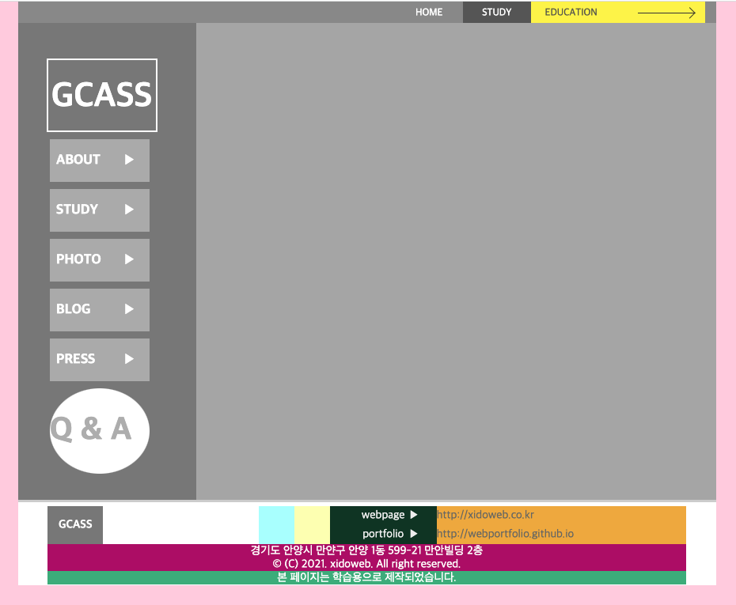
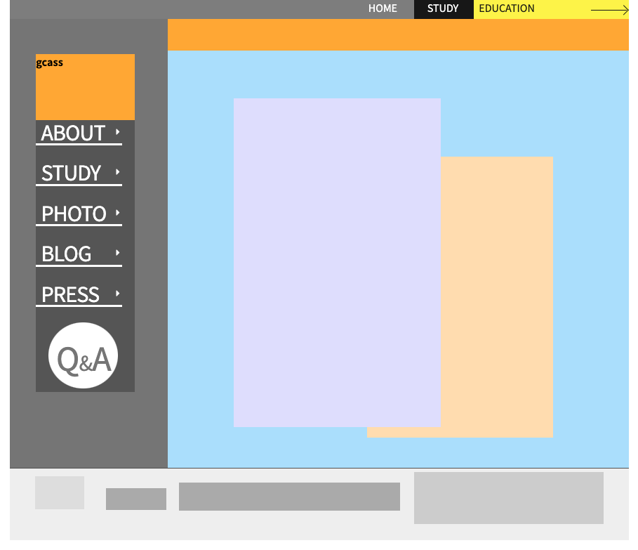

# TIL

- 📝 오늘 배운 내용 ✏️ : 
    - [x] 어제 포토샵으로 수정한 레이아웃을 토대로 coding 💻      

  <p style="padding-left: 40px;">
  👉 &nbsp; 어제 숙제로 미리 해본 레이아웃 <br />
  &nbsp; &nbsp; &nbsp; (cf. 내가 생각했을 때, 좀 더 맞는 레이아웃으로 푸터부분은 수정함)
  </p>
  
  <br />
  <br />

  <p style="padding-left: 40px;">
  👉 &nbsp; 수업시간에 쌤이랑 같이 해본 레이아웃
  </p>
  
  <br />

- [x] `:nth-child()`랑 `:nth-of-type()`이랑 다른점 헷갈리지 말기 ☝️   
  - 📍 `:nth-child()`는 무조건 연속되어진 요소에서 몇번째 요소인지를 의미 
  - 📍 `:nth-of-type()`는 형제 요소 중에서도 동일한 태그명끼리/사이의 순번을 ()안에 적어줘야 한다      
  - e.g.  
    ```html
      <aside id="sideBox">
        <h2 class="blind">utility navigation</h2>
        <ul class="unb"></ul>
        <ul class="test"></ul>
      </aside>
    ```
    ```css
      /* 
      :nth-child()
      :nth-of-type()
      */

      #sideBox > ul:nth-child(2) {}    /* 무조건 연속되어진 요소 중에 2번째니까... ul중 .test를 의미 */
      #sideBox > ul:nth-of-type(1) {}  /* 형제 요소중에서도 동일한 태그여야하고, 그 중 첫 번쨰 ul태그니까 .unb를 갖는 ul을 의미 */
    ```

<br />  
<br />

## HW
<!-- - [x] 💻 빽다방 반응형 웹사이트 프로토타입 figma로 더 develop ⌨️     -->
- [x] 💻 오늘 포토샵으로 레이아웃 수정한 부분 background 속성으로 이미지 처리해서 포토샵 시안과 비슷하게 구현하기 ⌨️    

<br />

---
<details>
<summary>CLICK ME!</summary>  

- cf.  
  - ✨ Only 선생님's 강의 ✨

</detials>   

