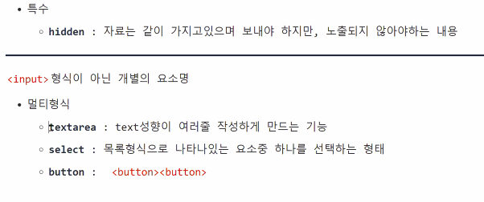

# TIL

- 📝 오늘 배운 내용 ✏️ : 
  - [x] `form` 태그로 [랜덤으로 고른 회원가입 페이지](https://service.jobis.co/signup/account
) 구현하기 
    - 구현한 모습은 아래와 같고, 코드는 클릭 [HTML](https://github.com/ekfka4863/frontEndCourse_210901/blob/main/practice/practice_17%20(signup_system)/html/test.html), [CSS](https://github.com/ekfka4863/frontEndCourse_210901/blob/main/practice/practice_17%20(signup_system)/css/src/test.css)!       
    
     

<!-- 회원가입 페이지 복습 내용 -->

  - [x] `form` 태그 관련... 
    - `form` 태그에서 `action =" "` 속성값은 백엔드와 협업하는 주소를 넣는 것이다
    - `method=" "` 에서는 만약 단순히 검색을 한다고 하면 **GET**을, 그리고 보이지 않게 숨김처리 해서 정보를 보내겠다고 하면 **POST**를 사용한단 것을 ~~일단~~ 알고있자!
    
     
  
  - [x] `input`타입    
   
  
  
   

  
 

## HW
- [x] 💻 빽다방 반응형 웹사이트 서브 페이지 프로토타입 3개 스케치, figma로 만들고, 그 중 하나 코딩으로 구현 ⌨️    

 

---

CLICK ME!
  

- cf.  
  - ✨ 선생님's 강의 ✨

</detials>   

