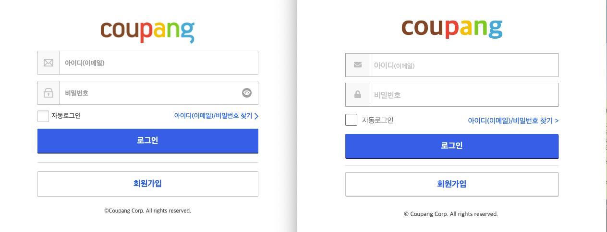

# TIL

- 📝 오늘 배운 내용 ✏️ : 
  - [x] `form` 태그로 [Coupang 로그인 페이지](https://login.coupang.com/login/login.pang?rtnUrl=https%3A%2F%2Fwww.coupang.com%2Fnp%2Fpost%2Flogin%3Fr%3D) 구현하기 
    - 왼쪽이 실제 쿠팡 사이트고, 오른쪽이 구현한 모습이다.        
    
      
    - 코드는 클릭 [HTML](), [CSS]()!       
    
 <!--
  - [x] `form` 태그로 [네이버 회원가입 페이지](https://nid.naver.com/user2/V2Join?token_sjoin=0nEqbe8X7ncizl43&langSelect=ko_KR&chk_all=on&termsService=on&termsPrivacy=on&termsLocation=Y&termsEmail=Y) 클론하기 
    - 구현한 모습은 아래와 같고, 코드는 클릭 [HTML](https://github.com/ekfka4863/frontEndCourse_210901/blob/main/practice/practice_17%20(signup_system)/html/test_naver_sign_up.html), [CSS](https://github.com/ekfka4863/frontEndCourse_210901/blob/main/practice/practice_17%20(signup_system)/css/src/test_naver_sign_up.css)!       
    
     

  - [x] `form` 태그 관련... 
    - `form` 태그에서 `action =" "` 속성값은 백엔드와 협업하는 주소를 넣는 것이다
    - `method=" "` 에서는 만약 단순히 검색을 한다고 하면 **GET**을, 그리고 보이지 않게 숨김처리 해서 정보를 보내겠다고 하면 **POST**를 사용한단 것을 ~~일단~~ 알고있자!
    
     
  
  - [x] `input`타입    
   
  
  
    -->

  
 

## HW
- [x] 💻 빽다방 반응형 웹사이트 서브 페이지 프로토타입 3개 스케치, figma로 만들고, 그 중 하나 코딩으로 구현 ⌨️    

 

---

CLICK ME!
  

- cf.  
  - ✨ 선생님's 강의 ✨

</detials>   

