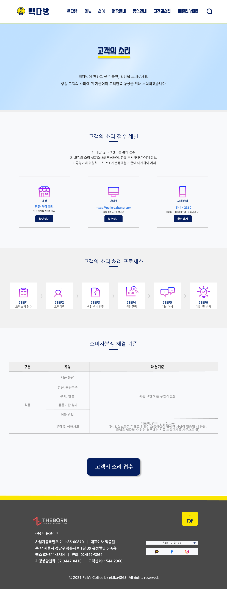

# TIL

- 📝 오늘 배운 내용 ✏️ : 
  - [x] 시험 당일 
    - 서브페이지 figma로 구현 
    
      

    - 서브페이지 코딩으로 구현 
     
      
      - 코드는 클릭 [HTML](https://github.com/ekfka4863/PaiksCoffeeRenewal/blob/master/code/html/subpage_cs_box_1280.html), [CSS](https://github.com/ekfka4863/PaiksCoffeeRenewal/blob/master/code/css/src/subpage_cs_box_1280.css)!       
      - 보완할 부분: 
        - 디테일 적인 부분에서 아이콘이나 텍스트 더 채워넣어야 함
        - `고객의 소리 접수` 버튼을 누르면 모달창과 모달창 안에 form 태그로 구성한 접수 형식이 나와야 하는데, 아직 구현 못함
        
 
 

---

CLICK ME!
  

- cf.  
  - ✨ 오늘은 하루종일 시험만 봄!✨

</detials>   

