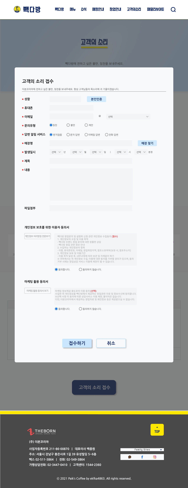

# TIL

- 📝 오늘 배운 내용 ✏️ : 
  - [x] 시험 제출 연장 
    - 서브페이지 모달창 및 폼 figma로 구현 
     
    <br /> 

    - 서브페이지 모달창 및 폼 코딩으로 구현 
    
    <br /> 
      - 코드는 클릭 [HTML](https://github.com/ekfka4863/PaiksCoffeeRenewal/blob/master/code/html/subpage_cs_box_1280.html), [CSS](https://github.com/ekfka4863/PaiksCoffeeRenewal/blob/master/code/css/src/subpage_cs_box_1280.css)!       
    <br /> 
  - [x] `placeholder` 대체 방법 (플로팅된 레이블 효과)
    - `placeholder` 속성은 많은 이슈가 있다. 왜 사용하면 안되는지 알아보자.    
      - **번역 불가**:          
        브라우저가 번역될 때 placeholder는 번역이 되지 않는 속성 중 하나이다.     
        그래서 번역되 않고 기존 언어로 유지되는 해당 속성은 페이지의 논리 구조를 
        정확히 이해하고 조작할 수 없게 할 가능성이 높기 때문에 placeholder 말고 
        label을 사용해 문제점을 보완해야겠다.    
      - **상호 운용성(interoperability)**:       
        label의 for 속성과 input의 id 속성에 같은 값을 넣어 완전히 다른 태그를 연결 시킬수 있다.       
      - **입력 시작시 힌트가 사라짐**:       
        placeholder는 인풋에 입력을 하기 전까지 사라지지 않는다.      
        ~~처음 서비스를 사용하는 사람은 이미 뭔가가 입력되었다고 생각할 수 있기에... 혼란을 초래할 수 있다.~~        
        하지만  `플로팅된 레이블 효과`를 사용하면 포커스가 입력란에 갔을 때, 바로 힌트를 사라지게 할 수 있다.         
      - **구형 브라우저에서 사용 불가**:         
        - [can I use](https://caniuse.com/?search=placeholder)에서 확인 가능!
      - 이 외에 다른 이유들을 알고싶다면 [클릭](https://ibrahimovic.tistory.com/30)!

    - 웹표준과 웹접근성을 위해 `form element`와 `label`을 연동해야 한다:     

      <details>
        <summary>CLICK TO SEE CODE!</summary>     
    
        ```html 
          <!-- layout -->
          <div id="wrap">
            <h1><a href="./a_content.html">웹</a></h1>

            <div class="part">
              <h2>게시판 작성내용</h2>

              <form action="#" method="POST">
                <fieldset>
                  <legend>질문 내용</legend>

                  <div class="title_area">
                    <input type="text" name="write__Title" id="writeTitle" value="" />
                    <label for="writeTitle">제목</label>
                  </div><!-- // .title_area -->
                  
                  <div class="content_area">
                    <label for="writeContent" class="blind">
                      상세내용을 작성하세요.
                    </label>
                    <textarea name="write__Content" id="writeContent" cols="30" rows="10"></textarea>
                  </div><!-- // .content_area -->

                </fieldset>
              </form>
            </div><!-- // .part -->
          </div><!-- // #wrap -->
        ```
        ```css
          #wrap {
            width: 800px;
            height: auto;
            margin: auto;
          }
          h1 {
            text-align: center;
            margin-bottom: 1rem;
          }
          .part {
            width: 100%;
            height: 450px;
            background-color: #eee;
          }
          h2 {
            width: 100%;
            height: auto;
            padding: 0.5rem 1rem;
            font-size: 1.5rem;
          }

          /* ------------------------------------------- */
          /* form */
          form {
            width: 100%;
            height: auto;
            padding: 0.5rem;
            background-color: #fad;
          }
          fieldset {
            width: 100%;
            height: auto;
            padding: 1rem;
            box-shadow: 0.3rem 0.3rem 0.3rem #777;
            background-color: #ddd;
          }

          /* .title_area 
          --------------------------------------*/
            .title_area {
              /* 위치 */
              position: relative;

              width: 100%;
              height: 30px;
              margin-bottom: 1rem;
              box-shadow: inset 0.1rem 0.1rem 0.2rem #999;
              background-color: #fff;
            }
            /* label */
              label {
                /* 위치 */
                /* float: left; */
                display: block;

                /* 스타일링 */
                width: 100px;
                height: 100%;
                font-weight: 700;
                font-size: 1.3rem;
                letter-spacing: 0.1rem;
                text-align: center;
                color: #07a;
              }   
            /* input */
              #writeTitle {
                /* 위치 */
                position: absolute;
                top: 0;
                left: 0;

                /* float: right; */
                display: block;

                /* 스타일링 */
                width: 100%;
                height: 100%;
                /* input은 기본적으로 패딩과 보더가 있음! */
                padding: 0;
                border: 0;

                text-indent: 1rem;
                background-color: rgba(255, 255, 255, 0.5);
              }

              /* 많이 쓰는 기법! */
              #writeTitle:focus {
                background-color: rgba(255, 255, 255, 1);
              } 

              /* .action */
              #writeTitle.action {
                background-color: rgba(255, 255, 255, 1);
              } 


          /* .content_area 
          --------------------------------------*/
            .content_area {
              width: 100%;
              height: 450px;
              background-color: #fff;
            }
              #writeContent {
              }
        ```
             
      </details>   
    
<br />

---
<details>
<summary>CLICK ME!</summary>  

- cf.  
  - ✨ 선생님's 강의 ✨
  - https://ibrahimovic.tistory.com/30
  - https://aosceno.tistory.com/403

</detials>   

