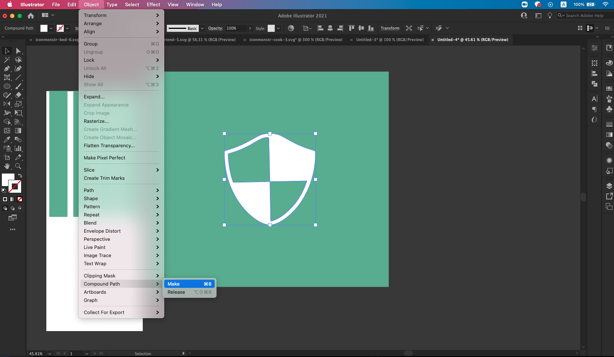

# TIL

- 📝 오늘 배운 내용 ✏️ : 
  - [x] Illustrator 중요 기능 3가지
    - 1. `컴파운드 패스(Compound Path)`
    <!--  -->
    - 2. `패스 파인더(Pathfinder)`
    
    - 3. `클리핑 마스크(Clipping Mask)`:    
    

         

  - [x] Illustrator 중요 기능 3가지 활용해서 `customized icon` 만들어서 `webfont`로 사용하는 방법
    - 커스텀 아이콘 만드는 방법
      - <u>step 1</u>:       
        일러스트레이터로 아이콘을 만든 뒤, `compound path`로 하나의 덩어리로 만들고,       
        상단 메뉴의 `Window` → `Asset Export`를 열고, 그 안으로 드래그 해준 뒤,       
        파일 포멧을 지정한 뒤 `Export` 시켜준다.      
      - <u>step 2</u>:             
        필요한 곳에 ~~e.g. css의 속성인 background-image: url(""); 등으로~~ 연결시켜서 사용한다.         
      
    - 웹폰트 만드는 방법
      - <u>step 1</u>:       
      일러스트레이터로 `.svg` 확장자를 갖는 아이콘을 만든다.       
      (cf. 보통 웹폰트를 만들 때 **size**는 **64px * 64px ~ 128px * 128px** 사이를 기준으로 한다.)          

        <u>다만</u>, svg로 만든 아이콘을 웹폰트로 사용하려면 <u>2가지 조건을 만족시켜야 한다</u>:        
        - <u>조건 1</u>:      
        svg로 만든 아이콘을 일러스트레이터의 `compound path`를 사용해서, 하나의 "덩어리"로 만들어서 export 해야한다.
        
               

        - <u>조건 2</u>:          
        HTMl 코드상에서 `link` 태그로 해당 아이콘/웹폰트가 담긴 폴더를 연결 시킨다.         
        (cf. 웹폰트로 만들었을 경우 생성된 파일 안에는 여러가지 폴더/파일들이 있을텐데, 이때 **font 폴더**와 **style.css**가 중요하다!)         
               
        
      - <u>step 2</u>:          
      [iconmoon](https://icomoon.io/app/#/select)으로 가서 `import icon`을 누르고, 웹폰트로 생성할 파일을 넣은뒤
       `generate` 버튼을 눌러준다.      
       그러면 import한 아이콘을 웹폰트로 사용할 수 있게 된다.       
      - <u>step 3</u>:          
      해당 폴더를 html 파일에서 \<link> 태그로 연결 시켜준다.      
      일반 텍스트/font 처럼 사용하면 된다.     

 
 
---

CLICK ME!
  

- cf.  
  - ✨ Only 선생님's 강의 ✨
  - https://blog.stories.pe.kr/208
  - https://m.blog.naver.com/wailmi93/221992953137
  - https://hailey0.tistory.com/13
  - https://sejiwork.blogspot.com/2021/01/icomoon.html?utm_source=feedburner&utm_medium=feed&utm_campaign=Feed:+Sejiwork+(%EC%B4%88%EA%B8%89+%EA%B0%9C%EB%B0%9C%EC%9E%90+sejiWork)&m=1
  - https://sonylove.tistory.com/1177
  - https://helpx.adobe.com/kr/illustrator/using/clipping-masks.html

</detials>   

