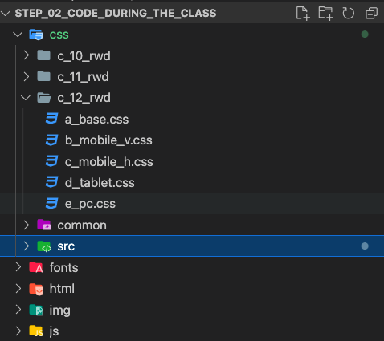
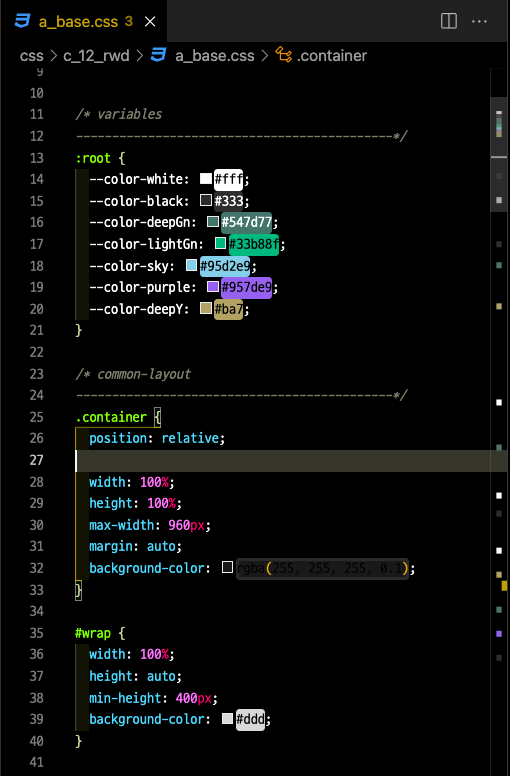
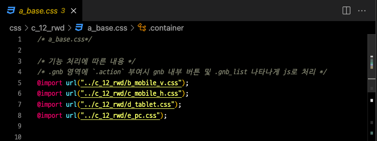

# TIL

## 미디어쿼리(@media)로 **responsive web** 만들기
<br />

> **WHY** 반응형 웹? 
- 다양한 디바이스들이 웹브라우징을 지원하면서 웹에서 화면의 해상도에 따라 유연하게 컨텐츠를 배치하는 기술이 점점 중요해지고 있다.     
특히, 과거에는 Desktop first라고 할 만큼, 기본 pc 크기를 중심을 두고 반응형 웹을 개발하였지만, 현재는 Mobile first라고 할 만큼 모바일을 중심으로,        
또 최근에는 애플워치에서도 웹브라우징을 지원하는 방법에 대한 관심이 생기고 있는 만큼 다양한 디바이스 크기에 맞춰서 웹 레이아웃을 구현하는 방법은 
그 중요도가 날로 높아지고 있다고 할 수 있겠다.      
<br />
<hr />
<br />

> **HOW** 반응형 웹? 
- CSS의 스타일시트에서 `@media`를 사용하면 지정한 뷰포트 크기에 반응하여 스타일링에 변화를 주는 **반응형웹**을 만들수 있다.      
<br />

>> @media 사용하는 방법
- `@media` 기본 문법:        
```css 
  @media 미디어타입 and (조건) {
    // 스타일
  }
```
<br />

- 위에서 `스타일` 부분에는 일반 CSS 코드가 들어가고, `조건` 부분에서는 `@media`를 활용하여 뷰포트 크기에 대한 조건을 걸어준다       
e.g.            
  ```css 
    /* 조건:
      - 스마트폰 크기인 320px 보다 작은 디바이스의 화면에서 div 요소의 배경색을 violet 색으로 바꾸고,        
      - 320px보다는 크고, 태블릿 크기인 786px 보다 작은 디바이스의 화면에서 div 요소의 배경색을 orange 색으로,        
      - 786px보다는 크고, 1280px 크기의 디바이스 화면에서는 배경색을 tomato 색으로, 그리고
      - 1280px과 1920px 화면 사이의 디바이스 화면에서는 배경색을 lightgray 색으로 바꾸려면 아래와 같이 조건을 작성한다
    */


    @media all and (max-width: 320px) {
      div {
        background-color: violet;
      }
    }

    @media all and (min-width: 320px) and (max-width: 768px) {
      div {
        background-color: orange;
      }
    }

    @media all and (min-width: 786px;) and (max-width: 1280px;) {
      div {
        background-color: tomato;
      }
    }

    @media all and (min-width: 1280px;) and (max-width: 1920px;) {
      div {
        background-color: lightgray;
      }
    }
  ```
  <!-- 위에꺼 맞는지 쌤한테 확인...  -->

- 이때, 위에서 `all` 이란 단어가 `@media`와 함께 사용되는데, 이는 미디어타입(media type)을 언급해 주는 것이다.        
대표적인 미디어 타입은 아래와 같다: 
  - **all**: 모든 기기에 적용
  - **screen**: 스크린 ~~화면~~용
  - **print**: 프린터 / 인쇄용            
  - **speech**: 음성 출력 장치용               
  📍다만, 미디어 타입의 언급은 선택사항으로 만약 미디어 쿼리에 미디어 유형을 명시하지 않으면 기본값으로 
  **모든 미디어 유형에 대한 것**으로 해석한다📍

<br />
<br />

>> 미디어 쿼리 지정 순서
- PC와 Mobile, 두 가지 기준으로 순서를 지정할 수 있다.      
  - PC를 기준으로 먼저 미디어쿼리를 지정하면, 후에 모바일 스타일을 지정해 덮어쓰기 형태로 지정할 수 있다.      
  e.g.     
    ```css
      @media all and (max-width:1200px) { ... }
      @media all and (max-width:768px) { ... }
      @media all and (max-width:480px) { ... }
    ```
  - 만약 모바일을 기준으로 하면, 모바일의 스타일을 먼저 지정해 준 후, PC 스타일을 지정해 주면 된다.      
  e.g.        
    ```css
      @media screen and (max-width:1200px) { ... }
      @media screen and (max-width:768px) { ... }
      @media screen and (max-width:480px) { ... }
    ```
  - 보통은 해상도가..
    - 320px ~ 768px 이면 **Smartphone**
    - 768px ~ 1024px 이면 **Tablet**
    - 1024px 이상이면 **PC**      
    으로 생각!
    

<br />
<br />


>> 미디어 쿼리를 사용해서 만든 스타일시트 레이아웃별로 분할하기
- 아래와 같은 구조로 ~~css 파일 내로 가서~~ 해당 웹 페이지 ~~반응형~~ 레이아웃들에 적용할 
css 스타일시트들을 하나의 파일로 만들어서 모아둔다.        
e.g.        
<span style="padding-left: 5px; font-weight: bold;">file 이름: c_12_rwd</span><br />        

<br />

- 해당 파일 안에 ...        
`base.css`를 만들어 모든 css에 공통으로 적용되는 css 코드를 모아둔다     
<br />

<br />

- 기타 다른 다양한 뷰포트 크기에 맞춰서 미디어쿼리를 적용한 만큼 
`_____.css` 스타일시트를 따로 만들어 각각의 레이아웃에 맞는 css를 적는다.      
이때, 해당 css 안에서 `@media 미디어유형 and (조건) { ... }` 형식으로 먼저 미디어 쿼리 조건을 열고, 
중괄호 {...} 안에 적용할 일반적으로 css를 적듯이 적어줘야 한다는 사실 유의!!      

<br />  

- 마지막으로 `base.css`에서 `@import url("");`로 모든 해당 웹페이지의 레이아웃과 관련된 css 파일을 연결해주고, 
html 문서에 가서도 \<link> 태그로 해당 `base.css`를 연결 시켜줘야한다는 사실 잊지말기!     

<br />  

---
<details>
<summary>CLICK ME!</summary>  

- cf.  
  - ✨ Only 선생님's 강의 ✨
  - https://m.blog.naver.com/PostView.naver?isHttpsRedirect=true&blogId=anedthh&logNo=221308534408
  - https://skydoor2019.tistory.com/8
  - https://velog.io/@yunsungyang-omc/CSS-%EB%B0%98%EC%9D%91%ED%98%95-%EC%9B%B9-%EB%AF%B8%EB%94%94%EC%96%B4-%EC%BF%BC%EB%A6%ACmedia-query
  - https://runebook.dev/ko/docs/css/media_queries/using_media_queries
  - https://developer.mozilla.org/ko/docs/Learn/CSS/CSS_layout/Media_queries
  - https://www.daleseo.com/css-media-queries/
  - https://velog.io/@bungouk6829/%EB%B0%98%EC%9D%91%ED%98%95-%EC%9B%B9%EC%9D%98-%EB%AF%B8%EB%94%94%EC%96%B4-%EC%BF%BC%EB%A6%AC-Media-Query-%EC%99%80-Viewport

</detials>   

