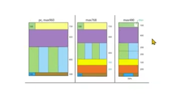

# TIL

- 📝 오늘 배운 내용 ✏️ : 
  - [x] responsive web 만드는 방법
    - 목표:       
    👉  아래의 레이아웃과 같이 **PC, Tablet, Smartphone** 뷰포트 크기에 반응하여 레이아웃이 달라지는 웹 페이지 만들기 
      
       
    - css 파일 해당 뷰포트 크기에 따라 나눠서 `@import url();`으로 연결하는 방법
    - 
    
 

---

CLICK ME!
  

- cf.  
  - ✨ Only 선생님's 강의 ✨

</detials>   

