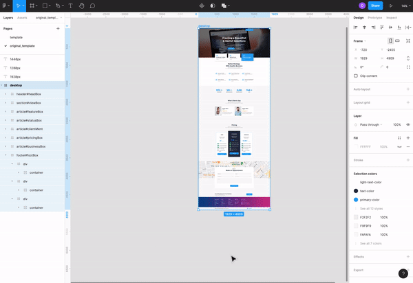
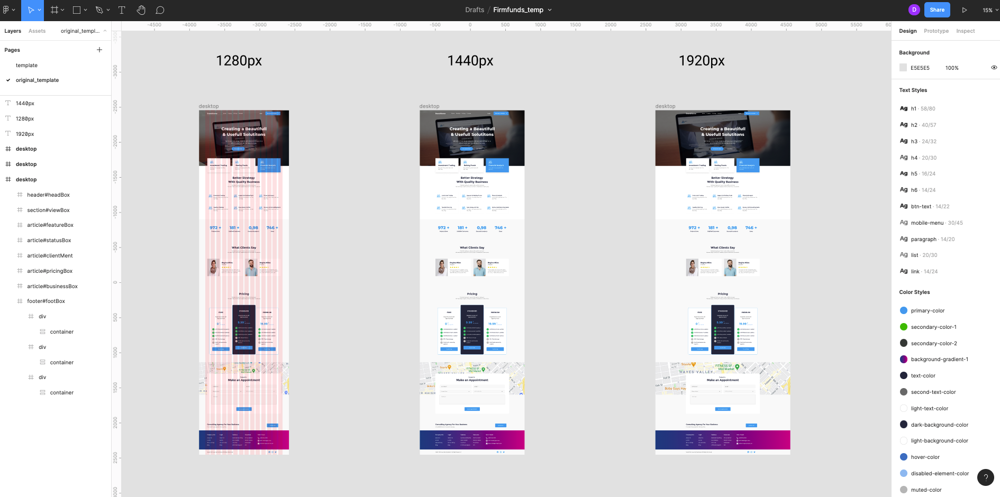
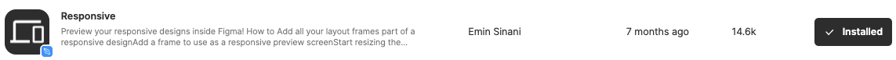

# TIL

- 📝 오늘 배운 내용 ✏️ : 
  - [x] 피그마에서 하나의 layout으로 responsive web 만드는 방법
    - <u>만드는 과정</u>:              
    👉  `frame`으로 각 영역의 box들을 만들고, `constraints`로 늘어나는 레이아웃과 연결되어있는 감싸는 부모 요소들은 
    `left and right` ~~+ `top`~~ 으로 설정하고, 그 감싸는 frame 안에 배치된 요소들 (e.g. image, list, 등)의 
    `constraints`는 `center`~~+ `top`~~ 으로 설정하여, 하나의 PC 버전인 **1440px** 레이아웃 하나로 
    **1280px, 1980px** 뷰포트 크기에 맞는 레이아웃들을 일괄적으로 만들어 낼 수 있다 
      
       
       

    - <u>완성본</u>:           
    👉 완성본 gif로 보기     
      
       
       
    👉 완성본 이미지로 보기     
      
       
       

    - <u>피그마로 responsive web 와이어 프레임 만들 때 <em>TIP</em> 📍</u>:              
      - 각 영역 (cf. 특히 id="____Box"라는 값을 갖는 영역들은... ) `frame`으로 감싸준다.      
      그리고 해당 frame은 `constraints`를 `left and right`로 잡아주어 기기의 크기가 작아지거나 커져도 대비할 수 있게 한다. 
      - 각 `frame` 안에 들어가는 요소들이 중심을 기준으로 배치될 것이라면 `constraints`를 `center`로 잡고, 
      만약 ~~그게 아니라~~ 레이아웃의 크기 변화에 따라갈 것이면 `left and right`로 설정한다.      
      - 가로나 세로로 같은 요소가 반복되어/같은 간격을 두고 나열 될 경우 `auto layout`을 적극 활용한다.
      - 또, 같은 요소가 반복되어 사용되면 해당 요소는 `component`로 지정하여, 부모 컴포넌트를 기준으로 자식 컴포넌트들을 일괄적으로 스타일링 할 수 있게 한다.
      - responsive하게 움직이는 하나의 frame/layout을 만들고 싶다면 [Responsive](https://www.figma.com/community/plugin/840727678445998968/Responsive)이라는 plugin을 적극 활용한다.       
      

     
 
 

---

CLICK ME!
  

- cf.  
  - ✨ Only 선생님's 강의 ✨

</detials>   

