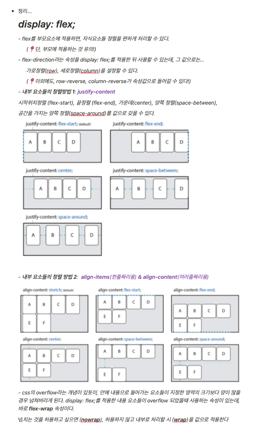
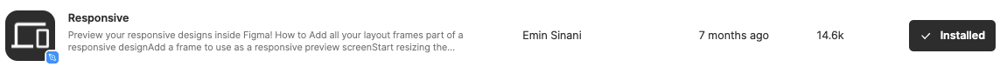

# TIL
- 📝 오늘 배운 내용 ✏️ : 
  - [x] `display: flex;` & `display: grid` 👉 [링크 클릭!](https://github.com/ekfka4863/TIL/blob/master/CSS%26SASS%26Bootstrap/CSS/CSS_%EB%AF%B8%EC%99%84_flex_grid.md)

   
  
   
   

  - [x] JS 변수 선언 방법 - **호이스팅 현상**

 
 
<!--  -->

  
  

     
 
 

---

CLICK ME!
  

- cf.  
  - ✨ Only 선생님's 강의 ✨
  - https://heropy.blog/2018/11/24/css-flexible-box/

</detials>   

