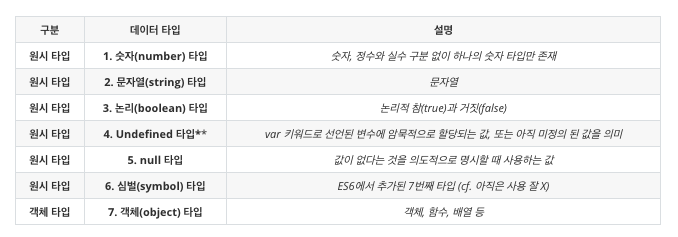

# TIL
- 📝 오늘 배운 내용 ✏️ : 
  - [x] JS `data type` & `scope`
    - 다만, `NaN(Not a Number)`는 typeof를 하면 number가 나오긴한다.     
    즉, JS 엔진이 인식하기를 ... 숫자로 강제 변환을 하겠다면 숫자로 타입을 바꿔줄 수는 있지만 그 값은 숫자가 아니라 모르겠다!      
    라고 인식/해석 하는 것!      
  - [x] JS 함수 정의 방법: 
    - `함수 선언식` (cf. 기명함수) 
    - `함수 표현식` (cf. 익명함수)
    - `함수 호이스팅`   
    - `parameter` & `argument`   
    - `return문`   
  - [x] `디버깅(debugging)`이란? 
    - _프로그래머가 실수로 잘못 코딩한 프로그램을 실행하면 오류(error)가 발생한다.
    이런 현상을 보고 버그(bug)가 생겼다고 하는데, 이런 버그를 검사하고 수정하는 작업을 
    디버깅(debugging)이라 한다._

<br />
<br />

### 자바스크립트 데이터 타입 (총 7가지)
<br />

<br />

- 타입 알고싶을 때 사용하는 명령어: `typeof(값이나 변수명)`
<br />

> 숫자형
- 정수(소수점 이하가 없는 숫자)와 실수(소수점 이하가 있는 숫자)를 구분하지 않고 전부 하나의 숫자 타입으로 처리한다.
  ```js
    var integer = 10;     // 정수
    var double = 10.12;   // 실수 
    var negative = -20;   // 음의 정수 
  ```
- 숫자형에~~만~~ 사용할 수 있는 `Math.____();`내장함수들 소개 
  ```js
    var double = 10.12;    
    Math.floor(double);   // 내리기 -> 10
    Math.round(double);   // 반올림 -> 10
    Math.ceil(double);    // 올리기 -> 11

    var negative = -20;   
    Math.abs(negative);   // 20

    Math.random();        // 난수 
    // e.g. 
    // 로또 -> 1부터 65까지의 숫자를 뽑고 싶다면... 64까지 왜냐면! 0~64까지 카운트해서~
    // 빈배열 만들기 
    var arr = [];
    // 1 ~ 65 중 랜덤 숫자 뽑기 방법 1
    // parseInt(Math.random() * 64) + 1
    // 1 ~ 65 중 랜덤 숫자 뽑기 방법 2
    Math.floor(Math.random() * 64) + 1

    arr.push(parseInt(Math.random() * 64) + 1);
    // for문 돌리고 그 안에 if문을 넣어서... 중복된 값을 넣지 않게 ... 
    
    // arr.sort(); 도 잊지 말기... ^^ 
  ```

<br />

> 문자형
- 문자열 타입은 텍스트 데이터를 나타내는 자료형이다.     
문자열은 작은 따옴표(' '), 큰 따옴표(" "), 또는 백틱(\` \`)으로 텍스트를 감싸면 된다.    
일반적으로 JS에서 문자형은 작은 따옴표를 사용한다.     
  ```js
  var string;    
  string = '문자열';
  string = "문자열";
  string = `문자열`;     // ES6

  string = '작은 따옴표로 감싼 문자열 내의 "큰따옴표"는 문자열로 인식된다';
  string = "큰따옴표로 감싼 문자열 내의 '작은따옴표'는 문자열로 인식된다";
  ```
<br />

> 논리형
- 논리형은 `불리언(boolean)`이라고도 불린다.    
불리언 타입의 값은 논리적 참, 거짓을 나타내는 **true**와 **false**, 단 두개 뿐이다.
  ```js
  var t = true; 
  console.log(t);     // true

  var f = false; 
  console.log(f);     // false
  ```
- 불리언 타입의 값은 참과 거짓으로 구분되는 조건에 의해 프로그램의 흐름을 제어하는 조건문에서 자주 사용한다.
  ```js
  // e.g. 
  var ex = 'example_value';    // truthy 값

  if (!ex) {                   // truthy 값을 뒤집으면 falsy값 -> false임으로 아래 return문 실행 안됨!
    console.log('실행안됨(X)');
  }

  if (!!ex) {
    console.log('실행됨(O)');          // falsy값인 !ex를 뒤집으면 truthy값이 된다 -> 조건문이 참임으로 아래 return문 실행됨!
  }                                 // 콘솔 창 출력 결과: '실행됨(O)'
  ```

<br />

> undefined
- `undefined` 타입의 값은 undefined가 유일하다.       
- var 키워드로 선언한 변수는 암묵적으로 undefined가 초기화된다.        
(cf. 변수 호이스팅)
- 변수 호이스팅:       
  - JS에는 `호이스팅(hoist) 현상`이라는 다른 프로그래밍 언어와는 조금 다른 독특한 특징이 있다. 
  - 호이스팅의 정의: 
    - 호이스팅이란 JS의 변수 또는 함수의 선언부가 마치 코드의 최상단으로 끌어올려진 것과 같이 작동한다 해서 
    붙여진 이름이다. 
    ```js
    // 변수 호이스팅 
    console.log(x);       // undefined

    var x = 10;

    console.log(x);       // 10


    // ------------------------------------------------------- 
    // 함수 호이스팅
    // 함수 표현식 - 변수 호이스팅 
    func();               // Uncaught ReferenceError: func is not defined
    console.log(func);    // undefined   ---> 여기서 일어나는 것은 변수 호이스팅 이다!

    var func =  function() {
      return '함수 호이스팅 현상!';
    };

    func();               // '함수 호이스팅 현상!'
    // console.log(func());

    // -------------------------------------------------------
    // 함수 선언식 - 함수 호이스팅 
    hoistedFn();          // '함수 호이스팅 현상!!!!'    ---> 여기서 일어나는 것은 함수 호이스팅 이다!
                          // BUT!!! 위의 함수 표현식이 더 권장되는 이유는, 아직 실행도 되지 않은 함수가 값을 갖는 것보다, 
                          // 차라리 함수 표현식을 써서 변수 호이스팅이 일어나 undefined(미정의) 값을 갖는 것이 더 좋기 때문이다.  
    function hoistedFn() {
      return '함수 호이스팅 현상!!!!';
    }

    hoistedFn();          // '함수 호이스팅 현상!!!!'

    ```
<br />

> null
- `null` 타입의 값은 null이 유일하다.      
다만, JS는 대소문자를 구분하므로 null과 Null, NULL, 등과는 다른 값이라는 것에 유의!!!      
- JS의 `null`은 <u>변수에 값이 없다는 것을 의도적으로 명시할 때 사용</u>하는 값이다.     
- 함수가 유효한 값을 반환할 수 없는 경우에도 null을 반환하기도 한다.     

<br />

> 심벌 타입
- 심벌(symbol)은 ES6에서 추가된 7번째 타입으로, 변경 불가능한 원시 타입의 값이다. 
- 심벌 값은 다른 ㄱ밧과 중복되지 않는 유일무이한 값이다.        
따라서 주로 이름이 충돌할 위험이 없는 객체의 유일한 프로퍼티 키를 만들기위해 사용한다.    
- 심벌 이외의 원시값은 리터럴을 통해 생성하지만 심벌은 `Symbol` 함수를 호출해 생성한다는 차이점이 있다.     
이때 생성된 심벌값은 외부에 노출되지 않으며, 다른 값과 절대 중복되지 않는 유일무이한 값이다.      
- ~~cf. 심벌은 아직 잘 사용되지 않으니, 여기까지만 알고있기!~~

<br />

> 객체 타입 
- JS의 데이터 타입은 총 7가지이다.    
위에서 본 6가지 데이터 타입(cf. 숫자, 문자, boolean, undefined, null, symbol)를 **원시 타입**이라고 하고, 
원시타입이 아닌 모든 데이터를 **객체 타입**이라고 한다.    
- e.g.     
  - 배열(Array)
  - 객체(Object)
  - 함수(Function) 
  - etc.
```js
  // 배열(Array)
  var arr = [];

  // 객체(Object)
  var obj = {
    name: 'ekfka4863',
    age: 26 
  };

  // 함수(Function) 
  var func = function() {
    // 내부 로직
    // return문;
  };
```

<br />
<br />

### 스코프란? 
> 스코프의 정의
- 스코프(scope)는 다른말로 **유효범위**다.      
스코프는 변수 그리고 함수와 깊은 관련이 있는데, 
변수의 입장에서 자신이 선언된 위치에 의해 자신이 유효한 범위, 즉 다른 코드가 변수 자신을 참조(/호출)
할 수 있는 범위가 결정된다.          
변수 뿐만 아니라 <u>모든 식별자(변수이름, 함수이름, 클래스 이름 등...)는 자신이 선언된 위치에 의해 다른
코드가 식별자 자신을 참조할 수 있는 유효범위가 결정된다</u>.      
즉, **스코프는 식별자가 유효한 범위를 의미**한다.      

<br />

> 스코프의 종류 (2가지)
- 스코프는 2가지 - `전역(global) 스코프`와 `지역(local) 스코프`로 구분할 수 있다.    

  |**구분**|**설명**|**스코프**|**변수**|
  |:---:|:---:|:---:|:---:|  
  |전역|코드의 가장 바깥 영역|전역 스코프|전역 변수|
  |지역|함수 몸체 내부|지역 스코프|지역 변수|

- e.g.     
  ```js
    var x = "global x";
    var y = "global y";

    function outer() {
      
      var z = "outer's local z";

      console.log(x);      // 1.
      console.log(y);      // 2.
      console.log(z);      // 3.

      function inner() {
        var x = "inner's local x";
        
        console.log(x);    // 4.
        console.log(y);    // 5.
        console.log(z);    // 6.
      }

      inner();
    }

    outer();

    console.log(x);        // 7.
    console.log(y);        // 8.
  ```

<details>
<summary>위의 예시 출력값 보려면 클릭!</summary>  

- 1. "global x"
- 2. "global y"
- 3. "outer's local z"
- 4. "inner's local x"
- 5. "global y"
- 6. "outer's local z"
- 7. "global x"
- 8. "global y"

<br />

- 다시,      
  - **전역 변수**는 어디서든지 참조할 수 있다.     
  - 하지만, **지역 변수**는 자신의 지역 스코프와 하위 지역 스코프에서만 유효하다.     
  - ~~📍 TIP!       
  전역변수가 부모고 지역변수가 자식이면, 자식은 부모님 방에 들락날락 거려도, 부모님은 다큰 자식방에 왔다갔다 맘대로 못하는거처럼...
  둘 사이에는 그런 스코프 barrier가 있다!~~  
</detials>   

<br />
<br />

---
<details>
<summary>CLICK ME!</summary>  

- cf.  
  - ✨ Only 선생님's 강의 ✨
  - https://heropy.blog/2018/11/24/css-flexible-box/

</detials>   

