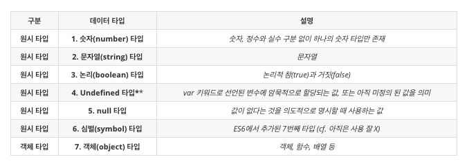

# TIL
- 📝 오늘 배운 내용 ✏️ : 
  - [x] `배열과 객체` 
    - 배열 내 배열 
    - 객체 내 객체 
    - 배열과 객체의 혼합형
    <!-- https://yjshin.tistory.com/entry/JavaScript-%EC%9E%90%EB%B0%94%EC%8A%A4%ED%81%AC%EB%A6%BD%ED%8A%B8-for-%EB%AC%B8-for-in-%EB%AC%B8-for-of-%EB%AC%B8
    https://medium.com/@hongkevin/js-5-es6-map-set-2a9ebf40f96b
    http://blog.302chanwoo.com/2017/08/javascript-array-method/
     -->
    - 엑셀 파일로 .csv 파일 만들고 json 파일로 컨버트 하는 방법 
  - [x] `SCSS` 기초 문법 
    - 

<br />
<br />

### 배열과 객체
<br />
<!--  -->
<br />
<br />

<!-- ### 사칙연산 (함수로 구현)
<br />

> 함수 선언 
- 기본 문법 

  ```js

  ``` 
- 연산자 
  ```js 


  ``` -->

<br />
<br />

---
<details>
<summary>CLICK ME!</summary>  

- cf.  
  - ✨ Only 선생님's 강의 ✨
  - https://choseongho93.tistory.com/99
  - https://im-developer.tistory.com/57
  - https://velog.io/@nathan29849/JAVA-%EC%A6%9D%EA%B0%90-%EC%97%B0%EC%82%B0%EC%9E%90-%EC%A0%84%EC%B9%98-%ED%9B%84%EC%B9%98
  - https://velog.io/@iamhayoung/JavaScript-%EC%A6%9D%EA%B0%90-%EC%97%B0%EC%82%B0%EC%9E%90-Feat.-%EC%A0%84%EC%9C%84-%EC%97%B0%EC%82%B0%EC%9E%90-%ED%9B%84%EC%9C%84-%EC%97%B0%EC%82%B0%EC%9E%90

  - http://megaton111.cafe24.com/2017/01/13/sass-%EB%AC%B8%EB%B2%95-%EB%B6%88%EB%9F%AC%EC%98%A4%EA%B8%B0import-%EC%83%81%EC%86%8Dextend-%EB%AF%B9%EC%8A%A4%EC%9D%B8mixin/
  - https://lunuloopp.tistory.com/entry/Sass-%EB%AC%B8%EB%B2%95-%EC%A0%95%EB%A6%AC-5-mixin-extend
  - https://m.blog.naver.com/PostView.naver?isHttpsRedirect=true&blogId=phlox__&logNo=221181093967
  - https://heropy.blog/2018/01/31/sass/

</detials>   

