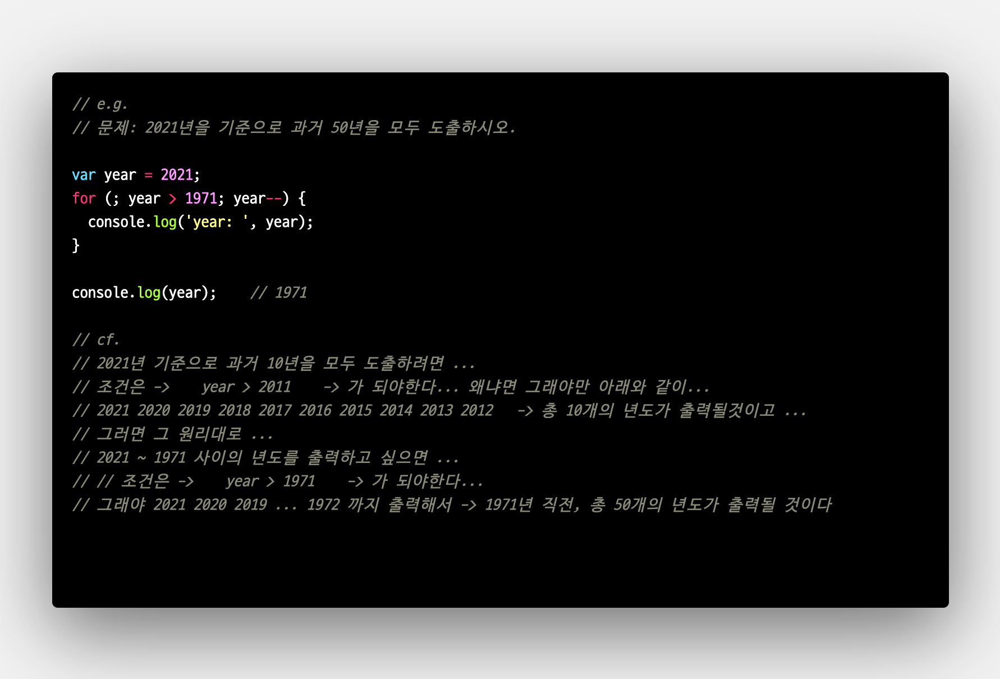
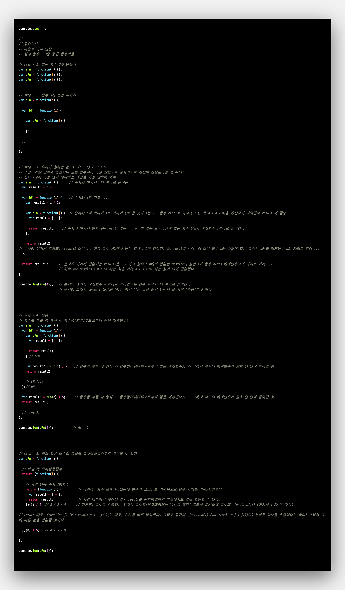

# TIL
- 📝 오늘 배운 내용 ✏️ : 
  - [x] `반복문` 
    - `while문`
    - `do-while문`
    - `for`
    - `for in`
    - `forEach`
  - [X] 반복문을 활용한 문제풀이 
    
    
  - [X] 생성자 함수 
  <!-- https://doitnow-man.tistory.com/132 -->
  - [X] 유사배열객체 <- forEach()
  <!-- https://curryyou.tistory.com/202 -->

  <!-- - 클로저와 즉시실행함수 
  https://wookgu.tistory.com/7 -->

  - [X] CLI에서 node-sass 명령어로 scss 파일 css로 변환하는 명령러 
    - `node-sass --watch scss/*.* --output css` 
     = `node-sass -w scss/*.* css/*.*` 
  - [X] CLI에서 sass 명령어로 scss 파일 css로 변환하는 명령러 
    - `sass --watch scss:css` 
     = `sass -w scss:css` 

<!--  -->

  - [X] 숫자를 문자열로 만드는 4가지 방법 
    - [참고 사이트 바로가기 클릭!](https://hianna.tistory.com/491)
  - [X] 클로저 예시 
     
  - [x] 맥북에서 여러개의 파일 이름 한번에 변경하는 방법 
    - [참고 사이트 바로가기 클릭!](https://archivers.tistory.com/55)

 
 

---

CLICK ME!
  

- cf.  
  - ✨ Only 선생님's 강의 ✨
  - https://developer.mozilla.org/ko/docs/Web/JavaScript/Reference/Statements/if...else
  - https://hianna.tistory.com/4
  - https://www.daleseo.com/js-key-events/ 

</detials>   

