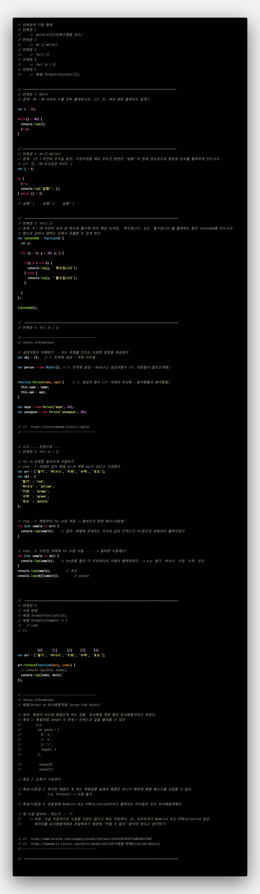

# TIL
- 📝 오늘 배운 내용 ✏️ : 
  - [x] `반복문` 
    - `while문`
    - `do-while문`
    - `for`
    - `for in`
    - `forEach`
  - [X] 반복문을 활용한 문제풀이 1
    
    <!--  -->
  - [X] 반복문을 활용한 문제풀이 2     
  (feat. `생성자 함수` & `유사배열객체`)      

    

      
CLICK ME TO SEE AN <u>EXAMPLE/SOLUTION/EXTRA EXPLANATION</u>!

      

    

     
     

  <!-- - [X] CLI에서 node-sass 명령어로 scss 파일 css로 변환하는 명령어
    - `node-sass --watch scss/*.* --output css` 
     = `node-sass -w scss/*.* css/*.*`  -->

  - [X] CLI에서 sass 명령어로 scss 파일 css로 변환하는 명령어
    - `sass --watch scss:css`  
    - (같은 명령어) `sass -w scss:css`  -> 이거 사용! 

 
 

---

CLICK ME!
  

- cf.  
  - ✨ Only 선생님's 강의 ✨
  - https://victorydntmd.tistory.com/51
  - https://www.zerocho.com/category/JavaScript/post/5af6f9e707d77a001bb579d2
  - https://kamang-it.tistory.com/entry/JavaScript15%EC%9C%A0%EC%82%AC%EB%B0%B0%EC%97%B4-%EA%B0%9D%EC%B2%B4Arraylike-Objects
  - https://nykim.work/97
  - https://poiemaweb.com/sass-basics
  - https://nykim.work/28
  - https://www.npmjs.com/package/node-sass

</detials>   

