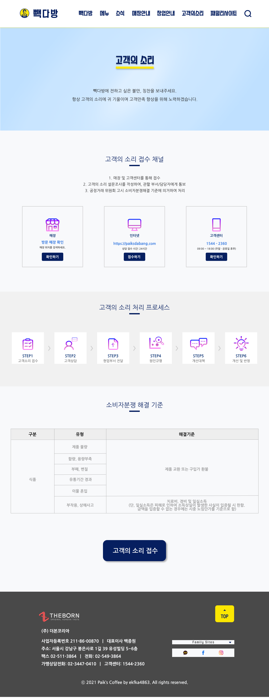

# TIL
- 📝 오늘 배운 내용 ✏️ : 
  - [x] `figma 빽다방 시험` 
    
    

      
메인페이지
  
      
       

    

    

      
서브페이지 1
  
      
       

    

    

      
서브 페이지 2
  
      
      
       

    

    

      
서브 페이지 3
  
      
      
       

    

     

  - [x] 배열과 객체의 `얕은 - / 깊은 복사` 

    

     
     

---

CLICK ME!
  

- cf.  
  - ✨ Only 선생님's 강의 ✨

</detials>   

