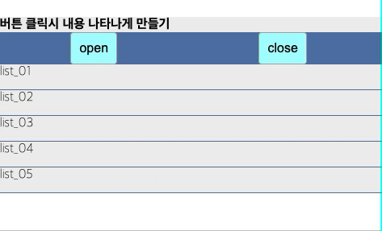

# TIL
- 📝 오늘 배운 내용 ✏️ : 
  - [x] `구구단`            
  ```js      
    // 구구단 
    for (var i = 2; i < 10; i++) {
      console.log();
      console.log(i + '로 시작하는 구구단 =================');
      for (var j = 1; j < 10; j++) {
        console.log(i + ' x ' + j + ' = ' + (i*j));
      }
    }
  ```

  <br />

  - [x] `타이머`          
  ```html 
    <!-- layout -->

    <article id="contentBox">
      <button type="button" class="btn">start</button>
      <p>count: <span></span></p>
    </article>
  ```

  <br />

  ```js
    // 타이머 
    // 문제: 500 -> 250까지 출력. 단, 0.1초마다 1씩 빠지는 숫자를 출력하라.

    // step 1: ============================================================
    var startNum = 500;
    var endNum = 250;
    var currentNum = startNum;

    var printFn = setInterval(function () {
      if (currentNum >= endNum) {
        console.log(currentNum);
        currentNum--;
      } else {
        clearInterval(printFn);
      }
    }, 100);
    printFn();


    // step2: ============================================================
    // DOM
    var btn = document.querySelector('.btn');
    var pSpan = document.querySelector('p > span');


    // btn 클릭시 printFn 함수가 실행이 되고, 
    // printFn 함수가 실행될 때, pSpan 안에 text 형식으로 숫자가 들어가게 만든다. 
    var startNum = 500;
    var endNum = 250;
    var currentNum = startNum;


    btn.addEventListener('click', function(e) {
      e.preventDefault();

      setInterval(function () {
        if (currentNum >= endNum) {
          pSpan.innerText = currentNum;
          currentNum--;
        } else {
          pSpan.innerText = "끝!!!!";
          clearInterval(printFn);
        }
      }, 10)
    });

    // step3: ============================================================
    var btn = document.querySelector('.btn');
    var pSpan = document.querySelector('p > span');

    // btn 클릭시 printFn 함수가 실행이 되고, 
    // printFn 함수가 실행될 때, pSpan 안에 text 형식으로 숫자가 들어가게 만든다. 
    var startNum = 500;
    var endNum = 250;
    var currentNum = startNum;
    var startPossible = true;    // timer가 끝나고도 재시작 할 수 있게하는 조건.


    var countFn = function(currentNum) {
      
      if (startPossible) {
        startPossible = false;
      
        var intervalFn = setInterval(function () {
          if (currentNum >= endNum) {
            pSpan.innerText = currentNum;
            currentNum--;
          } else {
            pSpan.innerText = "끝!!!!";
            clearInterval(intervalFn);
            startPossible = true;
          }
        }, 10)

      }
    };


    btn.addEventListener('click', function(e) {
      e.preventDefault();
      countFn(startNum);
    });

  ```

  <br />

  - [x] `accordion menu`    
    - 연습문제 보기    
       
    - 코드 보기         

      <details>
        <summary>CLICK ME TO SEE HTML CODE!</summary>

        ```html
          <!-- layout -->
          <section id="subBox">
            <h2>버튼 클릭시 내용 나타나게 만들기</h2>
            <div class="sub_box_btn">
              <button type="button" class="open">open</button>
              <button type="button" class="close">close</button>
              <button type="button" class="open2">open2</button>
            </div>
            <div class="content_area">
              <ul>
                <li><a href="#">list_01</a></li>
                <li><a href="#">list_02</a></li>
                <li><a href="#">list_03</a></li>
                <li><a href="#">list_04</a></li>
                <li><a href="#">list_05</a></li>
              </ul>
            </div>
          </section>
        ```

      </details>
      <br />
      
      <details>
        <summary>CLICK ME TO SEE JS CODE!</summary>

        ```js
          // e.g. 
          // vanilla javascript로 accordion menu slideUp/slideDown 하기 

          // DOM
          var subBoxBtn = document.querySelector('.sub_box_btn');
          var closeBtn = subBoxBtn.querySelector('.close');
          var openBtn = subBoxBtn.querySelector('.open');
          var open2Btn = subBoxBtn.querySelector('.open2');
          var contentArea = document.querySelector('.content_area');
          // -----------
          // var heightStrInCss = getComputedStyle(contentArea).height;  // '160px'
          // var heightNumInCss = parseInt(heightStrInCss);              // 160
          var heightNumInCss = contentArea.clientHeight;                // 160
          var currentHeight = contentArea.style.height;    
          var duration = 5;   // 지연시간
          // -----------
          
          // 기능 구현 
          // slideUp
          var slideUp = function(heightNumInCss) {
            currentHeight = heightNumInCss;

            var intervalFn = setInterval(function() {
              currentHeight--;

              if (currentHeight > 0) {
                contentArea.style.height = currentHeight + 'px';
              } else {
                clearInterval(intervalFn);
                contentArea.style.display = 'none';
              }
            }, duration)
          };

          // slideDown
          var slideDown = function(currentHeight) {

            var intervalFn = setInterval(function() {
              currentHeight++;

              if (currentHeight < heightNumInCss) {  // ___ < 160
                contentArea.style.display = 'block';
                contentArea.style.height = currentHeight + 'px';
              } else {
                clearInterval(intervalFn);
              }
            }, duration)
          };


          // ------------
          // event

          // slideUp
          closeBtn.addEventListener('click', function(e) {
            e.preventDefault();
            slideUp(heightNumInCss);
          });

          // slideDown
          openBtn.addEventListener('click', function(e) {
            e.preventDefault();
            slideDown(currentHeight);
          });

        ```

        <br />

      </details>


<br />
<br />

---
<details>
<summary>CLICK ME!</summary>  

- cf.  
  - ✨ Only 선생님's 강의 ✨
  
</detials>   

