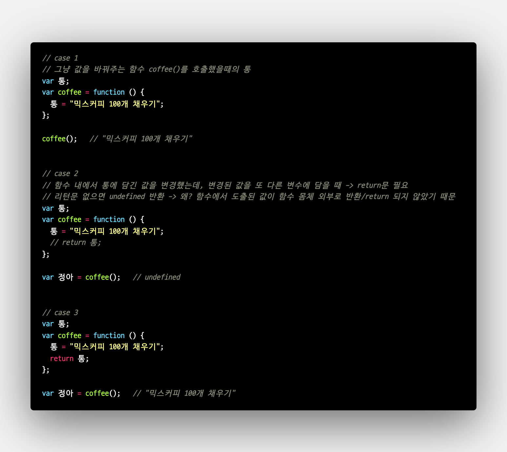

# TIL
- 📝 오늘 배운 내용 ✏️ : 
  - [x] `return문` 사용할 때

       

    <details>
      <summary>CLICK ME TO SEE CODES!</summary>

      ```js
        // case 1
        // 그냥 값을 바꿔주는 함수 coffee()를 호출했을때의 통
        var 통;
        var coffee = function () {
          통 = "믹스커피 100개 채우기";
        };

        coffee();   // "믹스커피 100개 채우기"


        // case 2
        // 함수 내에서 통에 담긴 값을 변경헀는데, 변경된 값을 또 다른 변수에 담을 때 -> return문 필요 
        // 리턴문 없으면 undefined 반환 -> 왜? 함수에서 도출된 값이 함수 몸체 외부로 반환/return 되지 않았기 때문 
        var 통;
        var coffee = function () {
          통 = "믹스커피 100개 채우기";
          // return 통;
        };

        var 정아 = coffee();   // undefined


        // case 3
        var 통;
        var coffee = function () {
          통 = "믹스커피 100개 채우기";
          return 통;
        };

        var 정아 = coffee();   // "믹스커피 100개 채우기"
      ```

    </details>
    <br />

  - [x] `document.write()` 활용 예제

         

    <details>
      <summary>CLICK ME TO SEE CODES!</summary>

      ```js
        let num = 1;
        let t = "<table border=1>";

          for(let i = 1; i <= 5; i++) {
            t+="<tr>";
          
            for(let j = 1; j <=5; j++) {
              t+="<td>";
              t+=num;
              t+="</td>";
              num++;
            }

            t+="</tr>";
          }

        t+="</table>";

        document.write(t);
      ```

    </details>
    <br />

  - [x] `DOM (Document Object Model)` 
    - **DOM**은 HTML 문서의 계층적 구조와 정보를 표현하며 이를 제어할 수 있는 API, 즉 프로퍼티와 메서드를 제공하는 트리 자료구조를 의미한다.         
    - **HTML 요소**는 HTML 문서를 구성하는 개별적인 요소를 의한다.       
    HTML 요소는 렌더링 엔진에 의해 파싱되어 DOM을 구성하는 요소 노드 객체로 변환된다.     
    이때, HTML 요소의 어트리 뷰트는 어트리뷰트 노드로, HTML 요소의 텍스트 콘텐츠는 텍스트 노드로 변환된다.        
     
    <br />
     

    - 다시, HTML 문서는 HTML 요소들의 집합이며, HTML 요소는 중첩관계를 갖는다.           
    HTML 요소 간에 중첩관계에 의해 계층적인 부자(parent-child) 관계가 형성되는데, 이러한 HTML 요소 간의 부자 관계를 반영하여 HTML 문서의 구성 요소인 HTML 요소를 객체화한 모든 노드 객체들을 트리자료 구조로 구성한다.       
    - 즉, 트리자료주고(tree sata structure)는 노드들의 게층 구조로 이뤄진다.
     

  - [x] `유사배열객체를 객체화 하기` 
    - 방법 1:    
    `Array.prototype.slice.call(유사배열객체명);`
    - 방법 2:    
    `Array.prototype.filter.call(유사배열객체명, function(data) {return data});`

<br />
<br />

---
<details>
<summary>CLICK ME!</summary>  

- cf.  
  - ✨ Only 선생님's 강의 ✨
  - 
  - 

</detials>   

