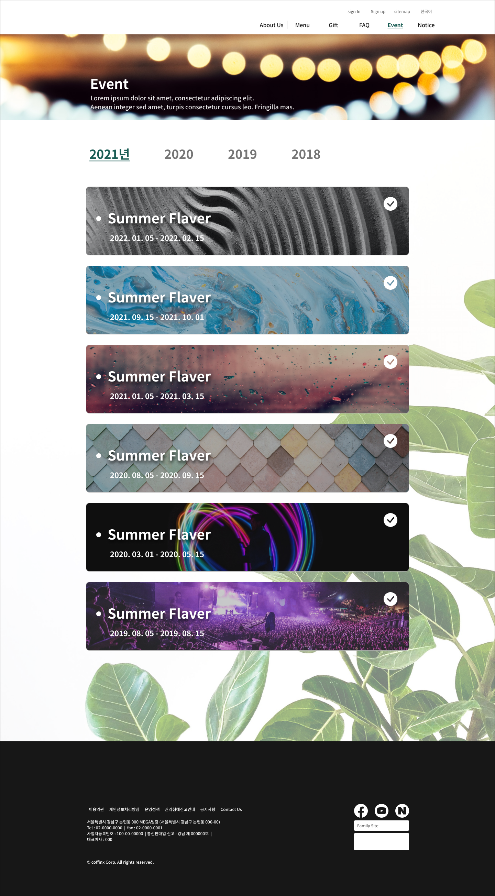
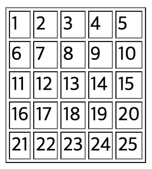

# TIL
- 📝 오늘 배운 내용 ✏️ : 
  - [x] js로 cardlist `fade in / fade out` 처리 복습 

  - [x] js로 `tab menu` 만드는 방법 
    - 만들어야 하는 예시:        
         


    <details>
      <summary>CLICK ME TO SEE CODES!</summary>

      ```js
  
      ```

    </details>
    <br />

  - [x] `document.write()` 활용 예제

      <!--     -->

    <details>
      <summary>CLICK ME TO SEE CODES!</summary>

      ```js
      
      ```

    </details>
    <br />

  - [x] `DOM (Document Object Model)` 
    - **DOM**은 HTML 문서의 계층적 구조와 정보를 표현하며 이를 제어할 수 있는 API, 즉 프로퍼티와 메서드를 제공하는 트리 자료구조를 의미한다.         
    - **HTML 요소**는 HTML 문서를 구성하는 개별적인 요소를 의한다.       
    HTML 요소는 렌더링 엔진에 의해 파싱되어 DOM을 구성하는 요소 노드 객체로 변환된다.     
    이때, HTML 요소의 어트리 뷰트는 어트리뷰트 노드로, HTML 요소의 텍스트 콘텐츠는 텍스트 노드로 변환된다.        
     
    <br />
     

    - 다시, HTML 문서는 HTML 요소들의 집합이며, HTML 요소는 중첩관계를 갖는다.           
    HTML 요소 간에 중첩관계에 의해 계층적인 부자(parent-child) 관계가 형성되는데, 이러한 HTML 요소 간의 부자 관계를 반영하여 HTML 문서의 구성 요소인 HTML 요소를 객체화한 모든 노드 객체들을 트리자료 구조로 구성한다.       
    - 즉, 트리자료주고(tree sata structure)는 노드들의 게층 구조로 이뤄진다.
     

  - [x] `유사배열객체를 배열로 강제 변환하기` 
    - 방법 1:    
    `Array.prototype.slice.call(유사배열객체명);`
    - 방법 2:    
    `Array.prototype.filter.call(유사배열객체명, function(data) {return data});`
    - 응용편:      
    `[].slice.call(유사배열객체명);`       
    - 브라우저가 반환하는 **HTML collection** 또는 **nodeList**와 같은 유사배열객체를 배열로 강제 변환하는 이유는, 반복문/배열의 메서드를 활용해서 불필요하게 중복되는 코드를 줄이고, 일괄적으로 작업을 처리해주기 위함이다.      
    - e.g.     
      <details>
        <summary>CLICK ME TO SEE CODES!</summary>

      ```html
        <!-- c_07_dom_selector_01.html -->

        <header id="headBox">
          <h1>
            <a href="./a_content.html">js - <abbr title="document object model">DOM</abbr></a>
            <span>test!!</span>
          </h1>
          <nav class="nav_area">
            <ul>
              <li><a href="#">link_01</a></li>
              <li><a href="#">link_02</a></li>
              <li><a href="#">link_03</a></li>
              <li><a href="#">link_04</a></li>
            </ul>
          </nav>
        </header>
      ```

      <br />

      ```js
        // c_07_dom_selector_01.js

        var headBox = document.querySelector("#headBox");
        headBox.style = "width: 100%; height: auto; background-color: #adf;";

        // h1
        var h1 = wrap.getElementsByTagName("h1");
        // var h1 = wrap.querySelector("h1");
        // console.log(h1.length);  // 1
        var idx = h1.length - 1;
        // HTML collection은 배열의 형식으로 나오기 떄문에 인덱스로 몇번쨰의 요소에 style을 적용할 것인지 알아야 한다! 
        h1[idx].style = "width: 100px; height: 30px; background-color: #dfd;";

        // h1
        var headH1 = headBox.querySelector("h1");
        // headH1.style = "border-radius: 5px; font-size: 1.2rem;"
        // 근데 위에꺼로 하면 아까 h1[idx].style부분에서 적용한 스타일링이 덮어쓰이니까 ... 아래와 같이 따로 값을 추가해줄 것! 
        headH1.style.borderRadius = "5px";
        headH1.style.fontSize = "1.2rem";
        
        // -----------------------------------
        // cf. 
        // HTML collection : 옛날방식의 선택자 
        //    - document.getElementById();

        // NodeList : 선택자는 아직 전부 사용하기엔 조금 무리가 있다 
        //    - document.querySelector();
        // -----------------------------------

        // 자식 선택자 
        var h1 = wrap.getElementsByTagName("h1")[0];  
        // getElement"s"ByTagName 처럼 element가 아닌 elements를 구하는 선택자에게는 반드시 몇번째의 요소인지를 명시. 
        // 요소가 하나만 있어도 인덱스를 꼭 명시해줘야 한다!!
        h1.style = "width: 100px; height: 30px; background-color: #dfd;";

        var h1Link = h1.children;           // HTMLCollection [a, span]
        // var h1Link = h1.children[0];     // <a href="./a_content.html">js - <abbr title="document object model">DOM</abbr></a>
        h1Link[0].style = "padding: 0.5rem; color: #05f;";
        h1Link[1].classList.add("blind");
        // console.log(h1Link);             // HTMLCollection(2) [a, span.blind]

        // cf. 이때, children과 childNodes의 차이점 비교
        var h1Insert = h1.childNodes;
        // console.log(h1Insert);           // NodeList(5) [text, a, text, span.blind, text]

      ```

      <br />

      ```js
      // nav 부터 ... 
      var navArea = wrap.getElementsByClassName("nav_area");
      var navArea2 = headBox.querySelector(".nav_area");
      var navUl = navArea2.children;
      console.log(navUl);       // HTMLCollection [ul]
      navUl[0].style = "display: flex; justify-content: space-between;";
      var navLiTags = navUl[0].children;
      console.log(navLiTags);   // HTMLCollection(4) [li, li, li, li]

      // 아래처럼 하기 싫으면!!!!! 유사배열객체 무.조.건. 배열로 강제 변환 해줄 것!!!!!
      // navLiTags[0].style = "width: 200px; border: 1px solid #333; padding: 2px 5px;";
      // navLiTags[1].style = "width: 200px; border: 1px solid #333; padding: 2px 5px;";
      // navLiTags[2].style = "width: 200px; border: 1px solid #333; padding: 2px 5px;";
      // navLiTags[3].style = "width: 200px; border: 1px solid #333; padding: 2px 5px;";

      // 배열로 강제 변환 후에는 배열 메서드인 forEach 등을 사용할 수 있다. -> 중복코드 없이 일괄적용 가능!
      navLiTags = Array.prototype.slice.call(navLiTags);
      // console.log(navLiTags);   // [li, li, li, li]
      navLiTags.forEach(function(elem) {
        elem.style = "width: 200px; border: 1px solid #333; padding: 2px 5px;";
      });

      ```

      </details>

<br />
<br />

---
<details>
<summary>CLICK ME!</summary>  

- cf.  
  - ✨ Only 선생님's 강의 ✨

</detials>   

